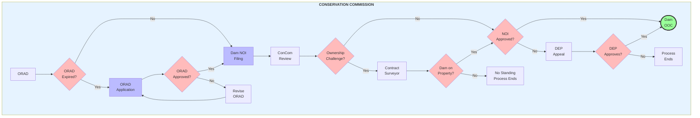
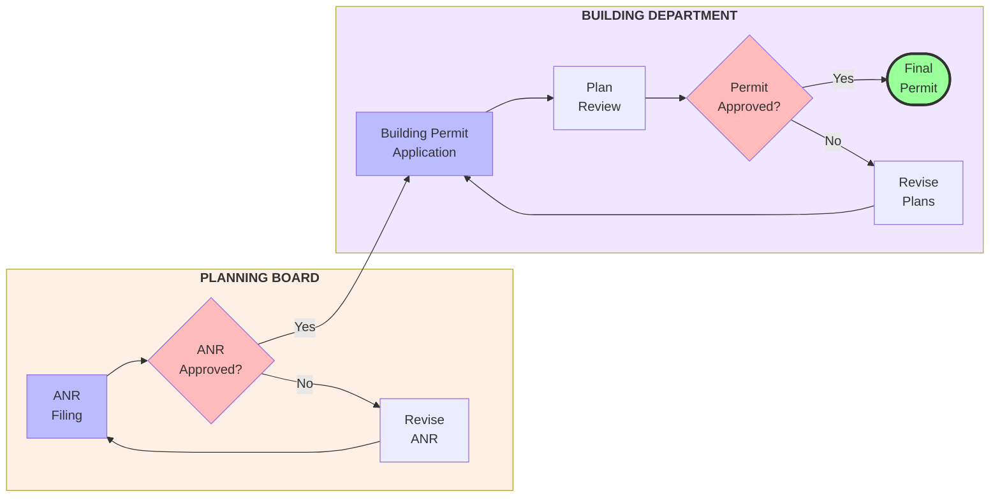
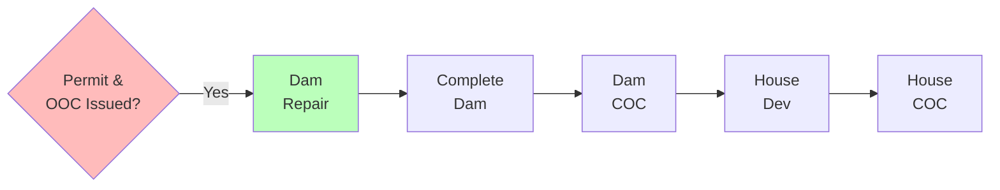

# Procedural Dependencies

## Planning Phase by Agency

#### Conservation Commission

#### Planning Board & Building Department

### Implementation Phase

## Legend
- Blue: Permit Applications
- Red: Decision Points
- Green: Construction Phase / Final Approvals