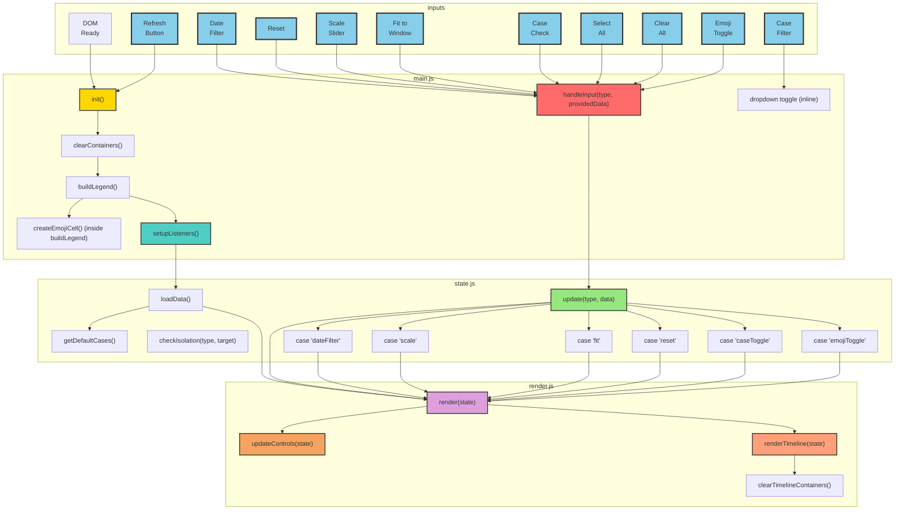

## Combined Chart (Main + Detail)

This chart combines the main architecture with all user input details in a single view.

## Complexity Assessment

The combined chart shows:
- **10 user input buttons** at the top
- **All functions** from the three files
- **All switch cases** in the update function
- **All connections** between components

While more complex than the separated charts, it's still readable because:
1. Color coding helps distinguish user inputs (blue) from functions
2. File boundaries (subgraphs) maintain organizational clarity  
3. The flow pattern is still clear: inputs → handleInput → update → render

However, the **separated two-chart approach** is likely better for documentation because:
- The main chart shows the overall architecture cleanly
- The detail chart focuses specifically on user input handling
- Readers can choose their level of detail