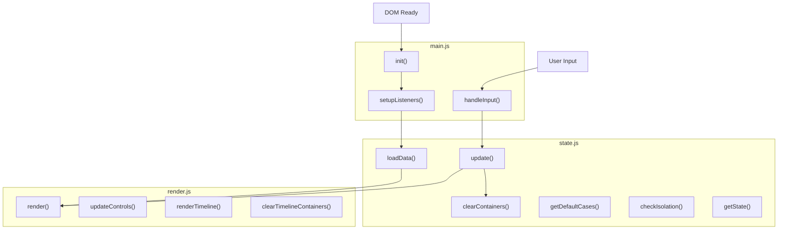

```mermaid
graph TD
    DOM["DOM Ready"] --> init
    
    subgraph main.js
        init["init()"]
        setupListeners["setupListeners()"]
        handleInput["handleInput()"]
    end
    
    subgraph state.js
        loadData["loadData()"]
        update["update()"]
        clearContainers["clearContainers()"]
        getDefaultCases["getDefaultCases()"]
        checkIsolation["checkIsolation()"]
        getState["getState()"]
    end
    
    subgraph render.js
        render["render()"]
        updateControls["updateControls()"]
        renderTimeline["renderTimeline()"]
        clearTimelineContainers["clearTimelineContainers()"]
    end
    
    init --> setupListeners
    setupListeners --> loadData
    handleInput --> update
    update --> clearContainers
    loadData --> render
    update --> render
    
    User["User Input"] --> handleInput
```