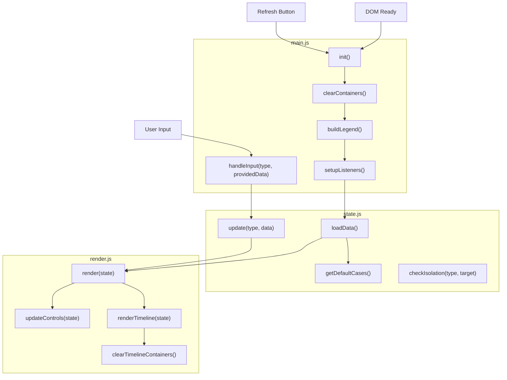

<!-- 
The mermaid chart should show:
- containers representing files
- nodes within those containers representing the functions in those files - all functions in the code should be in the chart
- connections between functions
-->

