# V2 Architecture

## Overview
- **Unidirectional flow**: main → state → render
- **Consolidated state.js**: All data loading, parsing, filtering, and persistence in one file
- **No circular dependencies**: Clean separation of concerns

## File Structure
- **main.js**: Event handling, DOM initialization, user input coordination (8 functions)
- **state.js**: Data loading, parsing, filtering, state updates, persistence (30 functions)
- **render.js**: All rendering logic including coordinate system and node creation (8 functions)
- **label-layout.js**: Label collision detection and positioning (7 functions)
- **case-titles.js**: Case title rendering (4 functions)

## External Dependencies (from ../js/)
- **connections.js**: drawCaselineConnections
- **stats.js**: calculateStats
- **emoji-config.js**: getEmojiArray, getEmojiConfig

## Main Architecture Flow

```mermaid
graph TD
    %% User Triggers
    DOM["🌐 DOM Ready"]:::trigger
    RefreshBtn["🔄 Refresh Button"]:::trigger
    UserAction["👆 User Interaction<br/>(Date/Scale/Filter/Reset)"]:::trigger
    
    %% main.js file
    subgraph "main.js"
        init["init()"]:::mainFunc
        clearContainers["clearContainers()"]:::mainFunc
        setupListeners["setupListeners()"]:::mainFunc
        buildLegend["buildLegend()"]:::mainFunc
        handleRefresh["handleRefresh()"]:::mainFunc
        handleInput["handleInput(type, data)"]:::mainFunc
        saveFocusDateMain["saveFocusDate()"]:::mainFunc
        clearTimelineContainers["clearTimelineContainers()"]:::mainFunc
        
        %% Internal sequential flow
        init -.->|1| clearContainers
        init -.->|2| setupListeners
        init -.->|3| buildLegend
        init -.->|4| initLoadData[/"calls loadData()"/]
        
        handleRefresh -.-> saveFocusDateMain
        handleRefresh -.-> init
        
        handleInput -.-> saveFocusDateMain
        handleInput -.-> clearTimelineContainers
        handleInput -.-> callUpdate[/"calls update()"/]
    end
    
    %% state.js file - showing ALL functions and their actual connections
    subgraph "state.js [30 functions]"
        %% Exported functions
        loadData["loadData() - EXPORTED"]:::stateExport
        update["update(type, data) - EXPORTED"]:::stateExport
        checkIsolation["checkIsolation() - EXPORTED"]:::stateExport
        saveFocus["saveFocus() - EXPORTED"]:::stateExport
        clearFocus["clearFocus() - EXPORTED"]:::stateExport
        hasActiveFilters["hasActiveFilters() - EXPORTED"]:::stateExport
        
        %% Data pipeline
        loadTableData["loadTableData()"]:::stateFunc
        parseMarkdown["parseMarkdown()"]:::stateFunc
        parseEventsOptimized["parseEventsOptimized()"]:::stateFunc
        
        %% UI State Loading
        loadAllUIState["loadAllUIState()"]:::stateFunc
        loadFocusDate["loadFocusDate()"]:::stateFunc
        loadState["loadState()"]:::stateFunc
        
        %% Filtering & calculation
        applyFilters["applyFilters()"]:::stateFunc
        filterByDate["filterByDate()"]:::stateFunc
        filterByCase["filterByCase()"]:::stateFunc
        calculateCoordinateSystem["calculateCoordinateSystem()"]:::stateFunc
        getDefaultCases["getDefaultCases()"]:::stateFunc
        arraysEqual["arraysEqual()"]:::stateFunc
        
        %% Persistence - Saving
        saveState["saveState()"]:::stateFunc
        saveFilterState["saveFilterState()"]:::stateFunc
        saveScaleState["saveScaleState()"]:::stateFunc
        saveEmojiVisibility["saveEmojiVisibility()"]:::stateFunc
        saveFocusDate["saveFocusDate()"]:::stateFunc
        clearFocusDate["clearFocusDate()"]:::stateFunc
        
        %% Isolation
        setIsolationMode["setIsolationMode()"]:::stateFunc
        getIsolationMode["getIsolationMode()"]:::stateFunc
        clearIsolationMode["clearIsolationMode()"]:::stateFunc
        isIsolating["isIsolating()"]:::stateFunc
        
        %% loadData internal flow
        loadData -.-> loadTableData
        loadTableData -.-> parseMarkdown
        parseMarkdown -.-> parseEventsOptimized
        loadData -.-> loadAllUIState
        loadAllUIState -.-> loadState
        loadData -.-> loadFocusDate
        loadFocusDate -.-> loadState
        loadData -.-> getDefaultCases
        loadData -.-> applyFilters
        applyFilters -.-> filterByDate
        applyFilters -.-> filterByCase
        loadData -.-> calculateCoordinateSystem
        loadData -.-> hasActiveFilters
        hasActiveFilters -.-> getDefaultCases
        hasActiveFilters -.-> arraysEqual
        loadData -.-> callRender[/"calls render()"/]
        
        %% update internal flow
        update -.-> saveFilterState
        saveFilterState -.-> saveState
        update -.-> saveScaleState
        saveScaleState -.-> saveState
        update -.-> saveEmojiVisibility
        saveEmojiVisibility -.-> saveState
        update -.-> clearFocusDate
        clearFocusDate -.-> saveState
        update -.-> getDefaultCases
        update -.-> setIsolationMode
        update -.-> getIsolationMode
        update -.-> clearIsolationMode
        update -.-> applyFilters
        update -.-> calculateCoordinateSystem
        update -.-> hasActiveFilters
        update -.-> callRender2[/"calls render()"/]
        
        %% saveFocus internal flow
        saveFocus -.-> saveFocusDate
        saveFocusDate -.-> saveState
        
        %% clearFocus internal flow
        clearFocus -.-> clearFocusDate
        
        %% checkIsolation internal flow
        checkIsolation -.-> isIsolating
    end
    
    %% render.js file
    subgraph "render.js"
        render["render(state) - EXPORTED"]:::renderFunc
        updateControls["updateControls(state)"]:::renderFunc
        renderTimeline["renderTimeline(state)"]:::renderFunc
        setContainerWidth["setContainerWidth()"]:::renderFunc
        calculateYearMarkers["calculateYearMarkers()"]:::renderFunc
        renderYearMarkers["renderYearMarkers()"]:::renderFunc
        determineCaselineColor["determineCaselineColor()"]:::renderFunc
        renderCaselineNodes["renderCaselineNodes()"]:::renderFunc
        
        render -.-> updateControls
        render -.-> renderTimeline
        renderTimeline -.-> setContainerWidth
        renderTimeline -.-> calculateYearMarkers
        renderTimeline -.-> renderYearMarkers
        renderTimeline -.-> renderCaselineNodes
        renderCaselineNodes -.-> determineCaselineColor
    end
    
    %% case-titles.js file
    subgraph "case-titles.js"
        renderCaseTitles["renderCaseTitles() - EXPORTED"]:::utilFunc
        updateCaseTitlesVisibility["updateCaseTitlesVisibility() - EXPORTED"]:::utilFunc
        getCaseInfo["getCaseInfo()"]:::utilFunc
        getCaseTitlesContainer["getCaseTitlesContainer()"]:::utilFunc
        
        renderCaseTitles -.-> getCaseInfo
        renderCaseTitles -.-> getCaseTitlesContainer
    end
    
    %% label-layout.js file
    subgraph "label-layout.js"
        createLabels["createLabelsWithCollisionDetection() - EXPORTED"]:::utilFunc
        splitLabel["splitLabel()"]:::utilFunc
        measureLabel["measureLabel()"]:::utilFunc
        getYPosition["getYPosition()"]:::utilFunc
        getNodeY["getNodeY()"]:::utilFunc
        resolveCollisions["resolveCollisions()"]:::utilFunc
        drawLeaderLine["drawLeaderLine()"]:::utilFunc
        
        createLabels -.-> measureLabel
        createLabels -.-> getYPosition
        createLabels -.-> resolveCollisions
        createLabels -.-> drawLeaderLine
        measureLabel -.-> splitLabel
        getYPosition -.-> getNodeY
    end
    
    %% External triggers to main.js
    DOM ==> init
    RefreshBtn ==> handleRefresh
    UserAction ==> handleInput
    
    %% Cross-file calls
    initLoadData ==> loadData
    callUpdate ==> update
    saveFocusDateMain ==> saveFocus
    callRender ==> render
    callRender2 ==> render
    renderTimeline ==> renderCaseTitles
    renderTimeline ==> updateCaseTitlesVisibility
    renderCaselineNodes ==> createLabels
    
    %% Styles
    classDef trigger fill:#ffd700,stroke:#333,stroke-width:3px
    classDef mainFunc fill:#87ceeb,stroke:#333,stroke-width:2px
    classDef stateExport fill:#98fb98,stroke:#2E8B57,stroke-width:3px
    classDef stateFunc fill:#98fb98,stroke:#333,stroke-width:2px
    classDef renderFunc fill:#f4a460,stroke:#333,stroke-width:2px
    classDef utilFunc fill:#dda0dd,stroke:#333,stroke-width:2px
```

## State.js Function Call Graph

29 of 30 functions in state.js are actively used (clearFocus is unused):

### Called from main.js (exported):
- `loadData()` - Called by init()
- `update()` - Called by handleInput()
- `saveFocus()` - Called by saveFocusDate() in main.js
- `clearFocus()` - EXPORTED BUT NEVER CALLED (candidate for removal)
- `checkIsolation()` - Called by main.js event listeners for isolation UI
- `hasActiveFilters()` - Exported and used internally

### Called internally by loadData():
- `loadTableData()` - Fetches markdown
- `parseMarkdown()` - Parses markdown in one pass
- `parseEventsOptimized()` - Called by parseMarkdown
- `loadAllUIState()` - Loads all UI state
- `loadFocusDate()` - Loads focus date separately
- `loadState()` - Called by loadAllUIState and loadFocusDate
- `getDefaultCases()` - Gets default case visibility
- `applyFilters()` - Applies all filters
- `filterByDate()` - Called by applyFilters
- `filterByCase()` - Called by applyFilters
- `calculateCoordinateSystem()` - Calculates rendering coordinates
- `hasActiveFilters()` - Checks for active filters
- `arraysEqual()` - Called by hasActiveFilters

### Called internally by update():
- `saveFilterState()` - Saves filter state
- `saveScaleState()` - Saves scale state
- `saveEmojiVisibility()` - Saves emoji visibility
- `clearFocusDate()` - Clears focus date
- `saveState()` - Called by all save functions
- `getDefaultCases()` - For reset action
- `setIsolationMode()` - For isolate action
- `getIsolationMode()` - For exitIsolation action
- `clearIsolationMode()` - For exitIsolation action
- All the same functions as loadData for reprocessing

### Called internally by other functions:
- `saveFocusDate()` - Called by saveFocus()
- `isIsolating()` - Called by checkIsolation()

## Data Flow Summary

1. **Initialization**: DOM → main.init() → state.loadData() → render()
2. **User Input**: Event → main.handleInput() → state.update() → render()
3. **Focus Save**: Scroll → main.saveFocusDate() → state.saveFocus()
4. **All 30 functions are actively used in the call graph**