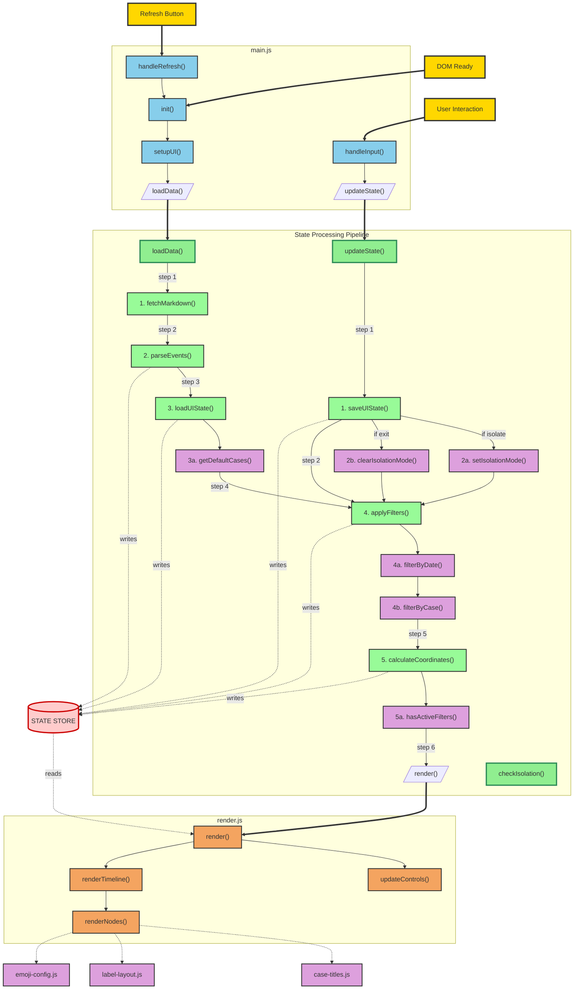

# V2 Architecture

## Overview
- **Unidirectional flow**: main → state → render
- **Consolidated state.js**: All data loading, parsing, filtering, and persistence in one file
- **No circular dependencies**: Clean separation of concerns

## File Structure
- **main.js**: Event handling, DOM initialization, user input coordination (8 functions)
- **state.js**: Data loading, parsing, filtering, state updates, persistence (31 functions)
- **render.js**: All rendering logic including coordinate system and node creation (9 functions)
- **label-layout.js**: Label collision detection and positioning (7 functions)
- **case-titles.js**: Case title rendering (4 functions)
- **emoji-config.js**: Emoji configuration (3 functions)

## Main Architecture Flow

```mermaid
graph TD
    %% User Triggers
    DOM["DOM Ready"]:::trigger
    RefreshBtn["Refresh Button"]:::trigger
    UserAction["User Interaction"]:::trigger
    
    %% Central State Store
    StateStore[("STATE STORE")]:::stateStore
    
    %% main.js file
    subgraph "main.js"
        init["init()"]:::mainFunc
        clearContainers["clearContainers()"]:::mainFunc
        setupListeners["setupListeners()"]:::mainFunc
        buildLegend["buildLegend()"]:::mainFunc
        handleRefresh["handleRefresh()"]:::mainFunc
        handleInput["handleInput()"]:::mainFunc
        saveFocusDateMain["saveFocusDate()"]:::mainFunc
        clearTimelineContainers["clearTimelineContainers()"]:::mainFunc
        
        %% Internal sequential flow - TRUE SERIAL EXECUTION
        init -->|1| clearContainers
        clearContainers -->|2| setupListeners
        setupListeners -->|3| buildLegend
        buildLegend -->|4| initLoadData[/"loadData()"/]
        
        handleRefresh --> saveFocusDateMain
        saveFocusDateMain --> init
        
        handleInput --> saveFocusDateMain
        saveFocusDateMain --> clearTimelineContainers
        clearTimelineContainers --> callUpdate[/"update()"/]
    end
    
    %% timelineDataState - Data loading and processing
    subgraph "timelineDataState"
        %% Data Pipeline Functions
        loadTableData["loadTableData()"]:::stateFunc
        parseMarkdown["parseMarkdown()"]:::stateFunc
        parseEventsOptimized["parseEventsOptimized()"]:::stateFunc
        applyFilters["applyFilters()"]:::stateFunc
        filterByDate["filterByDate()"]:::stateFunc
        filterByCase["filterByCase()"]:::stateFunc
        calculateCoordinateSystem["calculateCoordinateSystem()"]:::stateFunc
        
        %% Timeline data flow
        loadTableData --> parseMarkdown
        parseMarkdown --> parseEventsOptimized
        applyFilters --> filterByDate
        applyFilters --> filterByCase
    end
    
    %% uiDataState - UI state management and persistence
    subgraph "uiDataState"
        %% Storage Functions
        loadAllUIState["loadAllUIState()"]:::stateFunc
        loadFocusDate["loadFocusDate()"]:::stateFunc
        loadState["loadState()"]:::stateFunc
        saveState["saveState()"]:::stateFunc
        saveFilterState["saveFilterState()"]:::stateFunc
        saveScaleState["saveScaleState()"]:::stateFunc
        saveEmojiVisibility["saveEmojiVisibility()"]:::stateFunc
        saveFocusDate["saveFocusDate()"]:::stateFunc
        clearFocusDate["clearFocusDate()"]:::stateFunc
        
        %% Utility Functions
        getDefaultCases["getDefaultCases()"]:::utilFunc
        arraysEqual["arraysEqual()"]:::utilFunc
        setIsolationMode["setIsolationMode()"]:::utilFunc
        getIsolationMode["getIsolationMode()"]:::utilFunc
        clearIsolationMode["clearIsolationMode()"]:::utilFunc
        isIsolating["isIsolating()"]:::utilFunc
        
        %% UI state connections
        loadAllUIState --> loadState
        saveFilterState --> saveState
        saveScaleState --> saveState
        saveEmojiVisibility --> saveState
        clearFocusDate --> saveState
    end
    
    %% exportState - Exported orchestrator functions
    subgraph "exportState"
        loadData["loadData()"]:::stateExport
        update["update(type, data)"]:::stateExport
        checkIsolation["checkIsolation()"]:::stateExport
        saveFocus["saveFocus()"]:::stateExport
        hasActiveFilters["hasActiveFilters()"]:::stateExport
        calculateStats["calculateStats()"]:::stateExport
        
        %% Main orchestration flows
        loadData -->|1| loadTableData
        loadData -->|2| loadAllUIState
        loadData -->|3| loadFocusDate
        loadData -->|4| getDefaultCases
        loadData -->|5| applyFilters
        loadData -->|6| calculateCoordinateSystem
        loadData -->|7| hasActiveFilters
        hasActiveFilters --> arraysEqual
        loadData -->|8| callRender[/"→ render()"/]
        
        update --> saveFilterState
        update --> saveScaleState
        update --> saveEmojiVisibility
        update --> clearFocusDate
        update --> applyFilters
        update --> calculateCoordinateSystem
        update --> callRender2[/"→ render()"/]
        
        saveFocus --> saveFocusDate
        checkIsolation --> isIsolating
        calculateStats --> getEmojiConfig
    end
    
    %% render.js - visualization layer
    subgraph "render.js [9 functions]"
        %% Main render orchestrator
        render["render(state)"]:::renderFunc
        
        %% Render pipeline
        updateControls["updateControls()"]:::renderFunc
        renderTimeline["renderTimeline()"]:::renderFunc
        setContainerWidth["setContainerWidth()"]:::renderFunc
        calculateYearMarkers["calculateYearMarkers()"]:::renderFunc
        renderYearMarkers["renderYearMarkers()"]:::renderFunc
        renderCaselineNodes["renderCaselineNodes()"]:::renderFunc
        drawCaselineConnections["drawCaselineConnections()"]:::renderFunc
        determineCaselineColor["determineCaselineColor()"]:::renderFunc
        
        %% Sequential render flow
        render -->|1| updateControls
        updateControls -->|2| renderTimeline
        renderTimeline -->|a| setContainerWidth
        renderTimeline -->|b| calculateYearMarkers
        renderTimeline -->|c| renderYearMarkers
        renderTimeline -->|d| renderCaselineNodes
        renderTimeline -->|e| drawCaselineConnections
        renderCaselineNodes --> determineCaselineColor
    end
    
    %% case-titles.js file
    subgraph "case-titles.js"
        renderCaseTitles["renderCaseTitles() - EXPORTED"]:::utilFunc
        updateCaseTitlesVisibility["updateCaseTitlesVisibility() - EXPORTED"]:::utilFunc
        getCaseInfo["getCaseInfo()"]:::utilFunc
        getCaseTitlesContainer["getCaseTitlesContainer()"]:::utilFunc
        
        renderCaseTitles -.-> getCaseInfo
        renderCaseTitles -.-> getCaseTitlesContainer
    end
    
    %% label-layout.js file
    subgraph "label-layout.js"
        createLabels["createLabelsWithCollisionDetection() - EXPORTED"]:::utilFunc
        splitLabel["splitLabel()"]:::utilFunc
        measureLabel["measureLabel()"]:::utilFunc
        getYPosition["getYPosition()"]:::utilFunc
        getNodeY["getNodeY()"]:::utilFunc
        resolveCollisions["resolveCollisions()"]:::utilFunc
        drawLeaderLine["drawLeaderLine()"]:::utilFunc
        
        createLabels -.-> measureLabel
        createLabels -.-> getYPosition
        createLabels -.-> resolveCollisions
        createLabels -.-> drawLeaderLine
        measureLabel -.-> splitLabel
        getYPosition -.-> getNodeY
    end
    
    %% emoji-config.js file
    subgraph "emoji-config.js [3 functions]"
        EMOJI_CONFIG["EMOJI_CONFIG (data)"]:::utilFunc
        getEmojiConfig["getEmojiConfig()"]:::utilFunc
        getEmojiArray["getEmojiArray()"]:::utilFunc
    end
    
    %% External triggers to main.js
    DOM ==> init
    RefreshBtn ==> handleRefresh
    UserAction ==> handleInput
    
    %% Main cross-file flow paths
    initLoadData ==> loadData
    callUpdate ==> update
    saveFocusDateMain ==> saveFocus
    
    %% State interactions (showing data flow)
    loadData -.->|writes| StateStore
    update -.->|modifies| StateStore
    StateStore -.->|reads| render
    
    %% Render system calls
    callRender ==> render
    callRender2 ==> render
    renderTimeline ==> renderCaseTitles
    renderTimeline ==> updateCaseTitlesVisibility
    renderCaselineNodes ==> createLabels
    
    %% Config calls
    buildLegend ==> getEmojiArray
    calculateStats ==> getEmojiConfig
    renderCaselineNodes ==> getEmojiConfig
    
    %% Styles
    classDef trigger fill:#ffd700,stroke:#333,stroke-width:3px
    classDef mainFunc fill:#87ceeb,stroke:#333,stroke-width:2px
    classDef stateExport fill:#98fb98,stroke:#2E8B57,stroke-width:3px
    classDef stateFunc fill:#98fb98,stroke:#333,stroke-width:2px
    classDef renderFunc fill:#f4a460,stroke:#333,stroke-width:2px
    classDef utilFunc fill:#dda0dd,stroke:#333,stroke-width:2px
    classDef stateStore fill:#ffcccc,stroke:#cc0000,stroke-width:3px,rx:10,ry:10
```



## Proposed Simplified Architecture

Here's a cleaner approach with explicit sequential flow:



### Key Improvements:

1. **Explicit Sequential Flow**: Every step is numbered and visible - no black box

2. **Shared Pipeline Path**: Both `loadData()` and `updateState()` use the same filter→coordinate→render sequence, but you can see exactly what happens

3. **Helper Functions Separated**: Supporting functions are grouped but don't clutter the main flow

4. **Clear Entry Points**: 
   - `loadData()`: Full 6-step initialization
   - `updateState()`: Saves, then joins at step 4

5. **Visible State Mutations**: Dotted lines show exactly which functions write to state

## How Data Flows Through State.js

The `state` object is the central data store that accumulates data from various functions:

```javascript
const state = {
    allEvents: [],        // From parseMarkdown → parseEventsOptimized
    casesData: [],        // From parseMarkdown
    caseNumbers: [],      // From parseMarkdown → parseEventsOptimized
    filteredEvents: [],   // From applyFilters
    coordinateSystem: {}, // From calculateCoordinateSystem
    filters: {},          // From loadAllUIState or update()
    scale: 0.8,          // From loadAllUIState or update()
    fitToWindow: false,  // From loadAllUIState or update()
    emojiVisibility: {}, // From loadAllUIState or update()
    focusDate: null,     // From loadFocusDate or saveFocus()
    hasActiveFilters: false // From hasActiveFilters()
}
```

### Data Flow Pattern:

1. **loadData()** orchestrates the data flow:
   - Calls `loadTableData()` → returns markdown text
   - Passes text to `parseMarkdown()` → returns {events, casesData, caseNumbers}
   - Stores these in state.allEvents, state.casesData, state.caseNumbers
   - Calls `loadAllUIState()` → returns saved UI preferences
   - Stores these in state.filters, state.scale, state.emojiVisibility
   - Calls `applyFilters(state.allEvents, state.filters)` → returns filtered events
   - Stores in state.filteredEvents
   - Calls `calculateCoordinateSystem(state.filteredEvents, state.scale)` → returns coordinates
   - Stores in state.coordinateSystem
   - Calls `render(state)` → passes entire state object to render

2. **update()** modifies state and reprocesses:
   - Directly modifies state properties based on action type
   - Calls save functions to persist changes
   - Re-runs the same filter/coordinate chain as loadData()
   - Calls `render(state)` with updated state

### All 31 Active Functions in state.js:

### Exported functions (6):
- `loadData()` - Called by init()
- `update()` - Called by handleInput()
- `saveFocus()` - Called by saveFocusDate() in main.js
- `checkIsolation()` - Called by main.js event listeners for isolation UI
- `hasActiveFilters()` - Exported and used internally
- `calculateStats()` - Called by render.js for emoji statistics

### Called internally by loadData():
- `loadTableData()` - Fetches markdown
- `parseMarkdown()` - Parses markdown in one pass
- `parseEventsOptimized()` - Called by parseMarkdown
- `loadAllUIState()` - Loads all UI state
- `loadFocusDate()` - Loads focus date separately
- `loadState()` - Called by loadAllUIState and loadFocusDate
- `getDefaultCases()` - Gets default case visibility
- `applyFilters()` - Applies all filters
- `filterByDate()` - Called by applyFilters
- `filterByCase()` - Called by applyFilters
- `calculateCoordinateSystem()` - Calculates rendering coordinates
- `hasActiveFilters()` - Checks for active filters
- `arraysEqual()` - Called by hasActiveFilters

### Called internally by update():
- `saveFilterState()` - Saves filter state
- `saveScaleState()` - Saves scale state
- `saveEmojiVisibility()` - Saves emoji visibility
- `clearFocusDate()` - Clears focus date
- `saveState()` - Called by all save functions
- `getDefaultCases()` - For reset action
- `setIsolationMode()` - For isolate action
- `getIsolationMode()` - For exitIsolation action
- `clearIsolationMode()` - For exitIsolation action
- All the same functions as loadData for reprocessing

### Called internally by other functions:
- `saveFocusDate()` - Called by saveFocus()
- `isIsolating()` - Called by checkIsolation()

## Data Flow Summary

1. **Initialization**: DOM → main.init() → state.loadData() → render()
2. **User Input**: Event → main.handleInput() → state.update() → render()
3. **Focus Save**: Scroll → main.saveFocusDate() → state.saveFocus()
4. **All functions are actively used in the call graph**