```mermaid
graph TD
    subgraph "inputs"
        DOM["DOM<br/>Ready"]
        RefreshBtn["Refresh<br/>Button"]:::userInput
        DateFilterBtn["Date<br/>Filter"]:::userInput
        ResetBtn["Reset"]:::userInput
        ScaleSlider["Scale<br/>Slider"]:::userInput
        FitCheckbox["Fit to<br/>Window"]:::userInput
        CaseDropdownBtn["Case<br/>Filter"]:::userInput
        CaseCheckbox["Case<br/>Check"]:::userInput
        SelectAllBtn["Select<br/>All"]:::userInput
        ClearAllBtn["Clear<br/>All"]:::userInput
        EmojiCheckbox["Emoji<br/>Toggle"]:::userInput
        CaseTitleDblClick["Case Title<br/>Double Click"]:::userInput
        EmojiLegendDblClick["Emoji Legend<br/>Double Click"]:::userInput
    end
    
    subgraph "main.js"
        subgraph "init()"
            clearContainers["clearContainers()"]
            setupListeners["setupListeners()<br/>(includes scroll tracking,<br/>window resize, double-clicks)"]:::setupStyle
            buildLegend["buildLegend()<br/>(with count spans)"]
        end
        clearTimelineContainers["clearTimelineContainers()"]
        saveFocusDate["saveFocusDate()"]
        handleInput["handleInput(type, providedData)"]:::handleInputStyle
    end
    
    subgraph "state.js"
        loadData["loadData()"]
        getDefaultCases["getDefaultCases()"]
        update["update(type, data)"]:::updateStyle
        checkIsolation["checkIsolation(type, target)"]
        hasActiveFilters["hasActiveFilters(state)"]
        arraysEqual["arraysEqual(a, b)"]
        updateDateFilter["case 'dateFilter'"]
        updateScale["case 'scale'"]
        updateFit["case 'fit'"]
        updateReset["case 'reset'"]
        updateCaseToggle["case 'caseToggle'"]
        updateEmojiToggle["case 'emojiToggle'"]
        updateIsolate["case 'isolate'"]
        updateExitIsolation["case 'exitIsolation'"]
    end
    
    subgraph "render.js"
        render["render(state)"]:::renderStyle
        updateControls["updateControls(state)<br/>(includes smart button text,<br/>active filter indicator)"]:::updateControlsStyle
        renderTimeline["renderTimeline(state)<br/>(includes emoji visibility<br/>with OR logic for multi-emoji,<br/>legend count updates)"]:::renderTimelineStyle
    end
    
    subgraph "label-layout.js"
        createLabelsWithCollisionDetection["createLabelsWithCollisionDetection(nodeData, container)"]
        splitLabel["splitLabel(text)"]
        measureLabel["measureLabel(text, verticalPosition, emphasis)"]
        getYPosition["getYPosition(node, labelHeight)"]
        getNodeY["getNodeY(node)"]
        resolveCollisions["resolveCollisions(labelData)"]
        drawLeaderLine["drawLeaderLine(container, labelData)"]
    end
    
    %% Input connections
    DOM --> clearContainers
    RefreshBtn --> saveFocusDate
    saveFocusDate --> clearContainers
    DateFilterBtn --> handleInput
    ResetBtn --> handleInput
    ScaleSlider --> handleInput
    FitCheckbox --> handleInput
    CaseDropdownBtn --> handleInput
    CaseCheckbox --> handleInput
    SelectAllBtn --> handleInput
    ClearAllBtn --> handleInput
    EmojiCheckbox --> handleInput
    CaseTitleDblClick --> handleInput
    EmojiLegendDblClick --> handleInput
    
    %% Main.js init() sequence
    clearContainers --> setupListeners
    setupListeners --> buildLegend
    buildLegend --> loadData
    
    %% handleInput sequence (for some input types)
    handleInput --> clearTimelineContainers
    clearTimelineContainers --> update
    
    %% State.js connections
    loadData --> getDefaultCases
    loadData --> render
    update --> render
    update --> updateDateFilter
    update --> updateScale
    update --> updateFit
    update --> updateReset
    update --> updateCaseToggle
    update --> updateEmojiToggle
    update --> updateIsolate
    update --> updateExitIsolation
    
    %% Isolation checks
    updateIsolate --> checkIsolation
    updateExitIsolation --> checkIsolation
    
    %% Switch cases to render
    updateDateFilter --> render
    updateScale --> render
    updateFit --> render
    updateReset --> render
    updateCaseToggle --> render
    updateEmojiToggle --> render
    updateIsolate --> render
    updateExitIsolation --> render
    
    %% Render.js connections
    render --> updateControls
    render --> renderTimeline
    renderTimeline --> createLabelsWithCollisionDetection
    
    %% State.js internal calls before render
    update --> hasActiveFilters
    loadData --> hasActiveFilters
    hasActiveFilters --> arraysEqual
    hasActiveFilters --> getDefaultCases
    
    %% label-layout.js internal connections
    createLabelsWithCollisionDetection --> splitLabel
    createLabelsWithCollisionDetection --> measureLabel
    createLabelsWithCollisionDetection --> getYPosition
    createLabelsWithCollisionDetection --> getNodeY
    createLabelsWithCollisionDetection --> resolveCollisions
    createLabelsWithCollisionDetection --> drawLeaderLine
    getYPosition --> getNodeY
    
    classDef userInput fill:#87ceeb,stroke:#333,stroke-width:3px
    classDef initStyle fill:#ffd700,stroke:#333,stroke-width:2px
    classDef handleInputStyle fill:#ff6b6b,stroke:#333,stroke-width:2px
    classDef setupStyle fill:#4ecdc4,stroke:#333,stroke-width:2px
    classDef updateStyle fill:#95e77e,stroke:#333,stroke-width:2px
    classDef renderStyle fill:#dda0dd,stroke:#333,stroke-width:2px
    classDef updateControlsStyle fill:#f4a460,stroke:#333,stroke-width:2px
    classDef renderTimelineStyle fill:#ffa07a,stroke:#333,stroke-width:2px
```

<!-- 
The mermaid chart should show:
- containers representing files
- nodes within those containers representing the functions in those files - all functions in the code should be in the chart
- connections between functions
-->

<!-- 
Note: v2 imports functions from ../js/ (v1 files):
- date-scale.js: calculateDateRange, getXPosition, getDateFromX
- caseline-nodes.js: renderCaselineNodes
- connections.js: drawCaselineConnections
- case-titles.js: renderCaseTitles
- stats.js: calculateStats, renderStats
- emoji-config.js: getEmojiArray
- data-loader.js, event-parser.js, filters.js, state-persistence.js
-->

