# Emoji Toggle Trace

## Complete sequence from checkbox click to final render

```mermaid
graph TD
    Start["User clicks emoji checkbox<br/>(e.g. 'notice' emoji)"] --> NavListener

    subgraph "main.js"
        NavListener["nav.addEventListener('change')<br/>Line 163"] --> CheckEmoji{"target.classList.contains('emoji-toggle')<br/>Line 181"}
        CheckEmoji --> GetData["Get emojiClass from dataset<br/>Get isVisible from checked<br/>Lines 182-183"]
        GetData --> ConsoleLog["console.log('Emoji toggle clicked:', target)<br/>Line 182"]
        ConsoleLog --> CallHandleInput["handleInput('emojiToggle', {emoji, visible})<br/>Line 185"]
        
        CallHandleInput --> HandleInput["handleInput(type, providedData)<br/>Line 234"]
        HandleInput --> CheckProvided{"providedData exists?<br/>Line 237"}
        CheckProvided -->|Yes| CheckClear{"Check if type needs clear<br/>Line 257"}
        CheckClear -->|emojiToggle not in list| NoClean["No clearTimelineContainers()"]
        NoClean --> CallUpdate["update(type, data)<br/>Line 266"]
    end

    subgraph "state.js"
        CallUpdate --> Update["update('emojiToggle', data)<br/>Line 132"]
        Update --> EmojiCase["case 'emojiToggle':<br/>Line 183"]
        EmojiCase --> UpdateVisibility["state.emojiVisibility[data.emoji] = data.visible<br/>Line 184"]
        UpdateVisibility --> SaveEmoji["saveEmojiVisibility(state.emojiVisibility)<br/>Line 185"]
        SaveEmoji --> CheckFilter{"'emojiToggle' in filter list?<br/>Line 229"}
        CheckFilter -->|No| NoRefilter["Don't re-apply filters"]
        NoRefilter --> CallRender["render(state)<br/>Line 234"]
    end

    subgraph "render.js"
        CallRender --> Render["render(state)<br/>Line 18"]
        Render --> UpdateControls["updateControls(state)<br/>Line 20"]
        UpdateControls --> UpdateEmojiCheckbox["Update emoji checkbox states<br/>Lines 101-108"]
        
        Render --> RenderTimeline["renderTimeline(state)<br/>Line 23"]
        RenderTimeline --> NotClear["NO clearTimelineContainers()<br/>(removed from line 115)"]
        NotClear --> GetContainers["Get container elements<br/>Lines 116-118"]
        
        GetContainers --> CheckEmpty{"filteredEvents empty?<br/>Line 120"}
        CheckEmpty -->|No| CalcDateRange["calculateDateRange(filteredEvents)<br/>Line 135"]
        CalcDateRange --> SetWidth["setContainerWidth()<br/>Line 142"]
        SetWidth --> DrawYearMarkers["drawYearMarkers()<br/>Line 144"]
        
        DrawYearMarkers --> RenderNodes["renderCaselineNodes(filteredEvents)<br/>Line 147"]
        
        subgraph "caseline-nodes.js"
            RenderNodes --> CreateNodes["Creates NEW DOM nodes<br/>Sets data-emoji-type<br/>Returns caselineData.nodes"]
        end
        
        CreateNodes --> ApplyVisibility["Apply emoji visibility<br/>Lines 149-154"]
        ApplyVisibility --> QueryElements["document.querySelectorAll('[data-emoji-type]')<br/>Line 149"]
        QueryElements --> SetDisplay["element.style.display = 'none' or ''<br/>Line 151"]
        
        SetDisplay --> LogRecalc["console.log('Label recalculation triggered')<br/>Line 157"]
        LogRecalc --> CreateLabels["createLabelsWithCollisionDetection(caselineData.nodes)<br/>Line 158"]
        
        subgraph "label-layout.js"
            CreateLabels --> ProcessNodes["Process ALL nodes in array<br/>Lines 126-177"]
            ProcessNodes --> CreateLabelElements["Create label elements<br/>Set data-emoji-type<br/>Lines 184-195"]
            CreateLabelElements --> CreateLeaderLines["Create SVG leader lines<br/>Set data-emoji-type<br/>Lines 280-281"]
        end
        
        CreateLeaderLines --> RenderCaseTitles["renderCaseTitles()<br/>Line 165"]
        RenderCaseTitles --> DrawConnections["drawCaselineConnections()<br/>Line 168"]
        DrawConnections --> CalcStats["calculateStats()<br/>Line 172"]
        CalcStats --> RestoreScroll["Restore scroll position<br/>Lines 175-179"]
    end
    
    RestoreScroll --> End["Complete"]

    style NotClear fill:#ff6b6b
    style CheckEmpty fill:#ffd700
    style ProcessNodes fill:#ff6b6b
```

## Key Problems

1. **No clearing for emoji toggles** - Timeline containers are NOT cleared (Line 257 in main.js)
2. **BUT render still creates NEW nodes** - renderCaselineNodes() at line 147 creates fresh DOM elements
3. **Old nodes remain** - Since we didn't clear, old nodes are still in the DOM
4. **Visibility applied to NEW nodes only** - Line 149 queries and hides the new nodes
5. **Labels created for ALL nodes** - createLabelsWithCollisionDetection gets the full nodes array
6. **Result**: Duplicate nodes in DOM, visibility inconsistently applied, labels don't match visible nodes