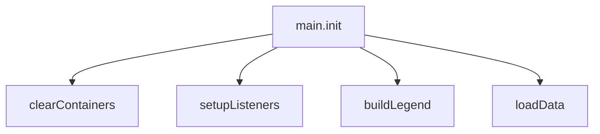
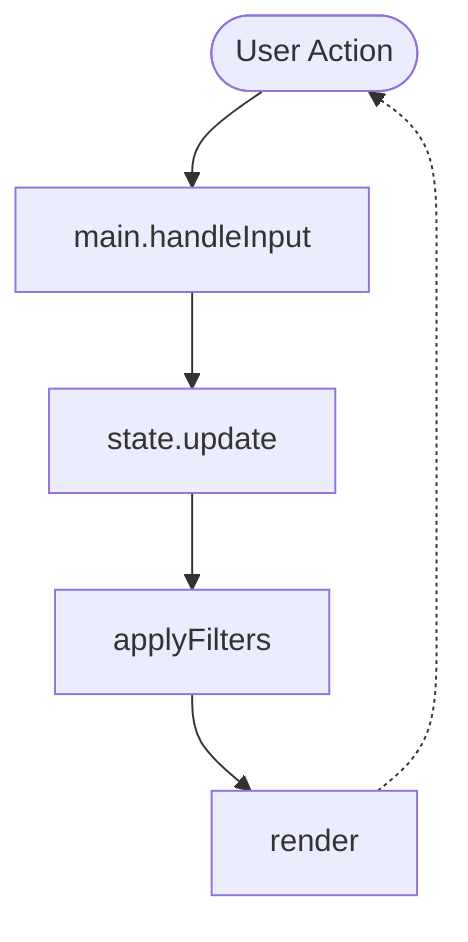
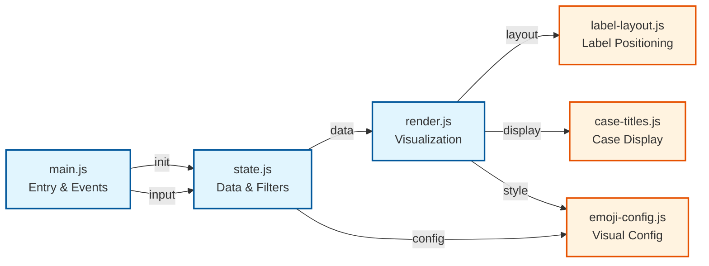

# Flow Analysis Summary

Generated: 9/9/2025, 12:51:24 AM

## Statistics
- **Functions found:** 59
- **Function calls detected:** 124
- **Calls with arguments:** 97
- **Calls without arguments:** 27
- **Files analyzed:** 6

---

## Function Flow Charts

### Timeline Application Flow (Based on Actual Code)

```mermaid
graph LR
    classDef entry fill:#2196F3,stroke:#0D47A1,stroke-width:3px,color:#fff,font-weight:bold
    classDef process fill:#9C27B0,stroke:#4A148C,stroke-width:2px,color:#fff
    classDef render fill:#FF9800,stroke:#E65100,stroke-width:2px,color:#fff
    classDef output fill:#4CAF50,stroke:#1B5E20,stroke-width:2px,color:#fff

    %% Entry point
    init[main.init]:::entry

    %% Data loading sequence (actual from state.loadData)
    loadData[state.loadData]:::process
    parseMarkdown[Parse<br/>Markdown]:::process
    applyFilters[Apply<br/>Filters]:::process
    calcCoords[Calculate<br/>Coordinates]:::process

    %% Rendering sequence (actual from render.renderTimeline)
    render[render.render]:::render
    renderTimeline[Render<br/>Timeline]:::render
    renderYears[Year<br/>Markers]:::render
    renderNodes[Case<br/>Nodes]:::render
    createLabels[Position<br/>Labels]:::render
    renderTitles[Case<br/>Titles]:::render

    %% Output
    display[Timeline<br/>Display]:::output

    %% The actual flow connections
    init --> loadData
    loadData --> parseMarkdown
    parseMarkdown --> applyFilters
    applyFilters --> calcCoords
    calcCoords --> render
    render --> renderTimeline
    renderTimeline --> renderYears
    renderYears --> renderNodes
    renderNodes --> createLabels
    createLabels --> renderTitles
    renderTitles --> display
```



### Detailed Breakdown by Stage

#### 1️⃣ Initialization Stage (main.init)

<details>
<summary>Click to see what happens during initialization</summary>



**What it does:**
- Clears all containers to reset the UI
- Sets up event listeners for user interactions
- Builds the emoji legend for filtering
- Triggers data loading

</details>

#### 2️⃣ Data Loading Stage (state.loadData)

```mermaid
graph LR
    loadData[loadData]
    parseMarkdown[parseMarkdown]
    loadData --> parseMarkdown
    loadAllUIState[loadAllUIState]
    parseMarkdown --> loadAllUIState
    loadFocusDate[loadFocusDate]
    loadAllUIState --> loadFocusDate
    getDefaultCases[getDefaultCases]
    loadFocusDate --> getDefaultCases
    applyFilters[applyFilters]
    getDefaultCases --> applyFilters
    calculateCoordinateSystem[calculateCoordinateSystem]
    applyFilters --> calculateCoordinateSystem
    hasActiveFilters[hasActiveFilters]
    calculateCoordinateSystem --> hasActiveFilters
    render[render]
    hasActiveFilters --> render
```

<details>
<summary>Click to see the data loading pipeline</summary>



**What it does:**
- Loads table data from markdown files
- Parses markdown to extract events
- Loads saved UI state (filters, scale, etc.)
- Applies filters to events
- Calculates timeline coordinates

</details>

#### 3️⃣ Rendering Stage (render.renderTimeline)

```mermaid
graph LR
    renderTimeline[renderTimeline]
    renderYearMarkers[render Year Markers]
    renderTimeline --> renderYearMarkers
    renderCaselineNodes[render Caseline Nodes]
    renderYearMarkers --> renderCaselineNodes
    createLabelsWithCollisionDetection[create Labels With Collision Detection]
    renderCaselineNodes --> createLabelsWithCollisionDetection
    renderCaseTitles[render Case Titles]
    createLabelsWithCollisionDetection --> renderCaseTitles
    drawCaselineConnections[draw Caseline Connections]
    renderCaseTitles --> drawCaselineConnections
    calculateStats[calculate Stats]
    drawCaselineConnections --> calculateStats
```

<details>
<summary>Click to see the rendering pipeline</summary>



**What it does:**
- Sets container width based on timeline scale
- Renders year markers on timeline
- Renders case nodes (events) with emojis
- Creates labels with collision detection
- Renders case titles
- Draws connections between related events
- Calculates and displays statistics

</details>

#### 4️⃣ User Interaction Cycle

<details>
<summary>Click to see how user input is handled</summary>



**Supported Actions:**
- Date filtering
- Case selection/filtering
- Scale adjustment
- Emoji visibility toggles
- Timeline refresh
- Isolation mode (focus on specific case/emoji)

</details>

### Detailed Flow Analysis

```mermaid
graph TD
    classDef highUse fill:#ff9999,stroke:#333,stroke-width:3px
    classDef medUse fill:#ffcc99,stroke:#333,stroke-width:2px
    classDef branch fill:#99ccff,stroke:#333,stroke-width:2px
    classDef utility fill:#e6e6e6,stroke:#999,stroke-width:1px,stroke-dasharray:5

    subgraph case-titles["case-titles.js"]
        case-titles_getCaseInfo["getCaseInfo"]:::utility
        case-titles_getCaseTitlesContainer["getCaseTitlesContainer"]:::utility
        case-titles_renderCaseTitles["renderCaseTitles"]
        case-titles_updateCaseTitlesVisibility["updateCaseTitlesVisibility"]
    end
    subgraph emoji-config["emoji-config.js"]
        emoji-config_getEmojiConfig["getEmojiConfig"]:::utility
        emoji-config_getEmojiArray["getEmojiArray"]:::utility
    end
    subgraph label-layout["label-layout.js"]
        label-layout_splitLabel["splitLabel"]
        label-layout_measureLabel["measureLabel"]
        label-layout_createLabelsWithCollisionDetection["createLabelsWithCollisionDetection"]
        label-layout_getYPosition["getYPosition"]:::utility
        label-layout_getNodeY["getNodeY"]:::utility
        label-layout_resolveCollisions["resolveCollisions"]
        label-layout_drawLeaderLine["drawLeaderLine"]
    end
    subgraph main["main.js"]
        main_init["init"]
        main_buildLegend["buildLegend"]
        main_clearContainers["clearContainers"]:::utility
        main_clearTimelineContainers["clearTimelineContainers"]:::utility
        main_handleRefresh["handleRefresh"]
        main_saveFocusDate["saveFocusDate"]:::utility
        main_setupListeners["setupListeners"]
        main_handleInput["handleInput"]
        main_createEmojiCell["createEmojiCell"]
    end
    subgraph render["render.js"]
        render_setContainerWidth["setContainerWidth"]:::utility
        render_calculateYearMarkers["calculateYearMarkers"]
        render_determineCaselineColor["determineCaselineColor"]
        render_renderCaselineNodes["renderCaselineNodes"]
        render_render["render"]
        render_updateControls["updateControls"]
        render_renderTimeline["renderTimeline"]
        render_renderYearMarkers["renderYearMarkers"]
        render_drawCaselineConnections["drawCaselineConnections"]
    end
    subgraph state["state.js"]
        state_loadData["loadData"]:::utility
        state_calculateCoordinateSystem["calculateCoordinateSystem"]
        state_getDefaultCases["getDefaultCases"]:::utility
        state_update["update"]
        state_checkIsolation["checkIsolation"]:::utility
        state_saveFocus["saveFocus"]:::utility
        state_arraysEqual["arraysEqual"]:::utility
        state_calculateStats["calculateStats"]
        state_hasActiveFilters["hasActiveFilters"]:::utility
        state_parseMarkdown["parseMarkdown"]
        state_loadTableData["loadTableData"]:::utility
        state_parseEventsOptimized["parseEventsOptimized"]
        state_applyFilters["applyFilters"]
        state_filterByDate["filterByDate"]
        state_filterByCase["filterByCase"]
        state_loadAllUIState["loadAllUIState"]:::utility
        state_saveState["saveState"]:::utility
        state_loadState["loadState"]:::utility
        state_saveFilterState["saveFilterState"]:::utility
        state_saveScaleState["saveScaleState"]:::utility
        state_saveEmojiVisibility["saveEmojiVisibility"]:::utility
        state_setIsolationMode["setIsolationMode"]:::utility
        state_getIsolationMode["getIsolationMode"]:::utility
        state_clearIsolationMode["clearIsolationMode"]:::utility
        state_isIsolating["isIsolating"]:::utility
        state_loadFocusDate["loadFocusDate"]:::utility
        state_clearFocusDate["clearFocusDate"]:::utility
        state_findColumn["findColumn"]:::utility
    end

    %% Sequential/Data Flow Connections
    label-layout_measureLabel --> label-layout_getYPosition
    main_saveFocusDate --> main_init
    render_updateControls --> render_renderTimeline
    render_setContainerWidth --> render_renderYearMarkers
    render_renderYearMarkers --> render_renderCaselineNodes
    render_renderCaselineNodes --> label-layout_createLabelsWithCollisionDetection
    label-layout_createLabelsWithCollisionDetection --> case-titles_renderCaseTitles
    case-titles_renderCaseTitles --> render_drawCaselineConnections
    render_drawCaselineConnections --> state_calculateStats
    state_loadTableData --> state_parseMarkdown
    state_parseMarkdown --> state_loadAllUIState
    state_loadAllUIState --> state_loadFocusDate
    state_loadFocusDate --> state_getDefaultCases
    state_getDefaultCases --> state_applyFilters
    state_applyFilters --> state_calculateCoordinateSystem
    state_calculateCoordinateSystem --> state_hasActiveFilters
    state_hasActiveFilters --> render_render
    state_getDefaultCases --> state_saveFilterState
    state_saveFilterState --> state_saveEmojiVisibility
    state_saveEmojiVisibility --> state_saveScaleState
    state_saveScaleState --> state_clearFocusDate
    state_setIsolationMode --> emoji-config_getEmojiArray
    emoji-config_getEmojiArray --> state_setIsolationMode
    state_saveEmojiVisibility --> state_clearIsolationMode
    state_filterByDate --> state_filterByCase

    %% Branched Flows (mutually exclusive)

    %% Nested Block Transitions
    case-titles_getCaseTitlesContainer ==>|enters| case-titles_getCaseInfo
    label-layout_getYPosition ==>|enters| label-layout_getNodeY
    label-layout_getNodeY ==>|exits| label-layout_resolveCollisions
    main_saveFocusDate ==>|enters| main_clearTimelineContainers
    main_clearTimelineContainers ==>|exits| state_update
    render_determineCaselineColor ==>|enters| emoji-config_getEmojiConfig
    state_setIsolationMode ==>|exits| state_saveFilterState
    state_getIsolationMode ==>|enters| state_saveFilterState
    state_clearIsolationMode ==>|exits| state_applyFilters
    state_applyFilters ==>|enters| state_saveScaleState
    state_getDefaultCases ==>|exits| state_arraysEqual

    %% Iterative Patterns
```

<details>
<summary>Click to expand detailed function-level flow</summary>



</details>

### Component Interactions



### Complete Call Graph

```mermaid
graph TD
    subgraph case-titles["case-titles.js"]
        case-titles_getCaseInfo["getCaseInfo"]
        case-titles_getCaseTitlesContainer["getCaseTitlesContainer"]
        case-titles_renderCaseTitles["renderCaseTitles"]
        case-titles_updateCaseTitlesVisibility["updateCaseTitlesVisibility"]
    end
    subgraph emoji-config["emoji-config.js"]
        emoji-config_getEmojiConfig["getEmojiConfig"]
        emoji-config_getEmojiArray["getEmojiArray"]
    end
    subgraph label-layout["label-layout.js"]
        label-layout_splitLabel["splitLabel"]
        label-layout_measureLabel["measureLabel"]
        label-layout_createLabelsWithCollisionDetection["createLabelsWithCollisionDetection"]
        label-layout_getYPosition["getYPosition"]
        label-layout_getNodeY["getNodeY"]
        label-layout_resolveCollisions["resolveCollisions"]
        label-layout_drawLeaderLine["drawLeaderLine"]
    end
    subgraph main["main.js"]
        main_init["init"]
        main_buildLegend["buildLegend"]
        main_clearContainers["clearContainers"]
        main_clearTimelineContainers["clearTimelineContainers"]
        main_handleRefresh["handleRefresh"]
        main_saveFocusDate["saveFocusDate"]
        main_setupListeners["setupListeners"]
        main_handleInput["handleInput"]
        main_createEmojiCell["createEmojiCell"]
    end
    subgraph render["render.js"]
        render_setContainerWidth["setContainerWidth"]
        render_calculateYearMarkers["calculateYearMarkers"]
        render_determineCaselineColor["determineCaselineColor"]
        render_renderCaselineNodes["renderCaselineNodes"]
        render_render["render"]
        render_updateControls["updateControls"]
        render_renderTimeline["renderTimeline"]
        render_renderYearMarkers["renderYearMarkers"]
        render_drawCaselineConnections["drawCaselineConnections"]
    end
    subgraph state["state.js"]
        state_loadData["loadData"]
        state_calculateCoordinateSystem["calculateCoordinateSystem"]
        state_getDefaultCases["getDefaultCases"]
        state_update["update"]
        state_checkIsolation["checkIsolation"]
        state_saveFocus["saveFocus"]
        state_arraysEqual["arraysEqual"]
        state_calculateStats["calculateStats"]
        state_hasActiveFilters["hasActiveFilters"]
        state_parseMarkdown["parseMarkdown"]
        state_loadTableData["loadTableData"]
        state_parseEventsOptimized["parseEventsOptimized"]
        state_applyFilters["applyFilters"]
        state_filterByDate["filterByDate"]
        state_filterByCase["filterByCase"]
        state_loadAllUIState["loadAllUIState"]
        state_saveState["saveState"]
        state_loadState["loadState"]
        state_saveFilterState["saveFilterState"]
        state_saveScaleState["saveScaleState"]
        state_saveEmojiVisibility["saveEmojiVisibility"]
        state_setIsolationMode["setIsolationMode"]
        state_getIsolationMode["getIsolationMode"]
        state_clearIsolationMode["clearIsolationMode"]
        state_isIsolating["isIsolating"]
        state_loadFocusDate["loadFocusDate"]
        state_clearFocusDate["clearFocusDate"]
        state_findColumn["findColumn"]
    end

    %% All 124 function calls detected
    case-titles_renderCaseTitles --> case-titles_getCaseInfo
    case-titles_renderCaseTitles --> case-titles_getCaseTitlesContainer
    case-titles_updateCaseTitlesVisibility --> case-titles_getCaseTitlesContainer
    label-layout_createLabelsWithCollisionDetection --> label-layout_splitLabel
    label-layout_createLabelsWithCollisionDetection --> label-layout_measureLabel
    label-layout_createLabelsWithCollisionDetection --> label-layout_getYPosition
    label-layout_createLabelsWithCollisionDetection --> label-layout_getNodeY
    label-layout_createLabelsWithCollisionDetection --> label-layout_resolveCollisions
    label-layout_createLabelsWithCollisionDetection --> label-layout_drawLeaderLine
    main_init --> main_buildLegend
    main_init --> main_clearContainers
    main_init --> main_setupListeners
    main_init --> state_loadData
    main_buildLegend --> emoji-config_getEmojiArray
    main_buildLegend --> main_createEmojiCell
    main_handleRefresh --> main_init
    main_handleRefresh --> main_saveFocusDate
    main_saveFocusDate --> state_saveFocus
    main_setupListeners --> main_handleRefresh
    main_setupListeners --> main_handleInput
    main_setupListeners --> state_checkIsolation
    main_handleInput --> main_clearTimelineContainers
    main_handleInput --> main_saveFocusDate
    main_handleInput --> state_update
    render_determineCaselineColor --> emoji-config_getEmojiConfig
    render_renderCaselineNodes --> emoji-config_getEmojiConfig
    render_renderCaselineNodes --> render_determineCaselineColor
    render_render --> render_updateControls
    render_render --> render_renderTimeline
    render_renderTimeline --> case-titles_renderCaseTitles
    render_renderTimeline --> label-layout_createLabelsWithCollisionDetection
    render_renderTimeline --> render_setContainerWidth
    render_renderTimeline --> render_renderCaselineNodes
    render_renderTimeline --> render_renderYearMarkers
    render_renderTimeline --> render_drawCaselineConnections
    render_renderTimeline --> state_calculateStats
    render_renderYearMarkers --> render_calculateYearMarkers
    state_loadData --> render_render
    state_loadData --> state_calculateCoordinateSystem
    state_loadData --> state_getDefaultCases
    state_loadData --> state_hasActiveFilters
    state_loadData --> state_parseMarkdown
    state_loadData --> state_loadTableData
    state_loadData --> state_applyFilters
    state_loadData --> state_loadAllUIState
    state_loadData --> state_loadFocusDate
    state_update --> emoji-config_getEmojiArray
    state_update --> render_render
    state_update --> state_calculateCoordinateSystem
    state_update --> state_getDefaultCases
    state_update --> state_hasActiveFilters
    state_update --> state_applyFilters
    state_update --> state_saveFilterState
    state_update --> state_saveScaleState
    state_update --> state_saveEmojiVisibility
    state_update --> state_setIsolationMode
    state_update --> state_getIsolationMode
    state_update --> state_clearIsolationMode
    state_update --> state_clearFocusDate
    state_checkIsolation --> state_isIsolating
    state_saveFocus --> state_saveState
    state_calculateStats --> emoji-config_getEmojiConfig
    state_hasActiveFilters --> state_getDefaultCases
    state_hasActiveFilters --> state_arraysEqual
    state_parseMarkdown --> state_parseEventsOptimized
    state_parseEventsOptimized --> state_findColumn
    state_applyFilters --> state_filterByDate
    state_applyFilters --> state_filterByCase
    state_loadAllUIState --> state_loadState
    state_saveFilterState --> state_saveState
    state_saveScaleState --> state_saveState
    state_saveEmojiVisibility --> state_saveState
    state_loadFocusDate --> state_loadState
```

<details>
<summary>Click to see all 124 function connections</summary>



</details>

---

=== PASS 5: Graph Generation ===

### Recommendations Summary

**📊 Sequential/Data Flow:**
  - measureLabel() → getYPosition() (in label-layout.createLabelsWithCollisionDetection)
  - saveFocusDate() → init() (in main.handleRefresh)
  - getEmojiConfig() → getEmojiConfig() (in render.renderCaselineNodes)
  - updateControls() → renderTimeline() (in render.render)
  - setContainerWidth() → renderYearMarkers() (in render.renderTimeline)
  - renderYearMarkers() → renderCaselineNodes() (in render.renderTimeline)
  - renderCaselineNodes() → createLabelsWithCollisionDetection() (in render.renderTimeline)
  - createLabelsWithCollisionDetection() → renderCaseTitles() (in render.renderTimeline)
  - renderCaseTitles() → drawCaselineConnections() (in render.renderTimeline)
  - drawCaselineConnections() → calculateStats() (in render.renderTimeline)
  - loadTableData() → parseMarkdown() (in state.loadData)
  - parseMarkdown() → loadAllUIState() (in state.loadData)
  - loadAllUIState() → loadFocusDate() (in state.loadData)
  - loadFocusDate() → getDefaultCases() (in state.loadData)
  - getDefaultCases() → applyFilters() (in state.loadData)
  - applyFilters() → calculateCoordinateSystem() (in state.loadData)
  - calculateCoordinateSystem() → hasActiveFilters() (in state.loadData)
  - hasActiveFilters() → render() (in state.loadData)
  - getDefaultCases() → saveFilterState() (in state.update)
  - saveFilterState() → saveEmojiVisibility() (in state.update)
  - saveEmojiVisibility() → saveScaleState() (in state.update)
  - saveScaleState() → clearFocusDate() (in state.update)
  - setIsolationMode() → getEmojiArray() (in state.update)
  - getEmojiArray() → setIsolationMode() (in state.update)
  - saveFilterState() → saveEmojiVisibility() (in state.update)
  - saveFilterState() → saveEmojiVisibility() (in state.update)
  - saveEmojiVisibility() → clearIsolationMode() (in state.update)
  - hasActiveFilters() → render() (in state.update)
  - filterByDate() → filterByCase() (in state.applyFilters)
  - loadState() → loadState() (in state.loadAllUIState)
  - loadState() → loadState() (in state.loadAllUIState)
  - loadState() → loadState() (in state.loadAllUIState)
  - loadState() → loadState() (in state.loadAllUIState)
  - saveState() → saveState() (in state.saveFilterState)
  - saveState() → saveState() (in state.saveFilterState)
  - saveState() → saveState() (in state.saveScaleState)

**🔀 Branched Flows:**
  - saveFocusDate() ⟷ saveFocusDate() (in main.handleInput)

**↘️ Nested Blocks:**
  - getCaseTitlesContainer() ↘️ getCaseInfo() (in case-titles.renderCaseTitles)
  - getYPosition() ↘️ getNodeY() (in label-layout.createLabelsWithCollisionDetection)
  - getNodeY() ↗️ resolveCollisions() (in label-layout.createLabelsWithCollisionDetection)
  - saveFocusDate() ↘️ clearTimelineContainers() (in main.handleInput)
  - clearTimelineContainers() ↗️ update() (in main.handleInput)
  - getEmojiConfig() ↗️ getEmojiConfig() (in render.determineCaselineColor)
  - determineCaselineColor() ↘️ getEmojiConfig() (in render.renderCaselineNodes)
  - getEmojiConfig() ↗️ getEmojiConfig() (in render.renderCaselineNodes)
  - setIsolationMode() ↗️ saveFilterState() (in state.update)
  - getIsolationMode() ↘️ saveFilterState() (in state.update)
  - clearIsolationMode() ↗️ applyFilters() (in state.update)
  - applyFilters() ↘️ saveScaleState() (in state.update)
  - getDefaultCases() ↗️ arraysEqual() (in state.hasActiveFilters)
  - loadState() ↗️ loadState() (in state.loadAllUIState)

**🔄 Iterative Patterns:**
  - findColumn() ⟲ findColumn() (in state.parseEventsOptimized)
  - findColumn() ⟲ findColumn() (in state.parseEventsOptimized)
  - findColumn() ⟲ findColumn() (in state.parseEventsOptimized)
  - findColumn() ⟲ findColumn() (in state.parseEventsOptimized)
  - findColumn() ⟲ findColumn() (in state.parseEventsOptimized)
  - findColumn() ⟲ findColumn() (in state.parseEventsOptimized)
  - findColumn() ⟲ findColumn() (in state.parseEventsOptimized)


=== PASS 4: Flow Structure Analysis ===

### case-titles.renderCaseTitles

**↘️ Enters block:**
  - getCaseTitlesContainer() → getCaseInfo()

### label-layout.createLabelsWithCollisionDetection

**➡️ Sequential:**
  - measureLabel() → getYPosition()

**↘️ Enters block:**
  - getYPosition() → getNodeY()

**↗️ Exits block:**
  - getNodeY() → resolveCollisions()

### main.handleRefresh

**➡️ Sequential:**
  - saveFocusDate() → init()

### main.handleInput

**🔀 Branched:**
  - saveFocusDate() → saveFocusDate()

**↘️ Enters block:**
  - saveFocusDate() → clearTimelineContainers()

**↗️ Exits block:**
  - clearTimelineContainers() → update()

### render.determineCaselineColor

**↗️ Exits block:**
  - getEmojiConfig() → getEmojiConfig()

### render.renderCaselineNodes

**↘️ Enters block:**
  - determineCaselineColor() → getEmojiConfig()

**➡️ Sequential:**
  - getEmojiConfig() → getEmojiConfig()

**↗️ Exits block:**
  - getEmojiConfig() → getEmojiConfig()

### render.render

**➡️ Sequential:**
  - updateControls() → renderTimeline()

### render.renderTimeline

**➡️ Sequential:**
  - setContainerWidth() → renderYearMarkers()
  - renderYearMarkers() → renderCaselineNodes()
  - renderCaselineNodes() → createLabelsWithCollisionDetection()
  - createLabelsWithCollisionDetection() → renderCaseTitles()
  - renderCaseTitles() → drawCaselineConnections()
  - drawCaselineConnections() → calculateStats()

### state.loadData

**📊 Data flow:**
  - loadTableData() → parseMarkdown()

**➡️ Sequential:**
  - parseMarkdown() → loadAllUIState()
  - loadAllUIState() → loadFocusDate()
  - loadFocusDate() → getDefaultCases()
  - getDefaultCases() → applyFilters()
  - applyFilters() → calculateCoordinateSystem()
  - calculateCoordinateSystem() → hasActiveFilters()
  - hasActiveFilters() → render()

### state.update

**➡️ Sequential:**
  - getDefaultCases() → saveFilterState()
  - saveFilterState() → saveEmojiVisibility()
  - saveEmojiVisibility() → saveScaleState()
  - saveScaleState() → clearFocusDate()
  - setIsolationMode() → getEmojiArray()
  - getEmojiArray() → setIsolationMode()
  - saveFilterState() → saveEmojiVisibility()
  - saveFilterState() → saveEmojiVisibility()
  - saveEmojiVisibility() → clearIsolationMode()
  - hasActiveFilters() → render()

**↗️ Exits block:**
  - setIsolationMode() → saveFilterState()
  - clearIsolationMode() → applyFilters()

**↘️ Enters block:**
  - getIsolationMode() → saveFilterState()
  - applyFilters() → saveScaleState()

### state.hasActiveFilters

**↗️ Exits block:**
  - getDefaultCases() → arraysEqual()

### state.parseEventsOptimized

**🔄 Iterative:**
  - findColumn() → findColumn()
  - findColumn() → findColumn()
  - findColumn() → findColumn()
  - findColumn() → findColumn()
  - findColumn() → findColumn()
  - findColumn() → findColumn()
  - findColumn() → findColumn()

### state.applyFilters

**➡️ Sequential:**
  - filterByDate() → filterByCase()

### state.loadAllUIState

**➡️ Sequential:**
  - loadState() → loadState()
  - loadState() → loadState()
  - loadState() → loadState()
  - loadState() → loadState()

**↗️ Exits block:**
  - loadState() → loadState()

### state.saveFilterState

**➡️ Sequential:**
  - saveState() → saveState()
  - saveState() → saveState()

### state.saveScaleState

**➡️ Sequential:**
  - saveState() → saveState()

### Complete Flow Data (JSON)

```json
{
  "case-titles.renderCaseTitles": {
    "function": "case-titles.renderCaseTitles",
    "flows": [
      {
        "from": "getCaseTitlesContainer",
        "to": "getCaseInfo",
        "relationship": "enters-block",
        "reason": "↘️ Enters nested block (2 deeper)",
        "depthChange": 2,
        "fromArgs": "",
        "toArgs": "caseNumber, casesData"
      }
    ]
  },
  "label-layout.createLabelsWithCollisionDetection": {
    "function": "label-layout.createLabelsWithCollisionDetection",
    "flows": [
      {
        "from": "measureLabel",
        "to": "getYPosition",
        "relationship": "sequential",
        "reason": "➡️ Sequential (shared vars)",
        "depthChange": 0,
        "fromArgs": "labelText, node.verticalPosition, node.labelEmphasis",
        "toArgs": "node, height"
      },
      {
        "from": "getYPosition",
        "to": "getNodeY",
        "relationship": "enters-block",
        "reason": "↘️ Enters nested block (1 deeper)",
        "depthChange": 1,
        "fromArgs": "node, height",
        "toArgs": "node"
      },
      {
        "from": "getNodeY",
        "to": "resolveCollisions",
        "relationship": "exits-block",
        "reason": "↗️ Exits to outer scope (2 up)",
        "depthChange": -2,
        "fromArgs": "node",
        "toArgs": "labels"
      }
    ]
  },
  "main.buildLegend": {
    "function": "main.buildLegend",
    "flows": []
  },
  "main.handleRefresh": {
    "function": "main.handleRefresh",
    "flows": [
      {
        "from": "saveFocusDate",
        "to": "init",
        "relationship": "sequential",
        "reason": "➡️ Sequential (no args)",
        "depthChange": 0,
        "fromArgs": "",
        "toArgs": ""
      }
    ]
  },
  "main.handleInput": {
    "function": "main.handleInput",
    "flows": [
      {
        "from": "saveFocusDate",
        "to": "saveFocusDate",
        "relationship": "branched",
        "reason": "🔀 Different branches",
        "depthChange": 0,
        "fromArgs": "",
        "toArgs": ""
      },
      {
        "from": "saveFocusDate",
        "to": "clearTimelineContainers",
        "relationship": "enters-block",
        "reason": "↘️ Enters nested block (1 deeper)",
        "depthChange": 1,
        "fromArgs": "",
        "toArgs": ""
      },
      {
        "from": "clearTimelineContainers",
        "to": "update",
        "relationship": "exits-block",
        "reason": "↗️ Exits to outer scope (2 up)",
        "depthChange": -2,
        "fromArgs": "",
        "toArgs": "type, data"
      }
    ]
  },
  "render.determineCaselineColor": {
    "function": "render.determineCaselineColor",
    "flows": [
      {
        "from": "getEmojiConfig",
        "to": "getEmojiConfig",
        "relationship": "exits-block",
        "reason": "↗️ Exits to outer scope (1 up)",
        "depthChange": -1,
        "fromArgs": "emojis[1]",
        "toArgs": "emojis[0]"
      }
    ]
  },
  "render.renderCaselineNodes": {
    "function": "render.renderCaselineNodes",
    "flows": [
      {
        "from": "determineCaselineColor",
        "to": "getEmojiConfig",
        "relationship": "enters-block",
        "reason": "↘️ Enters nested block (1 deeper)",
        "depthChange": 1,
        "fromArgs": "emojis",
        "toArgs": "emoji"
      },
      {
        "from": "getEmojiConfig",
        "to": "getEmojiConfig",
        "relationship": "sequential",
        "reason": "➡️ Sequential (shared vars)",
        "depthChange": 0,
        "fromArgs": "emoji",
        "toArgs": "emojis[1]"
      },
      {
        "from": "getEmojiConfig",
        "to": "getEmojiConfig",
        "relationship": "exits-block",
        "reason": "↗️ Exits to outer scope (1 up)",
        "depthChange": -1,
        "fromArgs": "emojis[1]",
        "toArgs": "emojis[1]"
      }
    ]
  },
  "render.render": {
    "function": "render.render",
    "flows": [
      {
        "from": "updateControls",
        "to": "renderTimeline",
        "relationship": "sequential",
        "reason": "➡️ Sequential (shared vars)",
        "depthChange": 0,
        "fromArgs": "state",
        "toArgs": "state"
      }
    ]
  },
  "render.renderTimeline": {
    "function": "render.renderTimeline",
    "flows": [
      {
        "from": "setContainerWidth",
        "to": "renderYearMarkers",
        "relationship": "sequential",
        "reason": "➡️ Sequential (shared vars)",
        "depthChange": 0,
        "fromArgs": "container, coordinateSystem.timelineWidth",
        "toArgs": "yearMarkersContainer, coordinateSystem"
      },
      {
        "from": "renderYearMarkers",
        "to": "renderCaselineNodes",
        "relationship": "sequential",
        "reason": "➡️ Sequential (shared vars)",
        "depthChange": 0,
        "fromArgs": "yearMarkersContainer, coordinateSystem",
        "toArgs": "state.filteredEvents, coordinateSystem"
      },
      {
        "from": "renderCaselineNodes",
        "to": "createLabelsWithCollisionDetection",
        "relationship": "sequential",
        "reason": "➡️ Sequential (potential flow)",
        "depthChange": 0,
        "fromArgs": "state.filteredEvents, coordinateSystem",
        "toArgs": "visibleNodes, nodesContainer"
      },
      {
        "from": "createLabelsWithCollisionDetection",
        "to": "renderCaseTitles",
        "relationship": "sequential",
        "reason": "➡️ Sequential (potential flow)",
        "depthChange": 0,
        "fromArgs": "visibleNodes, nodesContainer",
        "toArgs": "caselineData.caseGroups, visibleCases, state.casesData"
      },
      {
        "from": "renderCaseTitles",
        "to": "drawCaselineConnections",
        "relationship": "sequential",
        "reason": "➡️ Sequential (shared vars)",
        "depthChange": 0,
        "fromArgs": "caselineData.caseGroups, visibleCases, state.casesData",
        "toArgs": "caselineData.caseGroups, connectionsContainer"
      },
      {
        "from": "drawCaselineConnections",
        "to": "calculateStats",
        "relationship": "sequential",
        "reason": "➡️ Sequential (potential flow)",
        "depthChange": 0,
        "fromArgs": "caselineData.caseGroups, connectionsContainer",
        "toArgs": "state.filteredEvents, emojiVisibility"
      }
    ]
  },
  "state.loadData": {
    "function": "state.loadData",
    "flows": [
      {
        "from": "loadTableData",
        "to": "parseMarkdown",
        "relationship": "data-flow",
        "reason": "📊 Data flow (may use return)",
        "depthChange": 0,
        "fromArgs": "",
        "toArgs": "markdownText"
      },
      {
        "from": "parseMarkdown",
        "to": "loadAllUIState",
        "relationship": "sequential",
        "reason": "➡️ Sequential (no args)",
        "depthChange": 0,
        "fromArgs": "markdownText",
        "toArgs": ""
      },
      {
        "from": "loadAllUIState",
        "to": "loadFocusDate",
        "relationship": "sequential",
        "reason": "➡️ Sequential (no args)",
        "depthChange": 0,
        "fromArgs": "",
        "toArgs": ""
      },
      {
        "from": "loadFocusDate",
        "to": "getDefaultCases",
        "relationship": "sequential",
        "reason": "➡️ Sequential (no args)",
        "depthChange": 0,
        "fromArgs": "",
        "toArgs": ""
      },
      {
        "from": "getDefaultCases",
        "to": "applyFilters",
        "relationship": "sequential",
        "reason": "➡️ Sequential (scope vars)",
        "depthChange": 0,
        "fromArgs": "",
        "toArgs": "state.allEvents, state.filters"
      },
      {
        "from": "applyFilters",
        "to": "calculateCoordinateSystem",
        "relationship": "sequential",
        "reason": "➡️ Sequential (shared vars)",
        "depthChange": 0,
        "fromArgs": "state.allEvents, state.filters",
        "toArgs": "state.filteredEvents, state.scale"
      },
      {
        "from": "calculateCoordinateSystem",
        "to": "hasActiveFilters",
        "relationship": "sequential",
        "reason": "➡️ Sequential (shared vars)",
        "depthChange": 0,
        "fromArgs": "state.filteredEvents, state.scale",
        "toArgs": "state"
      },
      {
        "from": "hasActiveFilters",
        "to": "render",
        "relationship": "sequential",
        "reason": "➡️ Sequential (shared vars)",
        "depthChange": 0,
        "fromArgs": "state",
        "toArgs": "state"
      }
    ]
  },
  "state.update": {
    "function": "state.update",
    "flows": [
      {
        "from": "getDefaultCases",
        "to": "saveFilterState",
        "relationship": "sequential",
        "reason": "➡️ Sequential (scope vars)",
        "depthChange": 0,
        "fromArgs": "",
        "toArgs": "state.filters"
      },
      {
        "from": "saveFilterState",
        "to": "saveEmojiVisibility",
        "relationship": "sequential",
        "reason": "➡️ Sequential (shared vars)",
        "depthChange": 0,
        "fromArgs": "state.filters",
        "toArgs": "state.emojiVisibility"
      },
      {
        "from": "saveEmojiVisibility",
        "to": "saveScaleState",
        "relationship": "sequential",
        "reason": "➡️ Sequential (shared vars)",
        "depthChange": 0,
        "fromArgs": "state.emojiVisibility",
        "toArgs": "state.scale, state.fitToWindow"
      },
      {
        "from": "saveScaleState",
        "to": "clearFocusDate",
        "relationship": "sequential",
        "reason": "➡️ Sequential (no args)",
        "depthChange": 0,
        "fromArgs": "state.scale, state.fitToWindow",
        "toArgs": ""
      },
      {
        "from": "setIsolationMode",
        "to": "getEmojiArray",
        "relationship": "sequential",
        "reason": "➡️ Sequential (no args)",
        "depthChange": 0,
        "fromArgs": "'case', data.target, previousState",
        "toArgs": ""
      },
      {
        "from": "getEmojiArray",
        "to": "setIsolationMode",
        "relationship": "sequential",
        "reason": "➡️ Sequential (scope vars)",
        "depthChange": 0,
        "fromArgs": "",
        "toArgs": "'emoji', data.target, previousState"
      },
      {
        "from": "setIsolationMode",
        "to": "saveFilterState",
        "relationship": "exits-block",
        "reason": "↗️ Exits to outer scope (1 up)",
        "depthChange": -1,
        "fromArgs": "'emoji', data.target, previousState",
        "toArgs": "state.filters"
      },
      {
        "from": "saveFilterState",
        "to": "saveEmojiVisibility",
        "relationship": "sequential",
        "reason": "➡️ Sequential (shared vars)",
        "depthChange": 0,
        "fromArgs": "state.filters",
        "toArgs": "state.emojiVisibility"
      },
      {
        "from": "getIsolationMode",
        "to": "saveFilterState",
        "relationship": "enters-block",
        "reason": "↘️ Enters nested block (1 deeper)",
        "depthChange": 1,
        "fromArgs": "",
        "toArgs": "state.filters"
      },
      {
        "from": "saveFilterState",
        "to": "saveEmojiVisibility",
        "relationship": "sequential",
        "reason": "➡️ Sequential (shared vars)",
        "depthChange": 0,
        "fromArgs": "state.filters",
        "toArgs": "state.emojiVisibility"
      },
      {
        "from": "saveEmojiVisibility",
        "to": "clearIsolationMode",
        "relationship": "sequential",
        "reason": "➡️ Sequential (no args)",
        "depthChange": 0,
        "fromArgs": "state.emojiVisibility",
        "toArgs": ""
      },
      {
        "from": "clearIsolationMode",
        "to": "applyFilters",
        "relationship": "exits-block",
        "reason": "↗️ Exits to outer scope (1 up)",
        "depthChange": -1,
        "fromArgs": "",
        "toArgs": "state.allEvents, state.filters"
      },
      {
        "from": "applyFilters",
        "to": "saveScaleState",
        "relationship": "enters-block",
        "reason": "↘️ Enters nested block (1 deeper)",
        "depthChange": 1,
        "fromArgs": "state.allEvents, state.filters",
        "toArgs": "state.scale, state.fitToWindow"
      },
      {
        "from": "hasActiveFilters",
        "to": "render",
        "relationship": "sequential",
        "reason": "➡️ Sequential (shared vars)",
        "depthChange": 0,
        "fromArgs": "state",
        "toArgs": "state"
      }
    ]
  },
  "state.hasActiveFilters": {
    "function": "state.hasActiveFilters",
    "flows": [
      {
        "from": "getDefaultCases",
        "to": "arraysEqual",
        "relationship": "exits-block",
        "reason": "↗️ Exits to outer scope (1 up)",
        "depthChange": -1,
        "fromArgs": "",
        "toArgs": "state.filters.selectedCases, defaults.cases"
      }
    ]
  },
  "state.parseEventsOptimized": {
    "function": "state.parseEventsOptimized",
    "flows": [
      {
        "from": "findColumn",
        "to": "findColumn",
        "relationship": "iterative",
        "reason": "🔄 Loop/Iteration",
        "depthChange": 0,
        "fromArgs": "['date']",
        "toArgs": "['document_title', 'document', 'doc']"
      },
      {
        "from": "findColumn",
        "to": "findColumn",
        "relationship": "iterative",
        "reason": "🔄 Loop/Iteration",
        "depthChange": 0,
        "fromArgs": "['document_title', 'document', 'doc']",
        "toArgs": "['case_num', 'case #', 'case', 'case number']"
      },
      {
        "from": "findColumn",
        "to": "findColumn",
        "relationship": "iterative",
        "reason": "🔄 Loop/Iteration",
        "depthChange": 0,
        "fromArgs": "['case_num', 'case #', 'case', 'case number']",
        "toArgs": "['mrkrs', 'mrkr', 'marker', 'markers']"
      },
      {
        "from": "findColumn",
        "to": "findColumn",
        "relationship": "iterative",
        "reason": "🔄 Loop/Iteration",
        "depthChange": 0,
        "fromArgs": "['mrkrs', 'mrkr', 'marker', 'markers']",
        "toArgs": "['procedural_step', 'procedural step', 'procedural', 'procedure']"
      },
      {
        "from": "findColumn",
        "to": "findColumn",
        "relationship": "iterative",
        "reason": "🔄 Loop/Iteration",
        "depthChange": 0,
        "fromArgs": "['procedural_step', 'procedural step', 'procedural', 'procedure']",
        "toArgs": "['notes', 'legal']"
      },
      {
        "from": "findColumn",
        "to": "findColumn",
        "relationship": "iterative",
        "reason": "🔄 Loop/Iteration",
        "depthChange": 0,
        "fromArgs": "['notes', 'legal']",
        "toArgs": "['environmental_analysis', 'environmental/strategic', 'environmental', 'environ', 'strategic']"
      },
      {
        "from": "findColumn",
        "to": "findColumn",
        "relationship": "iterative",
        "reason": "🔄 Loop/Iteration",
        "depthChange": 0,
        "fromArgs": "['environmental_analysis', 'environmental/strategic', 'environmental', 'environ', 'strategic']",
        "toArgs": "['document_url', 'url', 'link']"
      }
    ]
  },
  "state.applyFilters": {
    "function": "state.applyFilters",
    "flows": [
      {
        "from": "filterByDate",
        "to": "filterByCase",
        "relationship": "sequential",
        "reason": "➡️ Sequential (shared vars)",
        "depthChange": 0,
        "fromArgs": "filtered, filterState.startDate, filterState.endDate",
        "toArgs": "filtered, filterState.selectedCases"
      }
    ]
  },
  "state.loadAllUIState": {
    "function": "state.loadAllUIState",
    "flows": [
      {
        "from": "loadState",
        "to": "loadState",
        "relationship": "sequential",
        "reason": "➡️ Sequential (shared vars)",
        "depthChange": 0,
        "fromArgs": "STORAGE_KEYS.START_DATE",
        "toArgs": "STORAGE_KEYS.END_DATE"
      },
      {
        "from": "loadState",
        "to": "loadState",
        "relationship": "sequential",
        "reason": "➡️ Sequential (shared vars)",
        "depthChange": 0,
        "fromArgs": "STORAGE_KEYS.END_DATE",
        "toArgs": "STORAGE_KEYS.SELECTED_CASES"
      },
      {
        "from": "loadState",
        "to": "loadState",
        "relationship": "exits-block",
        "reason": "↗️ Exits to outer scope (1 up)",
        "depthChange": -1,
        "fromArgs": "STORAGE_KEYS.SELECTED_CASES",
        "toArgs": "STORAGE_KEYS.SCALE"
      },
      {
        "from": "loadState",
        "to": "loadState",
        "relationship": "sequential",
        "reason": "➡️ Sequential (shared vars)",
        "depthChange": 0,
        "fromArgs": "STORAGE_KEYS.SCALE",
        "toArgs": "STORAGE_KEYS.FIT_TO_WINDOW"
      },
      {
        "from": "loadState",
        "to": "loadState",
        "relationship": "sequential",
        "reason": "➡️ Sequential (shared vars)",
        "depthChange": 0,
        "fromArgs": "STORAGE_KEYS.FIT_TO_WINDOW",
        "toArgs": "STORAGE_KEYS.EMOJI_VISIBILITY"
      }
    ]
  },
  "state.saveFilterState": {
    "function": "state.saveFilterState",
    "flows": [
      {
        "from": "saveState",
        "to": "saveState",
        "relationship": "sequential",
        "reason": "➡️ Sequential (shared vars)",
        "depthChange": 0,
        "fromArgs": "STORAGE_KEYS.START_DATE, filters.startDate",
        "toArgs": "STORAGE_KEYS.END_DATE, filters.endDate"
      },
      {
        "from": "saveState",
        "to": "saveState",
        "relationship": "sequential",
        "reason": "➡️ Sequential (shared vars)",
        "depthChange": 0,
        "fromArgs": "STORAGE_KEYS.END_DATE, filters.endDate",
        "toArgs": "STORAGE_KEYS.SELECTED_CASES, filters.selectedCases"
      }
    ]
  },
  "state.saveScaleState": {
    "function": "state.saveScaleState",
    "flows": [
      {
        "from": "saveState",
        "to": "saveState",
        "relationship": "sequential",
        "reason": "➡️ Sequential (shared vars)",
        "depthChange": 0,
        "fromArgs": "STORAGE_KEYS.SCALE, scale",
        "toArgs": "STORAGE_KEYS.FIT_TO_WINDOW, fitToWindow"
      }
    ]
  }
}
```


=== PASS 3: Function Calls ===

case-titles.renderCaseTitles calls:
  - getCaseInfo(caseNumber, casesData)
  - getCaseTitlesContainer()

case-titles.updateCaseTitlesVisibility calls:
  - getCaseTitlesContainer()

label-layout.createLabelsWithCollisionDetection calls:
  - splitLabel(node.label)
  - measureLabel(labelText, node.verticalPosition, node.labelEmphasis)
  - getYPosition(node, height)
  - getNodeY(node)
  - resolveCollisions(labels)
  - drawLeaderLine(container, label)

main.init calls:
  - buildLegend()
  - clearContainers()
  - setupListeners()
  - loadData()

main.buildLegend calls:
  - getEmojiArray()
  - createEmojiCell(item)
  - createEmojiCell(item)

main.handleRefresh calls:
  - init()
  - saveFocusDate()

main.saveFocusDate calls:
  - saveFocus(mainContent.scrollLeft, mainContent.clientWidth)

main.setupListeners calls:
  - handleRefresh()
  - handleInput('scroll')
  - handleInput('dateFilter')
  - handleInput('reset')
  - handleInput('caseToggle', { selectedCases })
  - handleInput('caseToggle', { selectedCases: [] })
  - handleInput('exitIsolation')
  - handleInput('isolate', { type: 'emoji', target: emojiClass })
  - handleInput('scale')
  - handleInput('fit')
  - handleInput('caseToggle', { selectedCases })
  - handleInput('emojiToggle', { emoji: emojiClass, visible: isVisible })
  - handleInput('scale')
  - handleInput('exitIsolation')
  - handleInput('isolate', { type: 'case', target: caseNumber })
  - handleInput('fit')
  - checkIsolation('emoji', emojiClass)
  - checkIsolation('case', caseNumber)

main.handleInput calls:
  - clearTimelineContainers()
  - clearTimelineContainers()
  - clearTimelineContainers()
  - clearTimelineContainers()
  - clearTimelineContainers()
  - saveFocusDate()
  - saveFocusDate()
  - update(type, data)

render.determineCaselineColor calls:
  - getEmojiConfig(emojis[1])
  - getEmojiConfig(emojis[0])

render.renderCaselineNodes calls:
  - getEmojiConfig(emojis[0])
  - getEmojiConfig(emoji)
  - getEmojiConfig(emojis[1])
  - getEmojiConfig(emojis[1])
  - determineCaselineColor(emojis)

render.render calls:
  - updateControls(state)
  - renderTimeline(state)

render.renderTimeline calls:
  - renderCaseTitles(caselineData.caseGroups, visibleCases, state.casesData)
  - createLabelsWithCollisionDetection(visibleNodes, nodesContainer)
  - setContainerWidth(container, coordinateSystem.timelineWidth)
  - renderCaselineNodes(state.filteredEvents, coordinateSystem)
  - renderYearMarkers(yearMarkersContainer, coordinateSystem)
  - drawCaselineConnections(caselineData.caseGroups, connectionsContainer)
  - calculateStats(state.filteredEvents, emojiVisibility)

render.renderYearMarkers calls:
  - calculateYearMarkers(coordinateSystem)

state.loadData calls:
  - render(state)
  - calculateCoordinateSystem(state.filteredEvents, state.scale)
  - getDefaultCases()
  - hasActiveFilters(state)
  - parseMarkdown(markdownText)
  - loadTableData()
  - applyFilters(state.allEvents, state.filters)
  - loadAllUIState()
  - loadFocusDate()

state.update calls:
  - getEmojiArray()
  - render(state)
  - calculateCoordinateSystem(state.filteredEvents, state.scale)
  - getDefaultCases()
  - hasActiveFilters(state)
  - applyFilters(state.allEvents, state.filters)
  - saveFilterState(state.filters)
  - saveFilterState(state.filters)
  - saveFilterState(state.filters)
  - saveFilterState(state.filters)
  - saveFilterState(state.filters)
  - saveScaleState(state.scale, state.fitToWindow)
  - saveScaleState(state.scale, state.fitToWindow)
  - saveScaleState(state.scale, state.fitToWindow)
  - saveScaleState(state.scale, state.fitToWindow)
  - saveEmojiVisibility(state.emojiVisibility)
  - saveEmojiVisibility(state.emojiVisibility)
  - saveEmojiVisibility(state.emojiVisibility)
  - saveEmojiVisibility(state.emojiVisibility)
  - setIsolationMode('case', data.target, previousState)
  - setIsolationMode('emoji', data.target, previousState)
  - getIsolationMode()
  - clearIsolationMode()
  - clearFocusDate()

state.checkIsolation calls:
  - isIsolating(type, target)

state.saveFocus calls:
  - saveState(STORAGE_KEYS.FOCUS_DATE, focusDate.toISOString())

state.calculateStats calls:
  - getEmojiConfig(emoji)

state.hasActiveFilters calls:
  - getDefaultCases()
  - arraysEqual(state.filters.selectedCases, defaults.cases)

state.parseMarkdown calls:
  - parseEventsOptimized(result.tableData, caseSet)

state.parseEventsOptimized calls:
  - findColumn(['date'])
  - findColumn(['document_title', 'document', 'doc'])
  - findColumn(['case_num', 'case #', 'case', 'case number'])
  - findColumn(['mrkrs', 'mrkr', 'marker', 'markers'])
  - findColumn(['procedural_step', 'procedural step', 'procedural', 'procedure'])
  - findColumn(['notes', 'legal'])
  - findColumn(['environmental_analysis', 'environmental/strategic', 'environmental', 'environ', 'strategic'])
  - findColumn(['document_url', 'url', 'link'])

state.applyFilters calls:
  - filterByDate(filtered, filterState.startDate, filterState.endDate)
  - filterByCase(filtered, filterState.selectedCases)

state.loadAllUIState calls:
  - loadState(STORAGE_KEYS.START_DATE)
  - loadState(STORAGE_KEYS.END_DATE)
  - loadState(STORAGE_KEYS.SELECTED_CASES)
  - loadState(STORAGE_KEYS.SCALE)
  - loadState(STORAGE_KEYS.FIT_TO_WINDOW)
  - loadState(STORAGE_KEYS.EMOJI_VISIBILITY)

state.saveFilterState calls:
  - saveState(STORAGE_KEYS.START_DATE, filters.startDate)
  - saveState(STORAGE_KEYS.END_DATE, filters.endDate)
  - saveState(STORAGE_KEYS.SELECTED_CASES, filters.selectedCases)

state.saveScaleState calls:
  - saveState(STORAGE_KEYS.SCALE, scale)
  - saveState(STORAGE_KEYS.FIT_TO_WINDOW, fitToWindow)

state.saveEmojiVisibility calls:
  - saveState(STORAGE_KEYS.EMOJI_VISIBILITY, emojiVisibility)

state.loadFocusDate calls:
  - loadState(STORAGE_KEYS.FOCUS_DATE)


=== PASS 2: Function Signatures ===

case-titles.js:
  getCaseInfo(caseNumber, casesData) - 2 args
  getCaseTitlesContainer() - no args
  renderCaseTitles(caseGroups, visibleCases, casesData) - 3 args
  updateCaseTitlesVisibility(visibleCases) - 1 args

emoji-config.js:
  getEmojiConfig(emoji) - 1 args
  getEmojiArray() - no args

label-layout.js:
  splitLabel(text) - 1 args
  measureLabel(text, verticalPosition, emphasis) - 3 args
  createLabelsWithCollisionDetection(nodeData, container) - 2 args
  getYPosition(node, labelHeight) - 2 args
  getNodeY(node) - 1 args
  resolveCollisions(labelData) - 1 args
  drawLeaderLine(container, labelData) - 2 args

main.js:
  init() - no args
  buildLegend() - no args
  clearContainers() - no args
  clearTimelineContainers() - no args
  handleRefresh() - no args
  saveFocusDate() - no args
  setupListeners() - no args
  handleInput(type, providedData = null) - 2 args
  createEmojiCell(item) - 1 args

render.js:
  setContainerWidth(container, width) - 2 args
  calculateYearMarkers(coordinateSystem) - 1 args
  determineCaselineColor(emojis) - 1 args
  renderCaselineNodes(events, coordinateSystem) - 2 args
  render(state) - 1 args
  updateControls(state) - 1 args
  renderTimeline(state) - 1 args
  renderYearMarkers(container, coordinateSystem) - 2 args
  drawCaselineConnections(caseGroups, container) - 2 args

state.js:
  loadData() - no args
  calculateCoordinateSystem(events, scale) - 2 args
  getDefaultCases() - no args
  update(type, data) - 2 args
  checkIsolation(type, target) - 2 args
  saveFocus(scrollLeft, clientWidth) - 2 args
  arraysEqual(a, b) - 2 args
  calculateStats(events, emojiVisibility = null) - 2 args
  hasActiveFilters(state) - 1 args
  parseMarkdown(markdownText) - 1 args
  loadTableData() - no args
  parseEventsOptimized(tableData, caseSet) - 2 args
  applyFilters(events, filterState) - 2 args
  filterByDate(events, startDate, endDate) - 3 args
  filterByCase(events, selectedCases) - 2 args
  loadAllUIState() - no args
  saveState(key, value) - 2 args
  loadState(key) - 1 args
  saveFilterState(filters) - 1 args
  saveScaleState(scale, fitToWindow) - 2 args
  saveEmojiVisibility(emojiVisibility) - 1 args
  setIsolationMode(type, target, previousState) - 3 args
  getIsolationMode() - no args
  clearIsolationMode() - no args
  isIsolating(type, target) - 2 args
  loadFocusDate() - no args
  clearFocusDate() - no args
  findColumn(names) - 1 args


=== PASS 1: Functions Found ===

case-titles.js: getCaseInfo, getCaseTitlesContainer, renderCaseTitles, updateCaseTitlesVisibility
emoji-config.js: getEmojiConfig, getEmojiArray
label-layout.js: splitLabel, measureLabel, createLabelsWithCollisionDetection, getYPosition, getNodeY, resolveCollisions, drawLeaderLine
main.js: init, buildLegend, clearContainers, clearTimelineContainers, handleRefresh, saveFocusDate, setupListeners, handleInput, createEmojiCell
render.js: setContainerWidth, calculateYearMarkers, determineCaselineColor, renderCaselineNodes, render, updateControls, renderTimeline, renderYearMarkers, drawCaselineConnections
state.js: loadData, calculateCoordinateSystem, getDefaultCases, update, checkIsolation, saveFocus, arraysEqual, calculateStats, hasActiveFilters, parseMarkdown, loadTableData, parseEventsOptimized, applyFilters, filterByDate, filterByCase, loadAllUIState, saveState, loadState, saveFilterState, saveScaleState, saveEmojiVisibility, setIsolationMode, getIsolationMode, clearIsolationMode, isIsolating, loadFocusDate, clearFocusDate, findColumn

Total functions: 59


## Complete Analysis Data (JSON)

```json
{
  "metadata": {
    "generated": "2025-09-09T04:51:24.729Z",
    "files": []
  },
  "functions": {
    "case-titles.getCaseInfo": {
      "file": "case-titles",
      "name": "getCaseInfo",
      "type": "function",
      "params": [
        "caseNumber",
        "casesData"
      ],
      "paramString": "caseNumber, casesData",
      "hasParams": true
    },
    "case-titles.getCaseTitlesContainer": {
      "file": "case-titles",
      "name": "getCaseTitlesContainer",
      "type": "function",
      "params": [],
      "paramString": "",
      "hasParams": false
    },
    "case-titles.renderCaseTitles": {
      "file": "case-titles",
      "name": "renderCaseTitles",
      "type": "function",
      "params": [
        "caseGroups",
        "visibleCases",
        "casesData"
      ],
      "paramString": "caseGroups, visibleCases, casesData",
      "hasParams": true
    },
    "case-titles.updateCaseTitlesVisibility": {
      "file": "case-titles",
      "name": "updateCaseTitlesVisibility",
      "type": "function",
      "params": [
        "visibleCases"
      ],
      "paramString": "visibleCases",
      "hasParams": true
    },
    "emoji-config.getEmojiConfig": {
      "file": "emoji-config",
      "name": "getEmojiConfig",
      "type": "function",
      "params": [
        "emoji"
      ],
      "paramString": "emoji",
      "hasParams": true
    },
    "emoji-config.getEmojiArray": {
      "file": "emoji-config",
      "name": "getEmojiArray",
      "type": "function",
      "params": [],
      "paramString": "",
      "hasParams": false
    },
    "label-layout.splitLabel": {
      "file": "label-layout",
      "name": "splitLabel",
      "type": "function",
      "params": [
        "text"
      ],
      "paramString": "text",
      "hasParams": true
    },
    "label-layout.measureLabel": {
      "file": "label-layout",
      "name": "measureLabel",
      "type": "function",
      "params": [
        "text",
        "verticalPosition",
        "emphasis"
      ],
      "paramString": "text, verticalPosition, emphasis",
      "hasParams": true
    },
    "label-layout.createLabelsWithCollisionDetection": {
      "file": "label-layout",
      "name": "createLabelsWithCollisionDetection",
      "type": "function",
      "params": [
        "nodeData",
        "container"
      ],
      "paramString": "nodeData, container",
      "hasParams": true
    },
    "label-layout.getYPosition": {
      "file": "label-layout",
      "name": "getYPosition",
      "type": "function",
      "params": [
        "node",
        "labelHeight"
      ],
      "paramString": "node, labelHeight",
      "hasParams": true
    },
    "label-layout.getNodeY": {
      "file": "label-layout",
      "name": "getNodeY",
      "type": "function",
      "params": [
        "node"
      ],
      "paramString": "node",
      "hasParams": true
    },
    "label-layout.resolveCollisions": {
      "file": "label-layout",
      "name": "resolveCollisions",
      "type": "function",
      "params": [
        "labelData"
      ],
      "paramString": "labelData",
      "hasParams": true
    },
    "label-layout.drawLeaderLine": {
      "file": "label-layout",
      "name": "drawLeaderLine",
      "type": "function",
      "params": [
        "container",
        "labelData"
      ],
      "paramString": "container, labelData",
      "hasParams": true
    },
    "main.init": {
      "file": "main",
      "name": "init",
      "type": "function",
      "params": [],
      "paramString": "",
      "hasParams": false
    },
    "main.buildLegend": {
      "file": "main",
      "name": "buildLegend",
      "type": "function",
      "params": [],
      "paramString": "",
      "hasParams": false
    },
    "main.clearContainers": {
      "file": "main",
      "name": "clearContainers",
      "type": "function",
      "params": [],
      "paramString": "",
      "hasParams": false
    },
    "main.clearTimelineContainers": {
      "file": "main",
      "name": "clearTimelineContainers",
      "type": "function",
      "params": [],
      "paramString": "",
      "hasParams": false
    },
    "main.handleRefresh": {
      "file": "main",
      "name": "handleRefresh",
      "type": "function",
      "params": [],
      "paramString": "",
      "hasParams": false
    },
    "main.saveFocusDate": {
      "file": "main",
      "name": "saveFocusDate",
      "type": "function",
      "params": [],
      "paramString": "",
      "hasParams": false
    },
    "main.setupListeners": {
      "file": "main",
      "name": "setupListeners",
      "type": "function",
      "params": [],
      "paramString": "",
      "hasParams": false
    },
    "main.handleInput": {
      "file": "main",
      "name": "handleInput",
      "type": "function",
      "params": [
        "type",
        "providedData"
      ],
      "paramString": "type, providedData = null",
      "hasParams": true
    },
    "main.createEmojiCell": {
      "file": "main",
      "name": "createEmojiCell",
      "type": "function",
      "params": [
        "item"
      ],
      "paramString": "item",
      "hasParams": true
    },
    "render.setContainerWidth": {
      "file": "render",
      "name": "setContainerWidth",
      "type": "function",
      "params": [
        "container",
        "width"
      ],
      "paramString": "container, width",
      "hasParams": true
    },
    "render.calculateYearMarkers": {
      "file": "render",
      "name": "calculateYearMarkers",
      "type": "function",
      "params": [
        "coordinateSystem"
      ],
      "paramString": "coordinateSystem",
      "hasParams": true
    },
    "render.determineCaselineColor": {
      "file": "render",
      "name": "determineCaselineColor",
      "type": "function",
      "params": [
        "emojis"
      ],
      "paramString": "emojis",
      "hasParams": true
    },
    "render.renderCaselineNodes": {
      "file": "render",
      "name": "renderCaselineNodes",
      "type": "function",
      "params": [
        "events",
        "coordinateSystem"
      ],
      "paramString": "events, coordinateSystem",
      "hasParams": true
    },
    "render.render": {
      "file": "render",
      "name": "render",
      "type": "function",
      "params": [
        "state"
      ],
      "paramString": "state",
      "hasParams": true
    },
    "render.updateControls": {
      "file": "render",
      "name": "updateControls",
      "type": "function",
      "params": [
        "state"
      ],
      "paramString": "state",
      "hasParams": true
    },
    "render.renderTimeline": {
      "file": "render",
      "name": "renderTimeline",
      "type": "function",
      "params": [
        "state"
      ],
      "paramString": "state",
      "hasParams": true
    },
    "render.renderYearMarkers": {
      "file": "render",
      "name": "renderYearMarkers",
      "type": "function",
      "params": [
        "container",
        "coordinateSystem"
      ],
      "paramString": "container, coordinateSystem",
      "hasParams": true
    },
    "render.drawCaselineConnections": {
      "file": "render",
      "name": "drawCaselineConnections",
      "type": "function",
      "params": [
        "caseGroups",
        "container"
      ],
      "paramString": "caseGroups, container",
      "hasParams": true
    },
    "state.loadData": {
      "file": "state",
      "name": "loadData",
      "type": "function",
      "params": [],
      "paramString": "",
      "hasParams": false
    },
    "state.calculateCoordinateSystem": {
      "file": "state",
      "name": "calculateCoordinateSystem",
      "type": "function",
      "params": [
        "events",
        "scale"
      ],
      "paramString": "events, scale",
      "hasParams": true
    },
    "state.getDefaultCases": {
      "file": "state",
      "name": "getDefaultCases",
      "type": "function",
      "params": [],
      "paramString": "",
      "hasParams": false
    },
    "state.update": {
      "file": "state",
      "name": "update",
      "type": "function",
      "params": [
        "type",
        "data"
      ],
      "paramString": "type, data",
      "hasParams": true
    },
    "state.checkIsolation": {
      "file": "state",
      "name": "checkIsolation",
      "type": "function",
      "params": [
        "type",
        "target"
      ],
      "paramString": "type, target",
      "hasParams": true
    },
    "state.saveFocus": {
      "file": "state",
      "name": "saveFocus",
      "type": "function",
      "params": [
        "scrollLeft",
        "clientWidth"
      ],
      "paramString": "scrollLeft, clientWidth",
      "hasParams": true
    },
    "state.arraysEqual": {
      "file": "state",
      "name": "arraysEqual",
      "type": "function",
      "params": [
        "a",
        "b"
      ],
      "paramString": "a, b",
      "hasParams": true
    },
    "state.calculateStats": {
      "file": "state",
      "name": "calculateStats",
      "type": "function",
      "params": [
        "events",
        "emojiVisibility"
      ],
      "paramString": "events, emojiVisibility = null",
      "hasParams": true
    },
    "state.hasActiveFilters": {
      "file": "state",
      "name": "hasActiveFilters",
      "type": "function",
      "params": [
        "state"
      ],
      "paramString": "state",
      "hasParams": true
    },
    "state.parseMarkdown": {
      "file": "state",
      "name": "parseMarkdown",
      "type": "function",
      "params": [
        "markdownText"
      ],
      "paramString": "markdownText",
      "hasParams": true
    },
    "state.loadTableData": {
      "file": "state",
      "name": "loadTableData",
      "type": "function",
      "params": [],
      "paramString": "",
      "hasParams": false
    },
    "state.parseEventsOptimized": {
      "file": "state",
      "name": "parseEventsOptimized",
      "type": "function",
      "params": [
        "tableData",
        "caseSet"
      ],
      "paramString": "tableData, caseSet",
      "hasParams": true
    },
    "state.applyFilters": {
      "file": "state",
      "name": "applyFilters",
      "type": "function",
      "params": [
        "events",
        "filterState"
      ],
      "paramString": "events, filterState",
      "hasParams": true
    },
    "state.filterByDate": {
      "file": "state",
      "name": "filterByDate",
      "type": "function",
      "params": [
        "events",
        "startDate",
        "endDate"
      ],
      "paramString": "events, startDate, endDate",
      "hasParams": true
    },
    "state.filterByCase": {
      "file": "state",
      "name": "filterByCase",
      "type": "function",
      "params": [
        "events",
        "selectedCases"
      ],
      "paramString": "events, selectedCases",
      "hasParams": true
    },
    "state.loadAllUIState": {
      "file": "state",
      "name": "loadAllUIState",
      "type": "function",
      "params": [],
      "paramString": "",
      "hasParams": false
    },
    "state.saveState": {
      "file": "state",
      "name": "saveState",
      "type": "function",
      "params": [
        "key",
        "value"
      ],
      "paramString": "key, value",
      "hasParams": true
    },
    "state.loadState": {
      "file": "state",
      "name": "loadState",
      "type": "function",
      "params": [
        "key"
      ],
      "paramString": "key",
      "hasParams": true
    },
    "state.saveFilterState": {
      "file": "state",
      "name": "saveFilterState",
      "type": "function",
      "params": [
        "filters"
      ],
      "paramString": "filters",
      "hasParams": true
    },
    "state.saveScaleState": {
      "file": "state",
      "name": "saveScaleState",
      "type": "function",
      "params": [
        "scale",
        "fitToWindow"
      ],
      "paramString": "scale, fitToWindow",
      "hasParams": true
    },
    "state.saveEmojiVisibility": {
      "file": "state",
      "name": "saveEmojiVisibility",
      "type": "function",
      "params": [
        "emojiVisibility"
      ],
      "paramString": "emojiVisibility",
      "hasParams": true
    },
    "state.setIsolationMode": {
      "file": "state",
      "name": "setIsolationMode",
      "type": "function",
      "params": [
        "type",
        "target",
        "previousState"
      ],
      "paramString": "type, target, previousState",
      "hasParams": true
    },
    "state.getIsolationMode": {
      "file": "state",
      "name": "getIsolationMode",
      "type": "function",
      "params": [],
      "paramString": "",
      "hasParams": false
    },
    "state.clearIsolationMode": {
      "file": "state",
      "name": "clearIsolationMode",
      "type": "function",
      "params": [],
      "paramString": "",
      "hasParams": false
    },
    "state.isIsolating": {
      "file": "state",
      "name": "isIsolating",
      "type": "function",
      "params": [
        "type",
        "target"
      ],
      "paramString": "type, target",
      "hasParams": true
    },
    "state.loadFocusDate": {
      "file": "state",
      "name": "loadFocusDate",
      "type": "function",
      "params": [],
      "paramString": "",
      "hasParams": false
    },
    "state.clearFocusDate": {
      "file": "state",
      "name": "clearFocusDate",
      "type": "function",
      "params": [],
      "paramString": "",
      "hasParams": false
    },
    "state.findColumn": {
      "file": "state",
      "name": "findColumn",
      "type": "function",
      "params": [
        "names"
      ],
      "paramString": "names",
      "hasParams": true
    }
  },
  "calls": {
    "case-titles.renderCaseTitles": [
      {
        "callee": "getCaseInfo",
        "calleeFile": "case-titles",
        "position": 716,
        "braceDepth": 3,
        "arguments": "caseNumber, casesData",
        "argList": [
          "caseNumber",
          "casesData"
        ]
      },
      {
        "callee": "getCaseTitlesContainer",
        "calleeFile": "case-titles",
        "position": 95,
        "braceDepth": 1,
        "arguments": "",
        "argList": []
      }
    ],
    "case-titles.updateCaseTitlesVisibility": [
      {
        "callee": "getCaseTitlesContainer",
        "calleeFile": "case-titles",
        "position": 82,
        "braceDepth": 1,
        "arguments": "",
        "argList": []
      }
    ],
    "label-layout.createLabelsWithCollisionDetection": [
      {
        "callee": "splitLabel",
        "calleeFile": "label-layout",
        "position": 374,
        "braceDepth": 2,
        "arguments": "node.label",
        "argList": [
          "node.label"
        ]
      },
      {
        "callee": "measureLabel",
        "calleeFile": "label-layout",
        "position": 479,
        "braceDepth": 2,
        "arguments": "labelText, node.verticalPosition, node.labelEmphasis",
        "argList": [
          "labelText",
          "node.verticalPosition",
          "node.labelEmphasis"
        ]
      },
      {
        "callee": "getYPosition",
        "calleeFile": "label-layout",
        "position": 1850,
        "braceDepth": 2,
        "arguments": "node, height",
        "argList": [
          "node",
          "height"
        ]
      },
      {
        "callee": "getNodeY",
        "calleeFile": "label-layout",
        "position": 2224,
        "braceDepth": 3,
        "arguments": "node",
        "argList": [
          "node"
        ]
      },
      {
        "callee": "resolveCollisions",
        "calleeFile": "label-layout",
        "position": 2318,
        "braceDepth": 1,
        "arguments": "labels",
        "argList": [
          "labels"
        ]
      },
      {
        "callee": "drawLeaderLine",
        "calleeFile": "label-layout",
        "position": 2836,
        "braceDepth": 3,
        "arguments": "container, label",
        "argList": [
          "container",
          "label"
        ]
      }
    ],
    "main.init": [
      {
        "callee": "buildLegend",
        "calleeFile": "main",
        "position": 76,
        "braceDepth": 1,
        "arguments": "",
        "argList": []
      },
      {
        "callee": "clearContainers",
        "calleeFile": "main",
        "position": 29,
        "braceDepth": 1,
        "arguments": "",
        "argList": []
      },
      {
        "callee": "setupListeners",
        "calleeFile": "main",
        "position": 53,
        "braceDepth": 1,
        "arguments": "",
        "argList": []
      },
      {
        "callee": "loadData",
        "calleeFile": "state",
        "position": 102,
        "braceDepth": 1,
        "arguments": "",
        "argList": []
      }
    ],
    "main.buildLegend": [
      {
        "callee": "getEmojiArray",
        "calleeFile": "emoji-config",
        "position": 224,
        "braceDepth": 1,
        "arguments": "",
        "argList": []
      },
      {
        "callee": "createEmojiCell",
        "calleeFile": "main",
        "position": 1643,
        "braceDepth": 2,
        "arguments": "item",
        "argList": [
          "item"
        ]
      },
      {
        "callee": "createEmojiCell",
        "calleeFile": "main",
        "position": 1799,
        "braceDepth": 2,
        "arguments": "item",
        "argList": [
          "item"
        ]
      }
    ],
    "main.handleRefresh": [
      {
        "callee": "init",
        "calleeFile": "main",
        "position": 506,
        "braceDepth": 2,
        "arguments": "",
        "argList": []
      },
      {
        "callee": "saveFocusDate",
        "calleeFile": "main",
        "position": 408,
        "braceDepth": 2,
        "arguments": "",
        "argList": []
      }
    ],
    "main.saveFocusDate": [
      {
        "callee": "saveFocus",
        "calleeFile": "state",
        "position": 196,
        "braceDepth": 1,
        "arguments": "mainContent.scrollLeft, mainContent.clientWidth",
        "argList": [
          "mainContent.scrollLeft",
          "mainContent.clientWidth"
        ]
      }
    ],
    "main.setupListeners": [
      {
        "callee": "handleRefresh",
        "calleeFile": "main",
        "position": 1364,
        "braceDepth": 4,
        "arguments": "",
        "argList": []
      },
      {
        "callee": "handleInput",
        "calleeFile": "main",
        "position": 627,
        "braceDepth": 4,
        "arguments": "'scroll'",
        "argList": [
          "'scroll'"
        ]
      },
      {
        "callee": "handleInput",
        "calleeFile": "main",
        "position": 1078,
        "braceDepth": 4,
        "arguments": "'dateFilter'",
        "argList": [
          "'dateFilter'"
        ]
      },
      {
        "callee": "handleInput",
        "calleeFile": "main",
        "position": 1221,
        "braceDepth": 4,
        "arguments": "'reset'",
        "argList": [
          "'reset'"
        ]
      },
      {
        "callee": "handleInput",
        "calleeFile": "main",
        "position": 2204,
        "braceDepth": 4,
        "arguments": "'caseToggle', { selectedCases }",
        "argList": [
          "'caseToggle'",
          "{ selectedCases }"
        ]
      },
      {
        "callee": "handleInput",
        "calleeFile": "main",
        "position": 2467,
        "braceDepth": 4,
        "arguments": "'caseToggle', { selectedCases: [] }",
        "argList": [
          "'caseToggle'",
          "{ selectedCases: [] }"
        ]
      },
      {
        "callee": "handleInput",
        "calleeFile": "main",
        "position": 3385,
        "braceDepth": 7,
        "arguments": "'exitIsolation'",
        "argList": [
          "'exitIsolation'"
        ]
      },
      {
        "callee": "handleInput",
        "calleeFile": "main",
        "position": 3478,
        "braceDepth": 7,
        "arguments": "'isolate', { type: 'emoji', target: emojiClass }",
        "argList": [
          "'isolate'",
          "{ type: 'emoji', target: emojiClass }"
        ]
      },
      {
        "callee": "handleInput",
        "calleeFile": "main",
        "position": 3897,
        "braceDepth": 4,
        "arguments": "'scale'",
        "argList": [
          "'scale'"
        ]
      },
      {
        "callee": "handleInput",
        "calleeFile": "main",
        "position": 4045,
        "braceDepth": 4,
        "arguments": "'fit'",
        "argList": [
          "'fit'"
        ]
      },
      {
        "callee": "handleInput",
        "calleeFile": "main",
        "position": 4369,
        "braceDepth": 4,
        "arguments": "'caseToggle', { selectedCases }",
        "argList": [
          "'caseToggle'",
          "{ selectedCases }"
        ]
      },
      {
        "callee": "handleInput",
        "calleeFile": "main",
        "position": 4658,
        "braceDepth": 4,
        "arguments": "'emojiToggle', { emoji: emojiClass, visible: isVisible }",
        "argList": [
          "'emojiToggle'",
          "{ emoji: emojiClass, visible: isVisible }"
        ]
      },
      {
        "callee": "handleInput",
        "calleeFile": "main",
        "position": 4920,
        "braceDepth": 4,
        "arguments": "'scale'",
        "argList": [
          "'scale'"
        ]
      },
      {
        "callee": "handleInput",
        "calleeFile": "main",
        "position": 5849,
        "braceDepth": 6,
        "arguments": "'exitIsolation'",
        "argList": [
          "'exitIsolation'"
        ]
      },
      {
        "callee": "handleInput",
        "calleeFile": "main",
        "position": 5934,
        "braceDepth": 6,
        "arguments": "'isolate', { type: 'case', target: caseNumber }",
        "argList": [
          "'isolate'",
          "{ type: 'case', target: caseNumber }"
        ]
      },
      {
        "callee": "handleInput",
        "calleeFile": "main",
        "position": 6488,
        "braceDepth": 4,
        "arguments": "'fit'",
        "argList": [
          "'fit'"
        ]
      },
      {
        "callee": "checkIsolation",
        "calleeFile": "state",
        "position": 3317,
        "braceDepth": 6,
        "arguments": "'emoji', emojiClass",
        "argList": [
          "'emoji'",
          "emojiClass"
        ]
      },
      {
        "callee": "checkIsolation",
        "calleeFile": "state",
        "position": 5786,
        "braceDepth": 5,
        "arguments": "'case', caseNumber",
        "argList": [
          "'case'",
          "caseNumber"
        ]
      }
    ],
    "main.handleInput": [
      {
        "callee": "clearTimelineContainers",
        "calleeFile": "main",
        "position": 769,
        "braceDepth": 3,
        "arguments": "",
        "argList": []
      },
      {
        "callee": "clearTimelineContainers",
        "calleeFile": "main",
        "position": 953,
        "braceDepth": 3,
        "arguments": "",
        "argList": []
      },
      {
        "callee": "clearTimelineContainers",
        "calleeFile": "main",
        "position": 1132,
        "braceDepth": 3,
        "arguments": "",
        "argList": []
      },
      {
        "callee": "clearTimelineContainers",
        "calleeFile": "main",
        "position": 1263,
        "braceDepth": 3,
        "arguments": "",
        "argList": []
      },
      {
        "callee": "clearTimelineContainers",
        "calleeFile": "main",
        "position": 1566,
        "braceDepth": 3,
        "arguments": "",
        "argList": []
      },
      {
        "callee": "saveFocusDate",
        "calleeFile": "main",
        "position": 184,
        "braceDepth": 2,
        "arguments": "",
        "argList": []
      },
      {
        "callee": "saveFocusDate",
        "calleeFile": "main",
        "position": 472,
        "braceDepth": 2,
        "arguments": "",
        "argList": []
      },
      {
        "callee": "update",
        "calleeFile": "state",
        "position": 1646,
        "braceDepth": 1,
        "arguments": "type, data",
        "argList": [
          "type",
          "data"
        ]
      }
    ],
    "render.determineCaselineColor": [
      {
        "callee": "getEmojiConfig",
        "calleeFile": "emoji-config",
        "position": 240,
        "braceDepth": 2,
        "arguments": "emojis[1]",
        "argList": [
          "emojis[1]"
        ]
      },
      {
        "callee": "getEmojiConfig",
        "calleeFile": "emoji-config",
        "position": 473,
        "braceDepth": 1,
        "arguments": "emojis[0]",
        "argList": [
          "emojis[0]"
        ]
      }
    ],
    "render.renderCaselineNodes": [
      {
        "callee": "getEmojiConfig",
        "calleeFile": "emoji-config",
        "position": 1016,
        "braceDepth": 2,
        "arguments": "emojis[0]",
        "argList": [
          "emojis[0]"
        ]
      },
      {
        "callee": "getEmojiConfig",
        "calleeFile": "emoji-config",
        "position": 1609,
        "braceDepth": 3,
        "arguments": "emoji",
        "argList": [
          "emoji"
        ]
      },
      {
        "callee": "getEmojiConfig",
        "calleeFile": "emoji-config",
        "position": 3214,
        "braceDepth": 3,
        "arguments": "emojis[1]",
        "argList": [
          "emojis[1]"
        ]
      },
      {
        "callee": "getEmojiConfig",
        "calleeFile": "emoji-config",
        "position": 4753,
        "braceDepth": 2,
        "arguments": "emojis[1]",
        "argList": [
          "emojis[1]"
        ]
      },
      {
        "callee": "determineCaselineColor",
        "calleeFile": "render",
        "position": 1080,
        "braceDepth": 2,
        "arguments": "emojis",
        "argList": [
          "emojis"
        ]
      }
    ],
    "render.render": [
      {
        "callee": "updateControls",
        "calleeFile": "render",
        "position": 398,
        "braceDepth": 1,
        "arguments": "state",
        "argList": [
          "state"
        ]
      },
      {
        "callee": "renderTimeline",
        "calleeFile": "render",
        "position": 466,
        "braceDepth": 1,
        "arguments": "state",
        "argList": [
          "state"
        ]
      }
    ],
    "render.renderTimeline": [
      {
        "callee": "renderCaseTitles",
        "calleeFile": "case-titles",
        "position": 3141,
        "braceDepth": 1,
        "arguments": "caselineData.caseGroups, visibleCases, state.casesData",
        "argList": [
          "caselineData.caseGroups",
          "visibleCases",
          "state.casesData"
        ]
      },
      {
        "callee": "createLabelsWithCollisionDetection",
        "calleeFile": "label-layout",
        "position": 2881,
        "braceDepth": 1,
        "arguments": "visibleNodes, nodesContainer",
        "argList": [
          "visibleNodes",
          "nodesContainer"
        ]
      },
      {
        "callee": "setContainerWidth",
        "calleeFile": "render",
        "position": 930,
        "braceDepth": 1,
        "arguments": "container, coordinateSystem.timelineWidth",
        "argList": [
          "container",
          "coordinateSystem.timelineWidth"
        ]
      },
      {
        "callee": "renderCaselineNodes",
        "calleeFile": "render",
        "position": 1157,
        "braceDepth": 1,
        "arguments": "state.filteredEvents, coordinateSystem",
        "argList": [
          "state.filteredEvents",
          "coordinateSystem"
        ]
      },
      {
        "callee": "renderYearMarkers",
        "calleeFile": "render",
        "position": 1031,
        "braceDepth": 1,
        "arguments": "yearMarkersContainer, coordinateSystem",
        "argList": [
          "yearMarkersContainer",
          "coordinateSystem"
        ]
      },
      {
        "callee": "drawCaselineConnections",
        "calleeFile": "render",
        "position": 3265,
        "braceDepth": 1,
        "arguments": "caselineData.caseGroups, connectionsContainer",
        "argList": [
          "caselineData.caseGroups",
          "connectionsContainer"
        ]
      },
      {
        "callee": "calculateStats",
        "calleeFile": "state",
        "position": 3462,
        "braceDepth": 1,
        "arguments": "state.filteredEvents, emojiVisibility",
        "argList": [
          "state.filteredEvents",
          "emojiVisibility"
        ]
      }
    ],
    "render.renderYearMarkers": [
      {
        "callee": "calculateYearMarkers",
        "calleeFile": "render",
        "position": 248,
        "braceDepth": 1,
        "arguments": "coordinateSystem",
        "argList": [
          "coordinateSystem"
        ]
      }
    ],
    "state.loadData": [
      {
        "callee": "render",
        "calleeFile": "render",
        "position": 1759,
        "braceDepth": 2,
        "arguments": "state",
        "argList": [
          "state"
        ]
      },
      {
        "callee": "calculateCoordinateSystem",
        "calleeFile": "state",
        "position": 1584,
        "braceDepth": 2,
        "arguments": "state.filteredEvents, state.scale",
        "argList": [
          "state.filteredEvents",
          "state.scale"
        ]
      },
      {
        "callee": "getDefaultCases",
        "calleeFile": "state",
        "position": 965,
        "braceDepth": 2,
        "arguments": "",
        "argList": []
      },
      {
        "callee": "hasActiveFilters",
        "calleeFile": "state",
        "position": 1680,
        "braceDepth": 2,
        "arguments": "state",
        "argList": [
          "state"
        ]
      },
      {
        "callee": "parseMarkdown",
        "calleeFile": "state",
        "position": 200,
        "braceDepth": 2,
        "arguments": "markdownText",
        "argList": [
          "markdownText"
        ]
      },
      {
        "callee": "loadTableData",
        "calleeFile": "state",
        "position": 155,
        "braceDepth": 2,
        "arguments": "",
        "argList": []
      },
      {
        "callee": "applyFilters",
        "calleeFile": "state",
        "position": 1504,
        "braceDepth": 2,
        "arguments": "state.allEvents, state.filters",
        "argList": [
          "state.allEvents",
          "state.filters"
        ]
      },
      {
        "callee": "loadAllUIState",
        "calleeFile": "state",
        "position": 537,
        "braceDepth": 2,
        "arguments": "",
        "argList": []
      },
      {
        "callee": "loadFocusDate",
        "calleeFile": "state",
        "position": 587,
        "braceDepth": 2,
        "arguments": "",
        "argList": []
      }
    ],
    "state.update": [
      {
        "callee": "getEmojiArray",
        "calleeFile": "emoji-config",
        "position": 3161,
        "braceDepth": 3,
        "arguments": "",
        "argList": []
      },
      {
        "callee": "render",
        "calleeFile": "render",
        "position": 5424,
        "braceDepth": 1,
        "arguments": "state",
        "argList": [
          "state"
        ]
      },
      {
        "callee": "calculateCoordinateSystem",
        "calleeFile": "state",
        "position": 5190,
        "braceDepth": 2,
        "arguments": "state.filteredEvents, state.scale",
        "argList": [
          "state.filteredEvents",
          "state.scale"
        ]
      },
      {
        "callee": "getDefaultCases",
        "calleeFile": "state",
        "position": 1598,
        "braceDepth": 2,
        "arguments": "",
        "argList": []
      },
      {
        "callee": "hasActiveFilters",
        "calleeFile": "state",
        "position": 5357,
        "braceDepth": 1,
        "arguments": "state",
        "argList": [
          "state"
        ]
      },
      {
        "callee": "applyFilters",
        "calleeFile": "state",
        "position": 4320,
        "braceDepth": 2,
        "arguments": "state.allEvents, state.filters",
        "argList": [
          "state.allEvents",
          "state.filters"
        ]
      },
      {
        "callee": "saveFilterState",
        "calleeFile": "state",
        "position": 301,
        "braceDepth": 2,
        "arguments": "state.filters",
        "argList": [
          "state.filters"
        ]
      },
      {
        "callee": "saveFilterState",
        "calleeFile": "state",
        "position": 1967,
        "braceDepth": 2,
        "arguments": "state.filters",
        "argList": [
          "state.filters"
        ]
      },
      {
        "callee": "saveFilterState",
        "calleeFile": "state",
        "position": 2324,
        "braceDepth": 2,
        "arguments": "state.filters",
        "argList": [
          "state.filters"
        ]
      },
      {
        "callee": "saveFilterState",
        "calleeFile": "state",
        "position": 3528,
        "braceDepth": 2,
        "arguments": "state.filters",
        "argList": [
          "state.filters"
        ]
      },
      {
        "callee": "saveFilterState",
        "calleeFile": "state",
        "position": 3980,
        "braceDepth": 3,
        "arguments": "state.filters",
        "argList": [
          "state.filters"
        ]
      },
      {
        "callee": "saveScaleState",
        "calleeFile": "state",
        "position": 482,
        "braceDepth": 2,
        "arguments": "state.scale, state.fitToWindow",
        "argList": [
          "state.scale",
          "state.fitToWindow"
        ]
      },
      {
        "callee": "saveScaleState",
        "calleeFile": "state",
        "position": 1450,
        "braceDepth": 2,
        "arguments": "state.scale, state.fitToWindow",
        "argList": [
          "state.scale",
          "state.fitToWindow"
        ]
      },
      {
        "callee": "saveScaleState",
        "calleeFile": "state",
        "position": 2069,
        "braceDepth": 2,
        "arguments": "state.scale, state.fitToWindow",
        "argList": [
          "state.scale",
          "state.fitToWindow"
        ]
      },
      {
        "callee": "saveScaleState",
        "calleeFile": "state",
        "position": 4910,
        "braceDepth": 3,
        "arguments": "state.scale, state.fitToWindow",
        "argList": [
          "state.scale",
          "state.fitToWindow"
        ]
      },
      {
        "callee": "saveEmojiVisibility",
        "calleeFile": "state",
        "position": 2012,
        "braceDepth": 2,
        "arguments": "state.emojiVisibility",
        "argList": [
          "state.emojiVisibility"
        ]
      },
      {
        "callee": "saveEmojiVisibility",
        "calleeFile": "state",
        "position": 2495,
        "braceDepth": 2,
        "arguments": "state.emojiVisibility",
        "argList": [
          "state.emojiVisibility"
        ]
      },
      {
        "callee": "saveEmojiVisibility",
        "calleeFile": "state",
        "position": 3573,
        "braceDepth": 2,
        "arguments": "state.emojiVisibility",
        "argList": [
          "state.emojiVisibility"
        ]
      },
      {
        "callee": "saveEmojiVisibility",
        "calleeFile": "state",
        "position": 4029,
        "braceDepth": 3,
        "arguments": "state.emojiVisibility",
        "argList": [
          "state.emojiVisibility"
        ]
      },
      {
        "callee": "setIsolationMode",
        "calleeFile": "state",
        "position": 2964,
        "braceDepth": 3,
        "arguments": "'case', data.target, previousState",
        "argList": [
          "'case'",
          "data.target",
          "previousState"
        ]
      },
      {
        "callee": "setIsolationMode",
        "calleeFile": "state",
        "position": 3431,
        "braceDepth": 3,
        "arguments": "'emoji', data.target, previousState",
        "argList": [
          "'emoji'",
          "data.target",
          "previousState"
        ]
      },
      {
        "callee": "getIsolationMode",
        "calleeFile": "state",
        "position": 3713,
        "braceDepth": 2,
        "arguments": "",
        "argList": []
      },
      {
        "callee": "clearIsolationMode",
        "calleeFile": "state",
        "position": 4090,
        "braceDepth": 3,
        "arguments": "",
        "argList": []
      },
      {
        "callee": "clearFocusDate",
        "calleeFile": "state",
        "position": 2130,
        "braceDepth": 2,
        "arguments": "",
        "argList": []
      }
    ],
    "state.checkIsolation": [
      {
        "callee": "isIsolating",
        "calleeFile": "state",
        "position": 59,
        "braceDepth": 1,
        "arguments": "type, target",
        "argList": [
          "type",
          "target"
        ]
      }
    ],
    "state.saveFocus": [
      {
        "callee": "saveState",
        "calleeFile": "state",
        "position": 441,
        "braceDepth": 2,
        "arguments": "STORAGE_KEYS.FOCUS_DATE, focusDate.toISOString()",
        "argList": [
          "STORAGE_KEYS.FOCUS_DATE",
          "focusDate.toISOString()"
        ]
      }
    ],
    "state.calculateStats": [
      {
        "callee": "getEmojiConfig",
        "calleeFile": "emoji-config",
        "position": 576,
        "braceDepth": 5,
        "arguments": "emoji",
        "argList": [
          "emoji"
        ]
      }
    ],
    "state.hasActiveFilters": [
      {
        "callee": "getDefaultCases",
        "calleeFile": "state",
        "position": 182,
        "braceDepth": 2,
        "arguments": "",
        "argList": []
      },
      {
        "callee": "arraysEqual",
        "calleeFile": "state",
        "position": 450,
        "braceDepth": 1,
        "arguments": "state.filters.selectedCases, defaults.cases",
        "argList": [
          "state.filters.selectedCases",
          "defaults.cases"
        ]
      }
    ],
    "state.parseMarkdown": [
      {
        "callee": "parseEventsOptimized",
        "calleeFile": "state",
        "position": 2506,
        "braceDepth": 1,
        "arguments": "result.tableData, caseSet",
        "argList": [
          "result.tableData",
          "caseSet"
        ]
      }
    ],
    "state.parseEventsOptimized": [
      {
        "callee": "findColumn",
        "calleeFile": "state",
        "position": 518,
        "braceDepth": 2,
        "arguments": "['date']",
        "argList": [
          "['date']"
        ]
      },
      {
        "callee": "findColumn",
        "calleeFile": "state",
        "position": 559,
        "braceDepth": 2,
        "arguments": "['document_title', 'document', 'doc']",
        "argList": [
          "['document_title', 'document', 'doc']"
        ]
      },
      {
        "callee": "findColumn",
        "calleeFile": "state",
        "position": 631,
        "braceDepth": 2,
        "arguments": "['case_num', 'case #', 'case', 'case number']",
        "argList": [
          "['case_num', 'case #', 'case', 'case number']"
        ]
      },
      {
        "callee": "findColumn",
        "calleeFile": "state",
        "position": 708,
        "braceDepth": 2,
        "arguments": "['mrkrs', 'mrkr', 'marker', 'markers']",
        "argList": [
          "['mrkrs', 'mrkr', 'marker', 'markers']"
        ]
      },
      {
        "callee": "findColumn",
        "calleeFile": "state",
        "position": 781,
        "braceDepth": 2,
        "arguments": "['procedural_step', 'procedural step', 'procedural', 'procedure']",
        "argList": [
          "['procedural_step', 'procedural step', 'procedural', 'procedure']"
        ]
      },
      {
        "callee": "findColumn",
        "calleeFile": "state",
        "position": 876,
        "braceDepth": 2,
        "arguments": "['notes', 'legal']",
        "argList": [
          "['notes', 'legal']"
        ]
      },
      {
        "callee": "findColumn",
        "calleeFile": "state",
        "position": 932,
        "braceDepth": 2,
        "arguments": "['environmental_analysis', 'environmental/strategic', 'environmental', 'environ', 'strategic']",
        "argList": [
          "['environmental_analysis', 'environmental/strategic', 'environmental', 'environ', 'strategic']"
        ]
      },
      {
        "callee": "findColumn",
        "calleeFile": "state",
        "position": 1062,
        "braceDepth": 2,
        "arguments": "['document_url', 'url', 'link']",
        "argList": [
          "['document_url', 'url', 'link']"
        ]
      }
    ],
    "state.applyFilters": [
      {
        "callee": "filterByDate",
        "calleeFile": "state",
        "position": 182,
        "braceDepth": 2,
        "arguments": "filtered, filterState.startDate, filterState.endDate",
        "argList": [
          "filtered",
          "filterState.startDate",
          "filterState.endDate"
        ]
      },
      {
        "callee": "filterByCase",
        "calleeFile": "state",
        "position": 412,
        "braceDepth": 2,
        "arguments": "filtered, filterState.selectedCases",
        "argList": [
          "filtered",
          "filterState.selectedCases"
        ]
      }
    ],
    "state.loadAllUIState": [
      {
        "callee": "loadState",
        "calleeFile": "state",
        "position": 86,
        "braceDepth": 3,
        "arguments": "STORAGE_KEYS.START_DATE",
        "argList": [
          "STORAGE_KEYS.START_DATE"
        ]
      },
      {
        "callee": "loadState",
        "calleeFile": "state",
        "position": 144,
        "braceDepth": 3,
        "arguments": "STORAGE_KEYS.END_DATE",
        "argList": [
          "STORAGE_KEYS.END_DATE"
        ]
      },
      {
        "callee": "loadState",
        "calleeFile": "state",
        "position": 206,
        "braceDepth": 3,
        "arguments": "STORAGE_KEYS.SELECTED_CASES",
        "argList": [
          "STORAGE_KEYS.SELECTED_CASES"
        ]
      },
      {
        "callee": "loadState",
        "calleeFile": "state",
        "position": 273,
        "braceDepth": 2,
        "arguments": "STORAGE_KEYS.SCALE",
        "argList": [
          "STORAGE_KEYS.SCALE"
        ]
      },
      {
        "callee": "loadState",
        "calleeFile": "state",
        "position": 333,
        "braceDepth": 2,
        "arguments": "STORAGE_KEYS.FIT_TO_WINDOW",
        "argList": [
          "STORAGE_KEYS.FIT_TO_WINDOW"
        ]
      },
      {
        "callee": "loadState",
        "calleeFile": "state",
        "position": 407,
        "braceDepth": 2,
        "arguments": "STORAGE_KEYS.EMOJI_VISIBILITY",
        "argList": [
          "STORAGE_KEYS.EMOJI_VISIBILITY"
        ]
      }
    ],
    "state.saveFilterState": [
      {
        "callee": "saveState",
        "calleeFile": "state",
        "position": 75,
        "braceDepth": 2,
        "arguments": "STORAGE_KEYS.START_DATE, filters.startDate",
        "argList": [
          "STORAGE_KEYS.START_DATE",
          "filters.startDate"
        ]
      },
      {
        "callee": "saveState",
        "calleeFile": "state",
        "position": 174,
        "braceDepth": 2,
        "arguments": "STORAGE_KEYS.END_DATE, filters.endDate",
        "argList": [
          "STORAGE_KEYS.END_DATE",
          "filters.endDate"
        ]
      },
      {
        "callee": "saveState",
        "calleeFile": "state",
        "position": 275,
        "braceDepth": 2,
        "arguments": "STORAGE_KEYS.SELECTED_CASES, filters.selectedCases",
        "argList": [
          "STORAGE_KEYS.SELECTED_CASES",
          "filters.selectedCases"
        ]
      }
    ],
    "state.saveScaleState": [
      {
        "callee": "saveState",
        "calleeFile": "state",
        "position": 51,
        "braceDepth": 1,
        "arguments": "STORAGE_KEYS.SCALE, scale",
        "argList": [
          "STORAGE_KEYS.SCALE",
          "scale"
        ]
      },
      {
        "callee": "saveState",
        "calleeFile": "state",
        "position": 94,
        "braceDepth": 1,
        "arguments": "STORAGE_KEYS.FIT_TO_WINDOW, fitToWindow",
        "argList": [
          "STORAGE_KEYS.FIT_TO_WINDOW",
          "fitToWindow"
        ]
      }
    ],
    "state.saveEmojiVisibility": [
      {
        "callee": "saveState",
        "calleeFile": "state",
        "position": 53,
        "braceDepth": 1,
        "arguments": "STORAGE_KEYS.EMOJI_VISIBILITY, emojiVisibility",
        "argList": [
          "STORAGE_KEYS.EMOJI_VISIBILITY",
          "emojiVisibility"
        ]
      }
    ],
    "state.loadFocusDate": [
      {
        "callee": "loadState",
        "calleeFile": "state",
        "position": 46,
        "braceDepth": 1,
        "arguments": "STORAGE_KEYS.FOCUS_DATE",
        "argList": [
          "STORAGE_KEYS.FOCUS_DATE"
        ]
      }
    ]
  },
  "flows": {
    "case-titles.renderCaseTitles": {
      "function": "case-titles.renderCaseTitles",
      "flows": [
        {
          "from": "getCaseTitlesContainer",
          "to": "getCaseInfo",
          "relationship": "enters-block",
          "reason": "↘️ Enters nested block (2 deeper)",
          "depthChange": 2,
          "fromArgs": "",
          "toArgs": "caseNumber, casesData"
        }
      ]
    },
    "label-layout.createLabelsWithCollisionDetection": {
      "function": "label-layout.createLabelsWithCollisionDetection",
      "flows": [
        {
          "from": "measureLabel",
          "to": "getYPosition",
          "relationship": "sequential",
          "reason": "➡️ Sequential (shared vars)",
          "depthChange": 0,
          "fromArgs": "labelText, node.verticalPosition, node.labelEmphasis",
          "toArgs": "node, height"
        },
        {
          "from": "getYPosition",
          "to": "getNodeY",
          "relationship": "enters-block",
          "reason": "↘️ Enters nested block (1 deeper)",
          "depthChange": 1,
          "fromArgs": "node, height",
          "toArgs": "node"
        },
        {
          "from": "getNodeY",
          "to": "resolveCollisions",
          "relationship": "exits-block",
          "reason": "↗️ Exits to outer scope (2 up)",
          "depthChange": -2,
          "fromArgs": "node",
          "toArgs": "labels"
        }
      ]
    },
    "main.buildLegend": {
      "function": "main.buildLegend",
      "flows": []
    },
    "main.handleRefresh": {
      "function": "main.handleRefresh",
      "flows": [
        {
          "from": "saveFocusDate",
          "to": "init",
          "relationship": "sequential",
          "reason": "➡️ Sequential (no args)",
          "depthChange": 0,
          "fromArgs": "",
          "toArgs": ""
        }
      ]
    },
    "main.handleInput": {
      "function": "main.handleInput",
      "flows": [
        {
          "from": "saveFocusDate",
          "to": "saveFocusDate",
          "relationship": "branched",
          "reason": "🔀 Different branches",
          "depthChange": 0,
          "fromArgs": "",
          "toArgs": ""
        },
        {
          "from": "saveFocusDate",
          "to": "clearTimelineContainers",
          "relationship": "enters-block",
          "reason": "↘️ Enters nested block (1 deeper)",
          "depthChange": 1,
          "fromArgs": "",
          "toArgs": ""
        },
        {
          "from": "clearTimelineContainers",
          "to": "update",
          "relationship": "exits-block",
          "reason": "↗️ Exits to outer scope (2 up)",
          "depthChange": -2,
          "fromArgs": "",
          "toArgs": "type, data"
        }
      ]
    },
    "render.determineCaselineColor": {
      "function": "render.determineCaselineColor",
      "flows": [
        {
          "from": "getEmojiConfig",
          "to": "getEmojiConfig",
          "relationship": "exits-block",
          "reason": "↗️ Exits to outer scope (1 up)",
          "depthChange": -1,
          "fromArgs": "emojis[1]",
          "toArgs": "emojis[0]"
        }
      ]
    },
    "render.renderCaselineNodes": {
      "function": "render.renderCaselineNodes",
      "flows": [
        {
          "from": "determineCaselineColor",
          "to": "getEmojiConfig",
          "relationship": "enters-block",
          "reason": "↘️ Enters nested block (1 deeper)",
          "depthChange": 1,
          "fromArgs": "emojis",
          "toArgs": "emoji"
        },
        {
          "from": "getEmojiConfig",
          "to": "getEmojiConfig",
          "relationship": "sequential",
          "reason": "➡️ Sequential (shared vars)",
          "depthChange": 0,
          "fromArgs": "emoji",
          "toArgs": "emojis[1]"
        },
        {
          "from": "getEmojiConfig",
          "to": "getEmojiConfig",
          "relationship": "exits-block",
          "reason": "↗️ Exits to outer scope (1 up)",
          "depthChange": -1,
          "fromArgs": "emojis[1]",
          "toArgs": "emojis[1]"
        }
      ]
    },
    "render.render": {
      "function": "render.render",
      "flows": [
        {
          "from": "updateControls",
          "to": "renderTimeline",
          "relationship": "sequential",
          "reason": "➡️ Sequential (shared vars)",
          "depthChange": 0,
          "fromArgs": "state",
          "toArgs": "state"
        }
      ]
    },
    "render.renderTimeline": {
      "function": "render.renderTimeline",
      "flows": [
        {
          "from": "setContainerWidth",
          "to": "renderYearMarkers",
          "relationship": "sequential",
          "reason": "➡️ Sequential (shared vars)",
          "depthChange": 0,
          "fromArgs": "container, coordinateSystem.timelineWidth",
          "toArgs": "yearMarkersContainer, coordinateSystem"
        },
        {
          "from": "renderYearMarkers",
          "to": "renderCaselineNodes",
          "relationship": "sequential",
          "reason": "➡️ Sequential (shared vars)",
          "depthChange": 0,
          "fromArgs": "yearMarkersContainer, coordinateSystem",
          "toArgs": "state.filteredEvents, coordinateSystem"
        },
        {
          "from": "renderCaselineNodes",
          "to": "createLabelsWithCollisionDetection",
          "relationship": "sequential",
          "reason": "➡️ Sequential (potential flow)",
          "depthChange": 0,
          "fromArgs": "state.filteredEvents, coordinateSystem",
          "toArgs": "visibleNodes, nodesContainer"
        },
        {
          "from": "createLabelsWithCollisionDetection",
          "to": "renderCaseTitles",
          "relationship": "sequential",
          "reason": "➡️ Sequential (potential flow)",
          "depthChange": 0,
          "fromArgs": "visibleNodes, nodesContainer",
          "toArgs": "caselineData.caseGroups, visibleCases, state.casesData"
        },
        {
          "from": "renderCaseTitles",
          "to": "drawCaselineConnections",
          "relationship": "sequential",
          "reason": "➡️ Sequential (shared vars)",
          "depthChange": 0,
          "fromArgs": "caselineData.caseGroups, visibleCases, state.casesData",
          "toArgs": "caselineData.caseGroups, connectionsContainer"
        },
        {
          "from": "drawCaselineConnections",
          "to": "calculateStats",
          "relationship": "sequential",
          "reason": "➡️ Sequential (potential flow)",
          "depthChange": 0,
          "fromArgs": "caselineData.caseGroups, connectionsContainer",
          "toArgs": "state.filteredEvents, emojiVisibility"
        }
      ]
    },
    "state.loadData": {
      "function": "state.loadData",
      "flows": [
        {
          "from": "loadTableData",
          "to": "parseMarkdown",
          "relationship": "data-flow",
          "reason": "📊 Data flow (may use return)",
          "depthChange": 0,
          "fromArgs": "",
          "toArgs": "markdownText"
        },
        {
          "from": "parseMarkdown",
          "to": "loadAllUIState",
          "relationship": "sequential",
          "reason": "➡️ Sequential (no args)",
          "depthChange": 0,
          "fromArgs": "markdownText",
          "toArgs": ""
        },
        {
          "from": "loadAllUIState",
          "to": "loadFocusDate",
          "relationship": "sequential",
          "reason": "➡️ Sequential (no args)",
          "depthChange": 0,
          "fromArgs": "",
          "toArgs": ""
        },
        {
          "from": "loadFocusDate",
          "to": "getDefaultCases",
          "relationship": "sequential",
          "reason": "➡️ Sequential (no args)",
          "depthChange": 0,
          "fromArgs": "",
          "toArgs": ""
        },
        {
          "from": "getDefaultCases",
          "to": "applyFilters",
          "relationship": "sequential",
          "reason": "➡️ Sequential (scope vars)",
          "depthChange": 0,
          "fromArgs": "",
          "toArgs": "state.allEvents, state.filters"
        },
        {
          "from": "applyFilters",
          "to": "calculateCoordinateSystem",
          "relationship": "sequential",
          "reason": "➡️ Sequential (shared vars)",
          "depthChange": 0,
          "fromArgs": "state.allEvents, state.filters",
          "toArgs": "state.filteredEvents, state.scale"
        },
        {
          "from": "calculateCoordinateSystem",
          "to": "hasActiveFilters",
          "relationship": "sequential",
          "reason": "➡️ Sequential (shared vars)",
          "depthChange": 0,
          "fromArgs": "state.filteredEvents, state.scale",
          "toArgs": "state"
        },
        {
          "from": "hasActiveFilters",
          "to": "render",
          "relationship": "sequential",
          "reason": "➡️ Sequential (shared vars)",
          "depthChange": 0,
          "fromArgs": "state",
          "toArgs": "state"
        }
      ]
    },
    "state.update": {
      "function": "state.update",
      "flows": [
        {
          "from": "getDefaultCases",
          "to": "saveFilterState",
          "relationship": "sequential",
          "reason": "➡️ Sequential (scope vars)",
          "depthChange": 0,
          "fromArgs": "",
          "toArgs": "state.filters"
        },
        {
          "from": "saveFilterState",
          "to": "saveEmojiVisibility",
          "relationship": "sequential",
          "reason": "➡️ Sequential (shared vars)",
          "depthChange": 0,
          "fromArgs": "state.filters",
          "toArgs": "state.emojiVisibility"
        },
        {
          "from": "saveEmojiVisibility",
          "to": "saveScaleState",
          "relationship": "sequential",
          "reason": "➡️ Sequential (shared vars)",
          "depthChange": 0,
          "fromArgs": "state.emojiVisibility",
          "toArgs": "state.scale, state.fitToWindow"
        },
        {
          "from": "saveScaleState",
          "to": "clearFocusDate",
          "relationship": "sequential",
          "reason": "➡️ Sequential (no args)",
          "depthChange": 0,
          "fromArgs": "state.scale, state.fitToWindow",
          "toArgs": ""
        },
        {
          "from": "setIsolationMode",
          "to": "getEmojiArray",
          "relationship": "sequential",
          "reason": "➡️ Sequential (no args)",
          "depthChange": 0,
          "fromArgs": "'case', data.target, previousState",
          "toArgs": ""
        },
        {
          "from": "getEmojiArray",
          "to": "setIsolationMode",
          "relationship": "sequential",
          "reason": "➡️ Sequential (scope vars)",
          "depthChange": 0,
          "fromArgs": "",
          "toArgs": "'emoji', data.target, previousState"
        },
        {
          "from": "setIsolationMode",
          "to": "saveFilterState",
          "relationship": "exits-block",
          "reason": "↗️ Exits to outer scope (1 up)",
          "depthChange": -1,
          "fromArgs": "'emoji', data.target, previousState",
          "toArgs": "state.filters"
        },
        {
          "from": "saveFilterState",
          "to": "saveEmojiVisibility",
          "relationship": "sequential",
          "reason": "➡️ Sequential (shared vars)",
          "depthChange": 0,
          "fromArgs": "state.filters",
          "toArgs": "state.emojiVisibility"
        },
        {
          "from": "getIsolationMode",
          "to": "saveFilterState",
          "relationship": "enters-block",
          "reason": "↘️ Enters nested block (1 deeper)",
          "depthChange": 1,
          "fromArgs": "",
          "toArgs": "state.filters"
        },
        {
          "from": "saveFilterState",
          "to": "saveEmojiVisibility",
          "relationship": "sequential",
          "reason": "➡️ Sequential (shared vars)",
          "depthChange": 0,
          "fromArgs": "state.filters",
          "toArgs": "state.emojiVisibility"
        },
        {
          "from": "saveEmojiVisibility",
          "to": "clearIsolationMode",
          "relationship": "sequential",
          "reason": "➡️ Sequential (no args)",
          "depthChange": 0,
          "fromArgs": "state.emojiVisibility",
          "toArgs": ""
        },
        {
          "from": "clearIsolationMode",
          "to": "applyFilters",
          "relationship": "exits-block",
          "reason": "↗️ Exits to outer scope (1 up)",
          "depthChange": -1,
          "fromArgs": "",
          "toArgs": "state.allEvents, state.filters"
        },
        {
          "from": "applyFilters",
          "to": "saveScaleState",
          "relationship": "enters-block",
          "reason": "↘️ Enters nested block (1 deeper)",
          "depthChange": 1,
          "fromArgs": "state.allEvents, state.filters",
          "toArgs": "state.scale, state.fitToWindow"
        },
        {
          "from": "hasActiveFilters",
          "to": "render",
          "relationship": "sequential",
          "reason": "➡️ Sequential (shared vars)",
          "depthChange": 0,
          "fromArgs": "state",
          "toArgs": "state"
        }
      ]
    },
    "state.hasActiveFilters": {
      "function": "state.hasActiveFilters",
      "flows": [
        {
          "from": "getDefaultCases",
          "to": "arraysEqual",
          "relationship": "exits-block",
          "reason": "↗️ Exits to outer scope (1 up)",
          "depthChange": -1,
          "fromArgs": "",
          "toArgs": "state.filters.selectedCases, defaults.cases"
        }
      ]
    },
    "state.parseEventsOptimized": {
      "function": "state.parseEventsOptimized",
      "flows": [
        {
          "from": "findColumn",
          "to": "findColumn",
          "relationship": "iterative",
          "reason": "🔄 Loop/Iteration",
          "depthChange": 0,
          "fromArgs": "['date']",
          "toArgs": "['document_title', 'document', 'doc']"
        },
        {
          "from": "findColumn",
          "to": "findColumn",
          "relationship": "iterative",
          "reason": "🔄 Loop/Iteration",
          "depthChange": 0,
          "fromArgs": "['document_title', 'document', 'doc']",
          "toArgs": "['case_num', 'case #', 'case', 'case number']"
        },
        {
          "from": "findColumn",
          "to": "findColumn",
          "relationship": "iterative",
          "reason": "🔄 Loop/Iteration",
          "depthChange": 0,
          "fromArgs": "['case_num', 'case #', 'case', 'case number']",
          "toArgs": "['mrkrs', 'mrkr', 'marker', 'markers']"
        },
        {
          "from": "findColumn",
          "to": "findColumn",
          "relationship": "iterative",
          "reason": "🔄 Loop/Iteration",
          "depthChange": 0,
          "fromArgs": "['mrkrs', 'mrkr', 'marker', 'markers']",
          "toArgs": "['procedural_step', 'procedural step', 'procedural', 'procedure']"
        },
        {
          "from": "findColumn",
          "to": "findColumn",
          "relationship": "iterative",
          "reason": "🔄 Loop/Iteration",
          "depthChange": 0,
          "fromArgs": "['procedural_step', 'procedural step', 'procedural', 'procedure']",
          "toArgs": "['notes', 'legal']"
        },
        {
          "from": "findColumn",
          "to": "findColumn",
          "relationship": "iterative",
          "reason": "🔄 Loop/Iteration",
          "depthChange": 0,
          "fromArgs": "['notes', 'legal']",
          "toArgs": "['environmental_analysis', 'environmental/strategic', 'environmental', 'environ', 'strategic']"
        },
        {
          "from": "findColumn",
          "to": "findColumn",
          "relationship": "iterative",
          "reason": "🔄 Loop/Iteration",
          "depthChange": 0,
          "fromArgs": "['environmental_analysis', 'environmental/strategic', 'environmental', 'environ', 'strategic']",
          "toArgs": "['document_url', 'url', 'link']"
        }
      ]
    },
    "state.applyFilters": {
      "function": "state.applyFilters",
      "flows": [
        {
          "from": "filterByDate",
          "to": "filterByCase",
          "relationship": "sequential",
          "reason": "➡️ Sequential (shared vars)",
          "depthChange": 0,
          "fromArgs": "filtered, filterState.startDate, filterState.endDate",
          "toArgs": "filtered, filterState.selectedCases"
        }
      ]
    },
    "state.loadAllUIState": {
      "function": "state.loadAllUIState",
      "flows": [
        {
          "from": "loadState",
          "to": "loadState",
          "relationship": "sequential",
          "reason": "➡️ Sequential (shared vars)",
          "depthChange": 0,
          "fromArgs": "STORAGE_KEYS.START_DATE",
          "toArgs": "STORAGE_KEYS.END_DATE"
        },
        {
          "from": "loadState",
          "to": "loadState",
          "relationship": "sequential",
          "reason": "➡️ Sequential (shared vars)",
          "depthChange": 0,
          "fromArgs": "STORAGE_KEYS.END_DATE",
          "toArgs": "STORAGE_KEYS.SELECTED_CASES"
        },
        {
          "from": "loadState",
          "to": "loadState",
          "relationship": "exits-block",
          "reason": "↗️ Exits to outer scope (1 up)",
          "depthChange": -1,
          "fromArgs": "STORAGE_KEYS.SELECTED_CASES",
          "toArgs": "STORAGE_KEYS.SCALE"
        },
        {
          "from": "loadState",
          "to": "loadState",
          "relationship": "sequential",
          "reason": "➡️ Sequential (shared vars)",
          "depthChange": 0,
          "fromArgs": "STORAGE_KEYS.SCALE",
          "toArgs": "STORAGE_KEYS.FIT_TO_WINDOW"
        },
        {
          "from": "loadState",
          "to": "loadState",
          "relationship": "sequential",
          "reason": "➡️ Sequential (shared vars)",
          "depthChange": 0,
          "fromArgs": "STORAGE_KEYS.FIT_TO_WINDOW",
          "toArgs": "STORAGE_KEYS.EMOJI_VISIBILITY"
        }
      ]
    },
    "state.saveFilterState": {
      "function": "state.saveFilterState",
      "flows": [
        {
          "from": "saveState",
          "to": "saveState",
          "relationship": "sequential",
          "reason": "➡️ Sequential (shared vars)",
          "depthChange": 0,
          "fromArgs": "STORAGE_KEYS.START_DATE, filters.startDate",
          "toArgs": "STORAGE_KEYS.END_DATE, filters.endDate"
        },
        {
          "from": "saveState",
          "to": "saveState",
          "relationship": "sequential",
          "reason": "➡️ Sequential (shared vars)",
          "depthChange": 0,
          "fromArgs": "STORAGE_KEYS.END_DATE, filters.endDate",
          "toArgs": "STORAGE_KEYS.SELECTED_CASES, filters.selectedCases"
        }
      ]
    },
    "state.saveScaleState": {
      "function": "state.saveScaleState",
      "flows": [
        {
          "from": "saveState",
          "to": "saveState",
          "relationship": "sequential",
          "reason": "➡️ Sequential (shared vars)",
          "depthChange": 0,
          "fromArgs": "STORAGE_KEYS.SCALE, scale",
          "toArgs": "STORAGE_KEYS.FIT_TO_WINDOW, fitToWindow"
        }
      ]
    }
  },
  "graph": {
    "nodes": {
      "case-titles.getCaseInfo": {
        "id": "case-titles.getCaseInfo",
        "file": "case-titles",
        "name": "getCaseInfo",
        "label": "case-titles::getCaseInfo",
        "type": "function",
        "hasParams": true,
        "callCount": 1
      },
      "case-titles.getCaseTitlesContainer": {
        "id": "case-titles.getCaseTitlesContainer",
        "file": "case-titles",
        "name": "getCaseTitlesContainer",
        "label": "case-titles::getCaseTitlesContainer",
        "type": "function",
        "hasParams": false,
        "callCount": 0
      },
      "case-titles.renderCaseTitles": {
        "id": "case-titles.renderCaseTitles",
        "file": "case-titles",
        "name": "renderCaseTitles",
        "label": "case-titles::renderCaseTitles",
        "type": "function",
        "hasParams": true,
        "callCount": 0
      },
      "case-titles.updateCaseTitlesVisibility": {
        "id": "case-titles.updateCaseTitlesVisibility",
        "file": "case-titles",
        "name": "updateCaseTitlesVisibility",
        "label": "case-titles::updateCaseTitlesVisibility",
        "type": "function",
        "hasParams": true,
        "callCount": 0
      },
      "emoji-config.getEmojiConfig": {
        "id": "emoji-config.getEmojiConfig",
        "file": "emoji-config",
        "name": "getEmojiConfig",
        "label": "emoji-config::getEmojiConfig",
        "type": "function",
        "hasParams": true,
        "callCount": 0
      },
      "emoji-config.getEmojiArray": {
        "id": "emoji-config.getEmojiArray",
        "file": "emoji-config",
        "name": "getEmojiArray",
        "label": "emoji-config::getEmojiArray",
        "type": "function",
        "hasParams": false,
        "callCount": 0
      },
      "label-layout.splitLabel": {
        "id": "label-layout.splitLabel",
        "file": "label-layout",
        "name": "splitLabel",
        "label": "label-layout::splitLabel",
        "type": "function",
        "hasParams": true,
        "callCount": 0
      },
      "label-layout.measureLabel": {
        "id": "label-layout.measureLabel",
        "file": "label-layout",
        "name": "measureLabel",
        "label": "label-layout::measureLabel",
        "type": "function",
        "hasParams": true,
        "callCount": 0
      },
      "label-layout.createLabelsWithCollisionDetection": {
        "id": "label-layout.createLabelsWithCollisionDetection",
        "file": "label-layout",
        "name": "createLabelsWithCollisionDetection",
        "label": "label-layout::createLabelsWithCollisionDetection",
        "type": "function",
        "hasParams": true,
        "callCount": 0
      },
      "label-layout.getYPosition": {
        "id": "label-layout.getYPosition",
        "file": "label-layout",
        "name": "getYPosition",
        "label": "label-layout::getYPosition",
        "type": "function",
        "hasParams": true,
        "callCount": 1
      },
      "label-layout.getNodeY": {
        "id": "label-layout.getNodeY",
        "file": "label-layout",
        "name": "getNodeY",
        "label": "label-layout::getNodeY",
        "type": "function",
        "hasParams": true,
        "callCount": 1
      },
      "label-layout.resolveCollisions": {
        "id": "label-layout.resolveCollisions",
        "file": "label-layout",
        "name": "resolveCollisions",
        "label": "label-layout::resolveCollisions",
        "type": "function",
        "hasParams": true,
        "callCount": 1
      },
      "label-layout.drawLeaderLine": {
        "id": "label-layout.drawLeaderLine",
        "file": "label-layout",
        "name": "drawLeaderLine",
        "label": "label-layout::drawLeaderLine",
        "type": "function",
        "hasParams": true,
        "callCount": 0
      },
      "main.init": {
        "id": "main.init",
        "file": "main",
        "name": "init",
        "label": "main::init",
        "type": "function",
        "hasParams": false,
        "callCount": 1
      },
      "main.buildLegend": {
        "id": "main.buildLegend",
        "file": "main",
        "name": "buildLegend",
        "label": "main::buildLegend",
        "type": "function",
        "hasParams": false,
        "callCount": 0
      },
      "main.clearContainers": {
        "id": "main.clearContainers",
        "file": "main",
        "name": "clearContainers",
        "label": "main::clearContainers",
        "type": "function",
        "hasParams": false,
        "callCount": 0
      },
      "main.clearTimelineContainers": {
        "id": "main.clearTimelineContainers",
        "file": "main",
        "name": "clearTimelineContainers",
        "label": "main::clearTimelineContainers",
        "type": "function",
        "hasParams": false,
        "callCount": 1
      },
      "main.handleRefresh": {
        "id": "main.handleRefresh",
        "file": "main",
        "name": "handleRefresh",
        "label": "main::handleRefresh",
        "type": "function",
        "hasParams": false,
        "callCount": 0
      },
      "main.saveFocusDate": {
        "id": "main.saveFocusDate",
        "file": "main",
        "name": "saveFocusDate",
        "label": "main::saveFocusDate",
        "type": "function",
        "hasParams": false,
        "callCount": 1
      },
      "main.setupListeners": {
        "id": "main.setupListeners",
        "file": "main",
        "name": "setupListeners",
        "label": "main::setupListeners",
        "type": "function",
        "hasParams": false,
        "callCount": 0
      },
      "main.handleInput": {
        "id": "main.handleInput",
        "file": "main",
        "name": "handleInput",
        "label": "main::handleInput",
        "type": "function",
        "hasParams": true,
        "callCount": 0
      },
      "main.createEmojiCell": {
        "id": "main.createEmojiCell",
        "file": "main",
        "name": "createEmojiCell",
        "label": "main::createEmojiCell",
        "type": "function",
        "hasParams": true,
        "callCount": 0
      },
      "render.setContainerWidth": {
        "id": "render.setContainerWidth",
        "file": "render",
        "name": "setContainerWidth",
        "label": "render::setContainerWidth",
        "type": "function",
        "hasParams": true,
        "callCount": 0
      },
      "render.calculateYearMarkers": {
        "id": "render.calculateYearMarkers",
        "file": "render",
        "name": "calculateYearMarkers",
        "label": "render::calculateYearMarkers",
        "type": "function",
        "hasParams": true,
        "callCount": 0
      },
      "render.determineCaselineColor": {
        "id": "render.determineCaselineColor",
        "file": "render",
        "name": "determineCaselineColor",
        "label": "render::determineCaselineColor",
        "type": "function",
        "hasParams": true,
        "callCount": 0
      },
      "render.renderCaselineNodes": {
        "id": "render.renderCaselineNodes",
        "file": "render",
        "name": "renderCaselineNodes",
        "label": "render::renderCaselineNodes",
        "type": "function",
        "hasParams": true,
        "callCount": 1
      },
      "render.render": {
        "id": "render.render",
        "file": "render",
        "name": "render",
        "label": "render::render",
        "type": "function",
        "hasParams": true,
        "callCount": 0
      },
      "render.updateControls": {
        "id": "render.updateControls",
        "file": "render",
        "name": "updateControls",
        "label": "render::updateControls",
        "type": "function",
        "hasParams": true,
        "callCount": 0
      },
      "render.renderTimeline": {
        "id": "render.renderTimeline",
        "file": "render",
        "name": "renderTimeline",
        "label": "render::renderTimeline",
        "type": "function",
        "hasParams": true,
        "callCount": 1
      },
      "render.renderYearMarkers": {
        "id": "render.renderYearMarkers",
        "file": "render",
        "name": "renderYearMarkers",
        "label": "render::renderYearMarkers",
        "type": "function",
        "hasParams": true,
        "callCount": 1
      },
      "render.drawCaselineConnections": {
        "id": "render.drawCaselineConnections",
        "file": "render",
        "name": "drawCaselineConnections",
        "label": "render::drawCaselineConnections",
        "type": "function",
        "hasParams": true,
        "callCount": 1
      },
      "state.loadData": {
        "id": "state.loadData",
        "file": "state",
        "name": "loadData",
        "label": "state::loadData",
        "type": "function",
        "hasParams": false,
        "callCount": 0
      },
      "state.calculateCoordinateSystem": {
        "id": "state.calculateCoordinateSystem",
        "file": "state",
        "name": "calculateCoordinateSystem",
        "label": "state::calculateCoordinateSystem",
        "type": "function",
        "hasParams": true,
        "callCount": 1
      },
      "state.getDefaultCases": {
        "id": "state.getDefaultCases",
        "file": "state",
        "name": "getDefaultCases",
        "label": "state::getDefaultCases",
        "type": "function",
        "hasParams": false,
        "callCount": 1
      },
      "state.update": {
        "id": "state.update",
        "file": "state",
        "name": "update",
        "label": "state::update",
        "type": "function",
        "hasParams": true,
        "callCount": 0
      },
      "state.checkIsolation": {
        "id": "state.checkIsolation",
        "file": "state",
        "name": "checkIsolation",
        "label": "state::checkIsolation",
        "type": "function",
        "hasParams": true,
        "callCount": 0
      },
      "state.saveFocus": {
        "id": "state.saveFocus",
        "file": "state",
        "name": "saveFocus",
        "label": "state::saveFocus",
        "type": "function",
        "hasParams": true,
        "callCount": 0
      },
      "state.arraysEqual": {
        "id": "state.arraysEqual",
        "file": "state",
        "name": "arraysEqual",
        "label": "state::arraysEqual",
        "type": "function",
        "hasParams": true,
        "callCount": 1
      },
      "state.calculateStats": {
        "id": "state.calculateStats",
        "file": "state",
        "name": "calculateStats",
        "label": "state::calculateStats",
        "type": "function",
        "hasParams": true,
        "callCount": 0
      },
      "state.hasActiveFilters": {
        "id": "state.hasActiveFilters",
        "file": "state",
        "name": "hasActiveFilters",
        "label": "state::hasActiveFilters",
        "type": "function",
        "hasParams": true,
        "callCount": 1
      },
      "state.parseMarkdown": {
        "id": "state.parseMarkdown",
        "file": "state",
        "name": "parseMarkdown",
        "label": "state::parseMarkdown",
        "type": "function",
        "hasParams": true,
        "callCount": 1
      },
      "state.loadTableData": {
        "id": "state.loadTableData",
        "file": "state",
        "name": "loadTableData",
        "label": "state::loadTableData",
        "type": "function",
        "hasParams": false,
        "callCount": 0
      },
      "state.parseEventsOptimized": {
        "id": "state.parseEventsOptimized",
        "file": "state",
        "name": "parseEventsOptimized",
        "label": "state::parseEventsOptimized",
        "type": "function",
        "hasParams": true,
        "callCount": 0
      },
      "state.applyFilters": {
        "id": "state.applyFilters",
        "file": "state",
        "name": "applyFilters",
        "label": "state::applyFilters",
        "type": "function",
        "hasParams": true,
        "callCount": 2
      },
      "state.filterByDate": {
        "id": "state.filterByDate",
        "file": "state",
        "name": "filterByDate",
        "label": "state::filterByDate",
        "type": "function",
        "hasParams": true,
        "callCount": 0
      },
      "state.filterByCase": {
        "id": "state.filterByCase",
        "file": "state",
        "name": "filterByCase",
        "label": "state::filterByCase",
        "type": "function",
        "hasParams": true,
        "callCount": 1
      },
      "state.loadAllUIState": {
        "id": "state.loadAllUIState",
        "file": "state",
        "name": "loadAllUIState",
        "label": "state::loadAllUIState",
        "type": "function",
        "hasParams": false,
        "callCount": 1
      },
      "state.saveState": {
        "id": "state.saveState",
        "file": "state",
        "name": "saveState",
        "label": "state::saveState",
        "type": "function",
        "hasParams": true,
        "callCount": 3
      },
      "state.loadState": {
        "id": "state.loadState",
        "file": "state",
        "name": "loadState",
        "label": "state::loadState",
        "type": "function",
        "hasParams": true,
        "callCount": 5
      },
      "state.saveFilterState": {
        "id": "state.saveFilterState",
        "file": "state",
        "name": "saveFilterState",
        "label": "state::saveFilterState",
        "type": "function",
        "hasParams": true,
        "callCount": 3
      },
      "state.saveScaleState": {
        "id": "state.saveScaleState",
        "file": "state",
        "name": "saveScaleState",
        "label": "state::saveScaleState",
        "type": "function",
        "hasParams": true,
        "callCount": 2
      },
      "state.saveEmojiVisibility": {
        "id": "state.saveEmojiVisibility",
        "file": "state",
        "name": "saveEmojiVisibility",
        "label": "state::saveEmojiVisibility",
        "type": "function",
        "hasParams": true,
        "callCount": 3
      },
      "state.setIsolationMode": {
        "id": "state.setIsolationMode",
        "file": "state",
        "name": "setIsolationMode",
        "label": "state::setIsolationMode",
        "type": "function",
        "hasParams": true,
        "callCount": 1
      },
      "state.getIsolationMode": {
        "id": "state.getIsolationMode",
        "file": "state",
        "name": "getIsolationMode",
        "label": "state::getIsolationMode",
        "type": "function",
        "hasParams": false,
        "callCount": 0
      },
      "state.clearIsolationMode": {
        "id": "state.clearIsolationMode",
        "file": "state",
        "name": "clearIsolationMode",
        "label": "state::clearIsolationMode",
        "type": "function",
        "hasParams": false,
        "callCount": 1
      },
      "state.isIsolating": {
        "id": "state.isIsolating",
        "file": "state",
        "name": "isIsolating",
        "label": "state::isIsolating",
        "type": "function",
        "hasParams": true,
        "callCount": 0
      },
      "state.loadFocusDate": {
        "id": "state.loadFocusDate",
        "file": "state",
        "name": "loadFocusDate",
        "label": "state::loadFocusDate",
        "type": "function",
        "hasParams": false,
        "callCount": 1
      },
      "state.clearFocusDate": {
        "id": "state.clearFocusDate",
        "file": "state",
        "name": "clearFocusDate",
        "label": "state::clearFocusDate",
        "type": "function",
        "hasParams": false,
        "callCount": 1
      },
      "state.findColumn": {
        "id": "state.findColumn",
        "file": "state",
        "name": "findColumn",
        "label": "state::findColumn",
        "type": "function",
        "hasParams": true,
        "callCount": 7
      }
    },
    "edges": [
      {
        "from": "case-titles.getCaseTitlesContainer",
        "to": "case-titles.getCaseInfo",
        "relationship": "enters-block",
        "depthChange": 2,
        "caller": "case-titles.renderCaseTitles"
      },
      {
        "from": "label-layout.measureLabel",
        "to": "label-layout.getYPosition",
        "relationship": "sequential",
        "depthChange": 0,
        "caller": "label-layout.createLabelsWithCollisionDetection"
      },
      {
        "from": "label-layout.getYPosition",
        "to": "label-layout.getNodeY",
        "relationship": "enters-block",
        "depthChange": 1,
        "caller": "label-layout.createLabelsWithCollisionDetection"
      },
      {
        "from": "label-layout.getNodeY",
        "to": "label-layout.resolveCollisions",
        "relationship": "exits-block",
        "depthChange": -2,
        "caller": "label-layout.createLabelsWithCollisionDetection"
      },
      {
        "from": "main.saveFocusDate",
        "to": "main.init",
        "relationship": "sequential",
        "depthChange": 0,
        "caller": "main.handleRefresh"
      },
      {
        "from": "main.saveFocusDate",
        "to": "main.saveFocusDate",
        "relationship": "branched",
        "depthChange": 0,
        "caller": "main.handleInput"
      },
      {
        "from": "main.saveFocusDate",
        "to": "main.clearTimelineContainers",
        "relationship": "enters-block",
        "depthChange": 1,
        "caller": "main.handleInput"
      },
      {
        "from": "main.clearTimelineContainers",
        "to": "main.update",
        "relationship": "exits-block",
        "depthChange": -2,
        "caller": "main.handleInput"
      },
      {
        "from": "render.getEmojiConfig",
        "to": "render.getEmojiConfig",
        "relationship": "exits-block",
        "depthChange": -1,
        "caller": "render.determineCaselineColor"
      },
      {
        "from": "render.determineCaselineColor",
        "to": "render.getEmojiConfig",
        "relationship": "enters-block",
        "depthChange": 1,
        "caller": "render.renderCaselineNodes"
      },
      {
        "from": "render.getEmojiConfig",
        "to": "render.getEmojiConfig",
        "relationship": "sequential",
        "depthChange": 0,
        "caller": "render.renderCaselineNodes"
      },
      {
        "from": "render.getEmojiConfig",
        "to": "render.getEmojiConfig",
        "relationship": "exits-block",
        "depthChange": -1,
        "caller": "render.renderCaselineNodes"
      },
      {
        "from": "render.updateControls",
        "to": "render.renderTimeline",
        "relationship": "sequential",
        "depthChange": 0,
        "caller": "render.render"
      },
      {
        "from": "render.setContainerWidth",
        "to": "render.renderYearMarkers",
        "relationship": "sequential",
        "depthChange": 0,
        "caller": "render.renderTimeline"
      },
      {
        "from": "render.renderYearMarkers",
        "to": "render.renderCaselineNodes",
        "relationship": "sequential",
        "depthChange": 0,
        "caller": "render.renderTimeline"
      },
      {
        "from": "render.renderCaselineNodes",
        "to": "render.createLabelsWithCollisionDetection",
        "relationship": "sequential",
        "depthChange": 0,
        "caller": "render.renderTimeline"
      },
      {
        "from": "render.createLabelsWithCollisionDetection",
        "to": "render.renderCaseTitles",
        "relationship": "sequential",
        "depthChange": 0,
        "caller": "render.renderTimeline"
      },
      {
        "from": "render.renderCaseTitles",
        "to": "render.drawCaselineConnections",
        "relationship": "sequential",
        "depthChange": 0,
        "caller": "render.renderTimeline"
      },
      {
        "from": "render.drawCaselineConnections",
        "to": "render.calculateStats",
        "relationship": "sequential",
        "depthChange": 0,
        "caller": "render.renderTimeline"
      },
      {
        "from": "state.loadTableData",
        "to": "state.parseMarkdown",
        "relationship": "data-flow",
        "depthChange": 0,
        "caller": "state.loadData"
      },
      {
        "from": "state.parseMarkdown",
        "to": "state.loadAllUIState",
        "relationship": "sequential",
        "depthChange": 0,
        "caller": "state.loadData"
      },
      {
        "from": "state.loadAllUIState",
        "to": "state.loadFocusDate",
        "relationship": "sequential",
        "depthChange": 0,
        "caller": "state.loadData"
      },
      {
        "from": "state.loadFocusDate",
        "to": "state.getDefaultCases",
        "relationship": "sequential",
        "depthChange": 0,
        "caller": "state.loadData"
      },
      {
        "from": "state.getDefaultCases",
        "to": "state.applyFilters",
        "relationship": "sequential",
        "depthChange": 0,
        "caller": "state.loadData"
      },
      {
        "from": "state.applyFilters",
        "to": "state.calculateCoordinateSystem",
        "relationship": "sequential",
        "depthChange": 0,
        "caller": "state.loadData"
      },
      {
        "from": "state.calculateCoordinateSystem",
        "to": "state.hasActiveFilters",
        "relationship": "sequential",
        "depthChange": 0,
        "caller": "state.loadData"
      },
      {
        "from": "state.hasActiveFilters",
        "to": "state.render",
        "relationship": "sequential",
        "depthChange": 0,
        "caller": "state.loadData"
      },
      {
        "from": "state.getDefaultCases",
        "to": "state.saveFilterState",
        "relationship": "sequential",
        "depthChange": 0,
        "caller": "state.update"
      },
      {
        "from": "state.saveFilterState",
        "to": "state.saveEmojiVisibility",
        "relationship": "sequential",
        "depthChange": 0,
        "caller": "state.update"
      },
      {
        "from": "state.saveEmojiVisibility",
        "to": "state.saveScaleState",
        "relationship": "sequential",
        "depthChange": 0,
        "caller": "state.update"
      },
      {
        "from": "state.saveScaleState",
        "to": "state.clearFocusDate",
        "relationship": "sequential",
        "depthChange": 0,
        "caller": "state.update"
      },
      {
        "from": "state.setIsolationMode",
        "to": "state.getEmojiArray",
        "relationship": "sequential",
        "depthChange": 0,
        "caller": "state.update"
      },
      {
        "from": "state.getEmojiArray",
        "to": "state.setIsolationMode",
        "relationship": "sequential",
        "depthChange": 0,
        "caller": "state.update"
      },
      {
        "from": "state.setIsolationMode",
        "to": "state.saveFilterState",
        "relationship": "exits-block",
        "depthChange": -1,
        "caller": "state.update"
      },
      {
        "from": "state.saveFilterState",
        "to": "state.saveEmojiVisibility",
        "relationship": "sequential",
        "depthChange": 0,
        "caller": "state.update"
      },
      {
        "from": "state.getIsolationMode",
        "to": "state.saveFilterState",
        "relationship": "enters-block",
        "depthChange": 1,
        "caller": "state.update"
      },
      {
        "from": "state.saveFilterState",
        "to": "state.saveEmojiVisibility",
        "relationship": "sequential",
        "depthChange": 0,
        "caller": "state.update"
      },
      {
        "from": "state.saveEmojiVisibility",
        "to": "state.clearIsolationMode",
        "relationship": "sequential",
        "depthChange": 0,
        "caller": "state.update"
      },
      {
        "from": "state.clearIsolationMode",
        "to": "state.applyFilters",
        "relationship": "exits-block",
        "depthChange": -1,
        "caller": "state.update"
      },
      {
        "from": "state.applyFilters",
        "to": "state.saveScaleState",
        "relationship": "enters-block",
        "depthChange": 1,
        "caller": "state.update"
      },
      {
        "from": "state.hasActiveFilters",
        "to": "state.render",
        "relationship": "sequential",
        "depthChange": 0,
        "caller": "state.update"
      },
      {
        "from": "state.getDefaultCases",
        "to": "state.arraysEqual",
        "relationship": "exits-block",
        "depthChange": -1,
        "caller": "state.hasActiveFilters"
      },
      {
        "from": "state.findColumn",
        "to": "state.findColumn",
        "relationship": "iterative",
        "depthChange": 0,
        "caller": "state.parseEventsOptimized"
      },
      {
        "from": "state.findColumn",
        "to": "state.findColumn",
        "relationship": "iterative",
        "depthChange": 0,
        "caller": "state.parseEventsOptimized"
      },
      {
        "from": "state.findColumn",
        "to": "state.findColumn",
        "relationship": "iterative",
        "depthChange": 0,
        "caller": "state.parseEventsOptimized"
      },
      {
        "from": "state.findColumn",
        "to": "state.findColumn",
        "relationship": "iterative",
        "depthChange": 0,
        "caller": "state.parseEventsOptimized"
      },
      {
        "from": "state.findColumn",
        "to": "state.findColumn",
        "relationship": "iterative",
        "depthChange": 0,
        "caller": "state.parseEventsOptimized"
      },
      {
        "from": "state.findColumn",
        "to": "state.findColumn",
        "relationship": "iterative",
        "depthChange": 0,
        "caller": "state.parseEventsOptimized"
      },
      {
        "from": "state.findColumn",
        "to": "state.findColumn",
        "relationship": "iterative",
        "depthChange": 0,
        "caller": "state.parseEventsOptimized"
      },
      {
        "from": "state.filterByDate",
        "to": "state.filterByCase",
        "relationship": "sequential",
        "depthChange": 0,
        "caller": "state.applyFilters"
      },
      {
        "from": "state.loadState",
        "to": "state.loadState",
        "relationship": "sequential",
        "depthChange": 0,
        "caller": "state.loadAllUIState"
      },
      {
        "from": "state.loadState",
        "to": "state.loadState",
        "relationship": "sequential",
        "depthChange": 0,
        "caller": "state.loadAllUIState"
      },
      {
        "from": "state.loadState",
        "to": "state.loadState",
        "relationship": "exits-block",
        "depthChange": -1,
        "caller": "state.loadAllUIState"
      },
      {
        "from": "state.loadState",
        "to": "state.loadState",
        "relationship": "sequential",
        "depthChange": 0,
        "caller": "state.loadAllUIState"
      },
      {
        "from": "state.loadState",
        "to": "state.loadState",
        "relationship": "sequential",
        "depthChange": 0,
        "caller": "state.loadAllUIState"
      },
      {
        "from": "state.saveState",
        "to": "state.saveState",
        "relationship": "sequential",
        "depthChange": 0,
        "caller": "state.saveFilterState"
      },
      {
        "from": "state.saveState",
        "to": "state.saveState",
        "relationship": "sequential",
        "depthChange": 0,
        "caller": "state.saveFilterState"
      },
      {
        "from": "state.saveState",
        "to": "state.saveState",
        "relationship": "sequential",
        "depthChange": 0,
        "caller": "state.saveScaleState"
      }
    ],
    "recommendations": {
      "sequential": [
        {
          "from": "measureLabel",
          "to": "getYPosition",
          "caller": "label-layout.createLabelsWithCollisionDetection",
          "reason": "➡️ Sequential (shared vars)"
        },
        {
          "from": "saveFocusDate",
          "to": "init",
          "caller": "main.handleRefresh",
          "reason": "➡️ Sequential (no args)"
        },
        {
          "from": "getEmojiConfig",
          "to": "getEmojiConfig",
          "caller": "render.renderCaselineNodes",
          "reason": "➡️ Sequential (shared vars)"
        },
        {
          "from": "updateControls",
          "to": "renderTimeline",
          "caller": "render.render",
          "reason": "➡️ Sequential (shared vars)"
        },
        {
          "from": "setContainerWidth",
          "to": "renderYearMarkers",
          "caller": "render.renderTimeline",
          "reason": "➡️ Sequential (shared vars)"
        },
        {
          "from": "renderYearMarkers",
          "to": "renderCaselineNodes",
          "caller": "render.renderTimeline",
          "reason": "➡️ Sequential (shared vars)"
        },
        {
          "from": "renderCaselineNodes",
          "to": "createLabelsWithCollisionDetection",
          "caller": "render.renderTimeline",
          "reason": "➡️ Sequential (potential flow)"
        },
        {
          "from": "createLabelsWithCollisionDetection",
          "to": "renderCaseTitles",
          "caller": "render.renderTimeline",
          "reason": "➡️ Sequential (potential flow)"
        },
        {
          "from": "renderCaseTitles",
          "to": "drawCaselineConnections",
          "caller": "render.renderTimeline",
          "reason": "➡️ Sequential (shared vars)"
        },
        {
          "from": "drawCaselineConnections",
          "to": "calculateStats",
          "caller": "render.renderTimeline",
          "reason": "➡️ Sequential (potential flow)"
        },
        {
          "from": "loadTableData",
          "to": "parseMarkdown",
          "caller": "state.loadData",
          "reason": "📊 Data flow (may use return)"
        },
        {
          "from": "parseMarkdown",
          "to": "loadAllUIState",
          "caller": "state.loadData",
          "reason": "➡️ Sequential (no args)"
        },
        {
          "from": "loadAllUIState",
          "to": "loadFocusDate",
          "caller": "state.loadData",
          "reason": "➡️ Sequential (no args)"
        },
        {
          "from": "loadFocusDate",
          "to": "getDefaultCases",
          "caller": "state.loadData",
          "reason": "➡️ Sequential (no args)"
        },
        {
          "from": "getDefaultCases",
          "to": "applyFilters",
          "caller": "state.loadData",
          "reason": "➡️ Sequential (scope vars)"
        },
        {
          "from": "applyFilters",
          "to": "calculateCoordinateSystem",
          "caller": "state.loadData",
          "reason": "➡️ Sequential (shared vars)"
        },
        {
          "from": "calculateCoordinateSystem",
          "to": "hasActiveFilters",
          "caller": "state.loadData",
          "reason": "➡️ Sequential (shared vars)"
        },
        {
          "from": "hasActiveFilters",
          "to": "render",
          "caller": "state.loadData",
          "reason": "➡️ Sequential (shared vars)"
        },
        {
          "from": "getDefaultCases",
          "to": "saveFilterState",
          "caller": "state.update",
          "reason": "➡️ Sequential (scope vars)"
        },
        {
          "from": "saveFilterState",
          "to": "saveEmojiVisibility",
          "caller": "state.update",
          "reason": "➡️ Sequential (shared vars)"
        },
        {
          "from": "saveEmojiVisibility",
          "to": "saveScaleState",
          "caller": "state.update",
          "reason": "➡️ Sequential (shared vars)"
        },
        {
          "from": "saveScaleState",
          "to": "clearFocusDate",
          "caller": "state.update",
          "reason": "➡️ Sequential (no args)"
        },
        {
          "from": "setIsolationMode",
          "to": "getEmojiArray",
          "caller": "state.update",
          "reason": "➡️ Sequential (no args)"
        },
        {
          "from": "getEmojiArray",
          "to": "setIsolationMode",
          "caller": "state.update",
          "reason": "➡️ Sequential (scope vars)"
        },
        {
          "from": "saveFilterState",
          "to": "saveEmojiVisibility",
          "caller": "state.update",
          "reason": "➡️ Sequential (shared vars)"
        },
        {
          "from": "saveFilterState",
          "to": "saveEmojiVisibility",
          "caller": "state.update",
          "reason": "➡️ Sequential (shared vars)"
        },
        {
          "from": "saveEmojiVisibility",
          "to": "clearIsolationMode",
          "caller": "state.update",
          "reason": "➡️ Sequential (no args)"
        },
        {
          "from": "hasActiveFilters",
          "to": "render",
          "caller": "state.update",
          "reason": "➡️ Sequential (shared vars)"
        },
        {
          "from": "filterByDate",
          "to": "filterByCase",
          "caller": "state.applyFilters",
          "reason": "➡️ Sequential (shared vars)"
        },
        {
          "from": "loadState",
          "to": "loadState",
          "caller": "state.loadAllUIState",
          "reason": "➡️ Sequential (shared vars)"
        },
        {
          "from": "loadState",
          "to": "loadState",
          "caller": "state.loadAllUIState",
          "reason": "➡️ Sequential (shared vars)"
        },
        {
          "from": "loadState",
          "to": "loadState",
          "caller": "state.loadAllUIState",
          "reason": "➡️ Sequential (shared vars)"
        },
        {
          "from": "loadState",
          "to": "loadState",
          "caller": "state.loadAllUIState",
          "reason": "➡️ Sequential (shared vars)"
        },
        {
          "from": "saveState",
          "to": "saveState",
          "caller": "state.saveFilterState",
          "reason": "➡️ Sequential (shared vars)"
        },
        {
          "from": "saveState",
          "to": "saveState",
          "caller": "state.saveFilterState",
          "reason": "➡️ Sequential (shared vars)"
        },
        {
          "from": "saveState",
          "to": "saveState",
          "caller": "state.saveScaleState",
          "reason": "➡️ Sequential (shared vars)"
        }
      ],
      "parallel": [],
      "branched": [
        {
          "from": "saveFocusDate",
          "to": "saveFocusDate",
          "caller": "main.handleInput",
          "reason": "🔀 Different branches"
        }
      ],
      "iterative": [
        {
          "from": "findColumn",
          "to": "findColumn",
          "caller": "state.parseEventsOptimized",
          "reason": "🔄 Loop/Iteration"
        },
        {
          "from": "findColumn",
          "to": "findColumn",
          "caller": "state.parseEventsOptimized",
          "reason": "🔄 Loop/Iteration"
        },
        {
          "from": "findColumn",
          "to": "findColumn",
          "caller": "state.parseEventsOptimized",
          "reason": "🔄 Loop/Iteration"
        },
        {
          "from": "findColumn",
          "to": "findColumn",
          "caller": "state.parseEventsOptimized",
          "reason": "🔄 Loop/Iteration"
        },
        {
          "from": "findColumn",
          "to": "findColumn",
          "caller": "state.parseEventsOptimized",
          "reason": "🔄 Loop/Iteration"
        },
        {
          "from": "findColumn",
          "to": "findColumn",
          "caller": "state.parseEventsOptimized",
          "reason": "🔄 Loop/Iteration"
        },
        {
          "from": "findColumn",
          "to": "findColumn",
          "caller": "state.parseEventsOptimized",
          "reason": "🔄 Loop/Iteration"
        }
      ],
      "nested": [
        {
          "from": "getCaseTitlesContainer",
          "to": "getCaseInfo",
          "caller": "case-titles.renderCaseTitles",
          "reason": "↘️ Enters nested block (2 deeper)"
        },
        {
          "from": "getYPosition",
          "to": "getNodeY",
          "caller": "label-layout.createLabelsWithCollisionDetection",
          "reason": "↘️ Enters nested block (1 deeper)"
        },
        {
          "from": "getNodeY",
          "to": "resolveCollisions",
          "caller": "label-layout.createLabelsWithCollisionDetection",
          "reason": "↗️ Exits to outer scope (2 up)"
        },
        {
          "from": "saveFocusDate",
          "to": "clearTimelineContainers",
          "caller": "main.handleInput",
          "reason": "↘️ Enters nested block (1 deeper)"
        },
        {
          "from": "clearTimelineContainers",
          "to": "update",
          "caller": "main.handleInput",
          "reason": "↗️ Exits to outer scope (2 up)"
        },
        {
          "from": "getEmojiConfig",
          "to": "getEmojiConfig",
          "caller": "render.determineCaselineColor",
          "reason": "↗️ Exits to outer scope (1 up)"
        },
        {
          "from": "determineCaselineColor",
          "to": "getEmojiConfig",
          "caller": "render.renderCaselineNodes",
          "reason": "↘️ Enters nested block (1 deeper)"
        },
        {
          "from": "getEmojiConfig",
          "to": "getEmojiConfig",
          "caller": "render.renderCaselineNodes",
          "reason": "↗️ Exits to outer scope (1 up)"
        },
        {
          "from": "setIsolationMode",
          "to": "saveFilterState",
          "caller": "state.update",
          "reason": "↗️ Exits to outer scope (1 up)"
        },
        {
          "from": "getIsolationMode",
          "to": "saveFilterState",
          "caller": "state.update",
          "reason": "↘️ Enters nested block (1 deeper)"
        },
        {
          "from": "clearIsolationMode",
          "to": "applyFilters",
          "caller": "state.update",
          "reason": "↗️ Exits to outer scope (1 up)"
        },
        {
          "from": "applyFilters",
          "to": "saveScaleState",
          "caller": "state.update",
          "reason": "↘️ Enters nested block (1 deeper)"
        },
        {
          "from": "getDefaultCases",
          "to": "arraysEqual",
          "caller": "state.hasActiveFilters",
          "reason": "↗️ Exits to outer scope (1 up)"
        },
        {
          "from": "loadState",
          "to": "loadState",
          "caller": "state.loadAllUIState",
          "reason": "↗️ Exits to outer scope (1 up)"
        }
      ]
    }
  }
}
```
