# Serial Flow Chart

Generated: 9/8/2025, 10:06:58 PM

```mermaid
graph TD
    subgraph case-titles["case-titles.js"]
        case-titles_getCaseInfo["getCaseInfo"]
        case-titles_getCaseTitlesContainer["getCaseTitlesContainer"]
        case-titles_renderCaseTitles["renderCaseTitles"]
        case-titles_updateCaseTitlesVisibility["updateCaseTitlesVisibility"]
    end

    subgraph label-layout["label-layout.js"]
        label-layout_splitLabel["splitLabel"]
        label-layout_measureLabel["measureLabel"]
        label-layout_createLabelsWithCollisionDetection["createLabelsWithCollisionDetection"]
        label-layout_getYPosition["getYPosition"]
        label-layout_getNodeY["getNodeY"]
        label-layout_resolveCollisions["resolveCollisions"]
        label-layout_drawLeaderLine["drawLeaderLine"]
    end

    subgraph main["main.js"]
        main_init["init"]
        main_buildLegend["buildLegend 🔴"]
        main_clearContainers["clearContainers"]
        main_clearTimelineContainers["clearTimelineContainers"]
        main_handleRefresh["handleRefresh"]
        main_saveFocusDate["saveFocusDate"]
        main_setupListeners["setupListeners"]
        main_handleInput["handleInput"]
    end

    subgraph render["render.js"]
        render_setContainerWidth["setContainerWidth"]
        render_calculateYearMarkers["calculateYearMarkers"]
        render_determineCaselineColor["determineCaselineColor 🔴🔴"]
        render_renderCaselineNodes["renderCaselineNodes 🔴🔴🔴🔴"]
        render_render["render"]
        render_updateControls["updateControls"]
        render_renderTimeline["renderTimeline"]
        render_renderYearMarkers["renderYearMarkers"]
        render_drawCaselineConnections["drawCaselineConnections"]
    end

    subgraph state["state.js"]
        state_loadData["loadData"]
        state_calculateCoordinateSystem["calculateCoordinateSystem"]
        state_getDefaultCases["getDefaultCases"]
        state_update["update 🔴"]
        state_checkIsolation["checkIsolation"]
        state_saveFocus["saveFocus"]
        state_arraysEqual["arraysEqual"]
        state_calculateStats["calculateStats 🔴"]
        state_hasActiveFilters["hasActiveFilters"]
        state_parseMarkdown["parseMarkdown"]
        state_loadTableData["loadTableData"]
        state_parseEventsOptimized["parseEventsOptimized"]
        state_applyFilters["applyFilters"]
        state_filterByDate["filterByDate"]
        state_filterByCase["filterByCase"]
        state_loadAllUIState["loadAllUIState"]
        state_saveState["saveState"]
        state_loadState["loadState"]
        state_saveFilterState["saveFilterState"]
        state_saveScaleState["saveScaleState"]
        state_saveEmojiVisibility["saveEmojiVisibility"]
        state_setIsolationMode["setIsolationMode"]
        state_getIsolationMode["getIsolationMode"]
        state_clearIsolationMode["clearIsolationMode"]
        state_isIsolating["isIsolating"]
        state_loadFocusDate["loadFocusDate"]
        state_clearFocusDate["clearFocusDate"]
    end

    %% Serial function calls
    case-titles_renderCaseTitles --> case-titles_getCaseTitlesContainer
    case-titles_getCaseTitlesContainer --> case-titles_getCaseInfo
    case-titles_updateCaseTitlesVisibility --> case-titles_getCaseTitlesContainer
    label-layout_createLabelsWithCollisionDetection --> label-layout_splitLabel
    label-layout_splitLabel --> label-layout_measureLabel
    label-layout_measureLabel --> label-layout_getYPosition
    label-layout_getYPosition --> label-layout_getNodeY
    label-layout_getNodeY --> label-layout_resolveCollisions
    label-layout_resolveCollisions --> label-layout_drawLeaderLine
    main_init --> main_clearContainers
    main_clearContainers --> main_setupListeners
    main_setupListeners --> main_buildLegend
    main_buildLegend --> state_loadData
    main_handleRefresh --> main_saveFocusDate
    main_saveFocusDate --> main_init
    main_saveFocusDate --> state_saveFocus
    main_setupListeners --> main_handleInput
    main_handleInput --> main_handleInput
    main_handleInput --> main_handleInput
    main_handleInput --> main_handleRefresh
    main_handleRefresh --> main_handleInput
    main_handleInput --> main_handleInput
    main_handleInput --> state_checkIsolation
    state_checkIsolation --> main_handleInput
    main_handleInput --> main_handleInput
    main_handleInput --> main_handleInput
    main_handleInput --> main_handleInput
    main_handleInput --> main_handleInput
    main_handleInput --> main_handleInput
    main_handleInput --> main_handleInput
    main_handleInput --> state_checkIsolation
    state_checkIsolation --> main_handleInput
    main_handleInput --> main_handleInput
    main_handleInput --> main_handleInput
    main_handleInput --> main_saveFocusDate
    main_saveFocusDate --> main_saveFocusDate
    main_saveFocusDate --> main_clearTimelineContainers
    main_clearTimelineContainers --> main_clearTimelineContainers
    main_clearTimelineContainers --> main_clearTimelineContainers
    main_clearTimelineContainers --> main_clearTimelineContainers
    main_clearTimelineContainers --> main_clearTimelineContainers
    main_clearTimelineContainers --> state_update
    render_renderCaselineNodes --> render_determineCaselineColor
    render_render --> render_updateControls
    render_updateControls --> render_renderTimeline
    render_renderTimeline --> render_setContainerWidth
    render_setContainerWidth --> render_renderYearMarkers
    render_renderYearMarkers --> render_renderCaselineNodes
    render_renderCaselineNodes --> label-layout_createLabelsWithCollisionDetection
    label-layout_createLabelsWithCollisionDetection --> case-titles_renderCaseTitles
    case-titles_renderCaseTitles --> render_drawCaselineConnections
    render_drawCaselineConnections --> state_calculateStats
    render_renderYearMarkers --> render_calculateYearMarkers
    state_loadData --> state_loadTableData
    state_loadTableData --> state_parseMarkdown
    state_parseMarkdown --> state_loadAllUIState
    state_loadAllUIState --> state_loadFocusDate
    state_loadFocusDate --> state_getDefaultCases
    state_getDefaultCases --> state_applyFilters
    state_applyFilters --> state_calculateCoordinateSystem
    state_calculateCoordinateSystem --> state_hasActiveFilters
    state_hasActiveFilters --> render_render
    state_update --> state_saveFilterState
    state_saveFilterState --> state_saveScaleState
    state_saveScaleState --> state_saveScaleState
    state_saveScaleState --> state_getDefaultCases
    state_getDefaultCases --> state_saveFilterState
    state_saveFilterState --> state_saveEmojiVisibility
    state_saveEmojiVisibility --> state_saveScaleState
    state_saveScaleState --> state_clearFocusDate
    state_clearFocusDate --> state_saveFilterState
    state_saveFilterState --> state_saveEmojiVisibility
    state_saveEmojiVisibility --> state_setIsolationMode
    state_setIsolationMode --> state_setIsolationMode
    state_setIsolationMode --> state_saveFilterState
    state_saveFilterState --> state_saveEmojiVisibility
    state_saveEmojiVisibility --> state_getIsolationMode
    state_getIsolationMode --> state_saveFilterState
    state_saveFilterState --> state_saveEmojiVisibility
    state_saveEmojiVisibility --> state_clearIsolationMode
    state_clearIsolationMode --> state_applyFilters
    state_applyFilters --> state_saveScaleState
    state_saveScaleState --> state_calculateCoordinateSystem
    state_calculateCoordinateSystem --> state_hasActiveFilters
    state_hasActiveFilters --> render_render
    state_checkIsolation --> state_isIsolating
    state_saveFocus --> state_saveState
    state_hasActiveFilters --> state_getDefaultCases
    state_getDefaultCases --> state_arraysEqual
    state_parseMarkdown --> state_parseEventsOptimized
    state_applyFilters --> state_filterByDate
    state_filterByDate --> state_filterByCase
    state_loadAllUIState --> state_loadState
    state_loadState --> state_loadState
    state_loadState --> state_loadState
    state_loadState --> state_loadState
    state_loadState --> state_loadState
    state_loadState --> state_loadState
    state_saveFilterState --> state_saveState
    state_saveState --> state_saveState
    state_saveState --> state_saveState
    state_saveScaleState --> state_saveState
    state_saveState --> state_saveState
    state_saveEmojiVisibility --> state_saveState
    state_loadFocusDate --> state_loadState
```

## Legend

Color indicators show calls to utility/source files:

- 🔴 = emoji-config.js (getEmojiConfig, getEmojiArray)

### Flow Type
- Arrows show **serial execution order** within functions
- Functions are chained in the order they are called

## Function Call Analysis

### Source/Utility Files (excluded from flow)

**emoji-config.js**
  - getEmojiConfig: called by render.determineCaselineColor, render.determineCaselineColor, render.renderCaselineNodes, render.renderCaselineNodes, render.renderCaselineNodes, render.renderCaselineNodes, state.calculateStats
  - getEmojiArray: called by main.buildLegend, state.update

