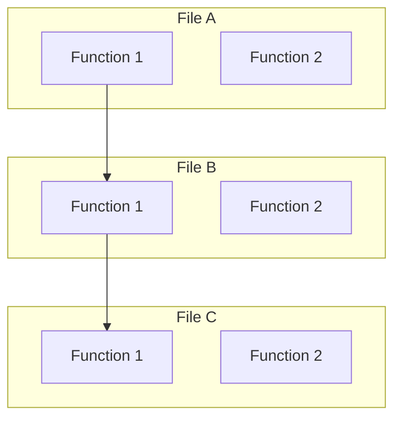
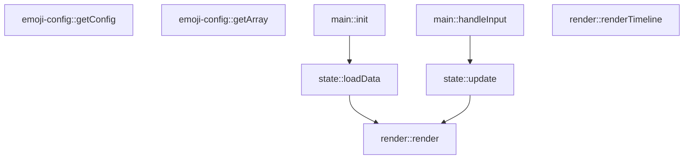
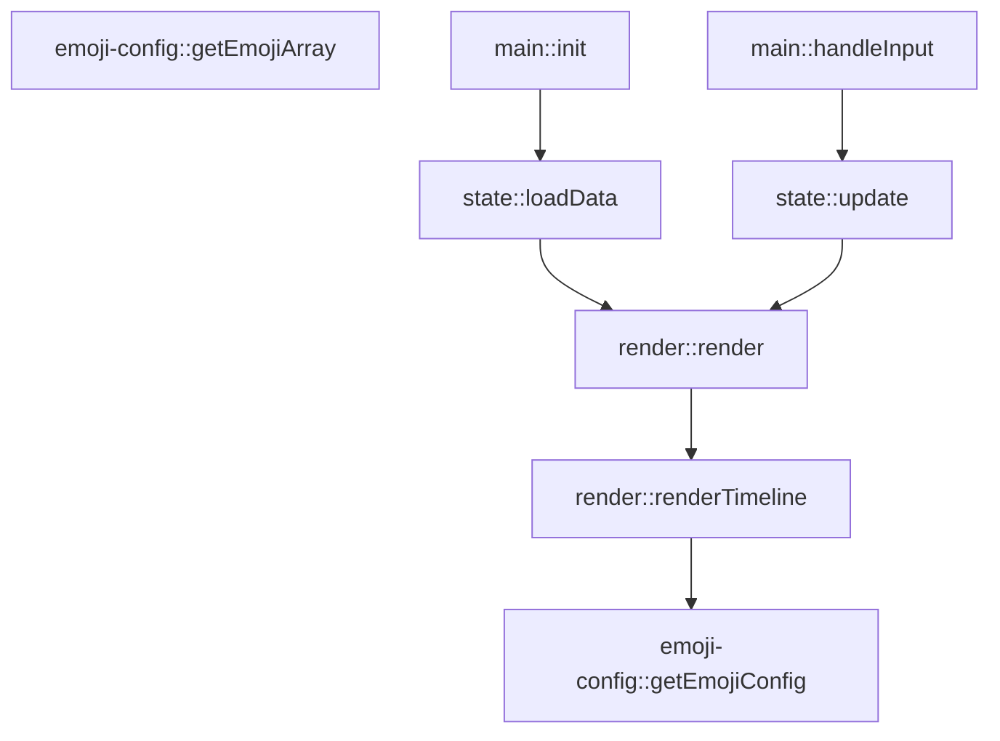
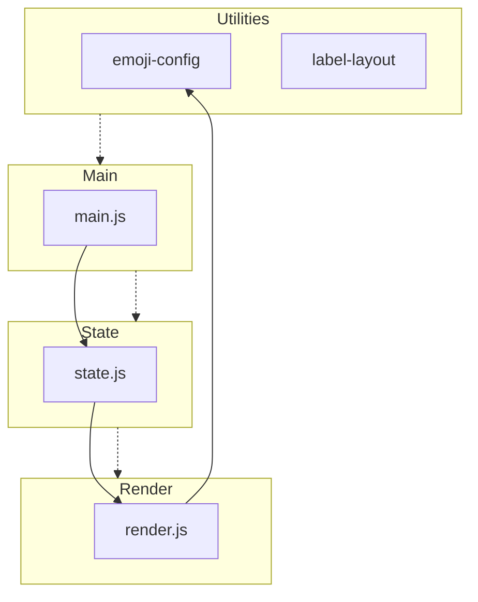
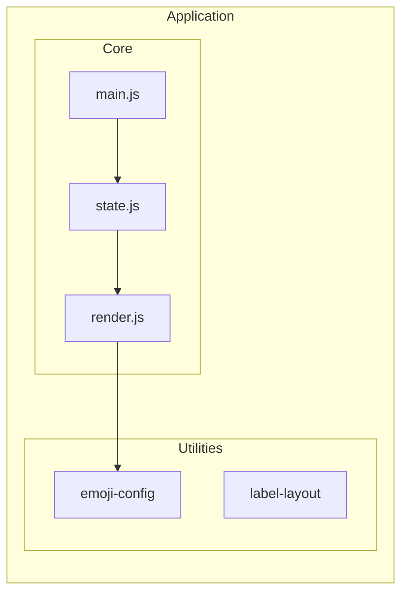

# Mermaid Layout Experiments

## Test 1: Basic TD with subgraphs

## Test 2: Without subgraphs (grouped visually)

## Test 3: Using clustering without subgraphs

## Test 4: Force vertical with invisible edges

## Test 5: Nested subgraphs
