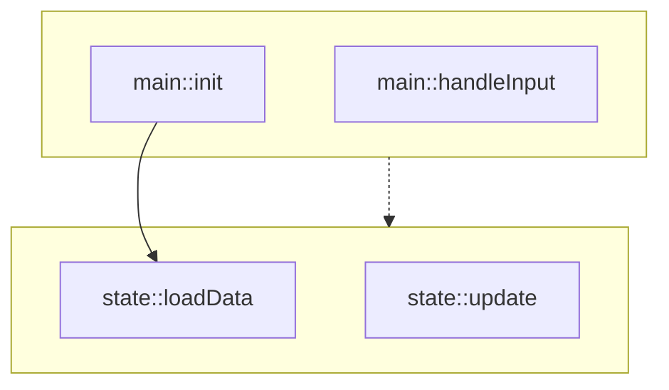
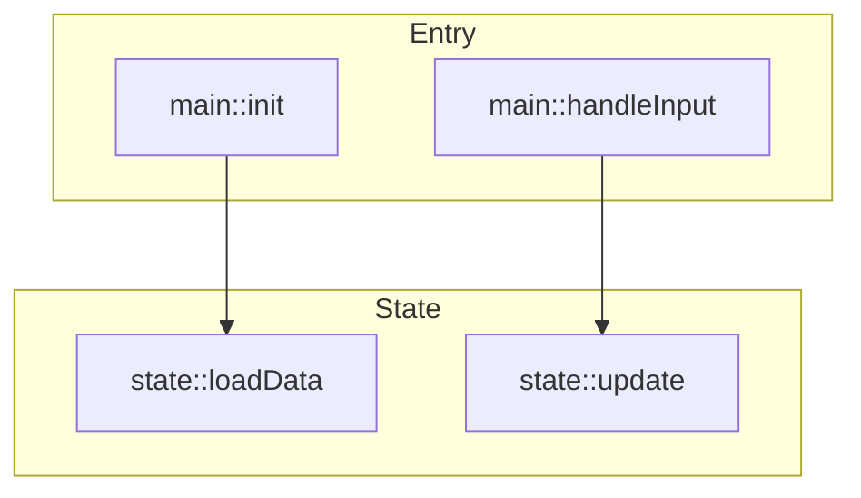
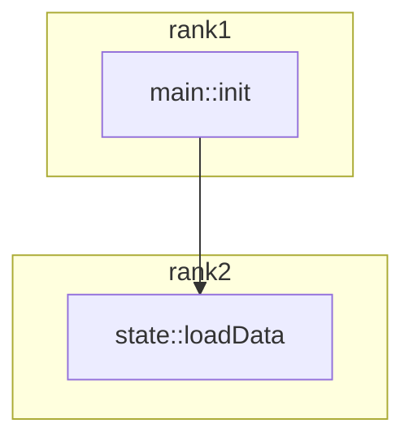
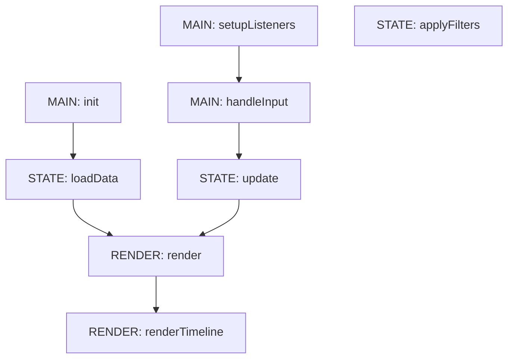
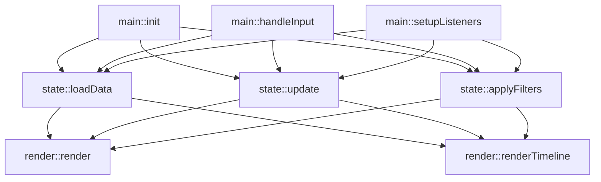

# Testing Vertical Stacking

## Test 1: Current approach (not working)

## Test 2: Direct connection between subgraph nodes

## Test 3: Using explicit ranks (doesn't work in mermaid)

## Test 4: No subgraphs, just visual grouping

## Test 5: Force ranking with ALL nodes connected
