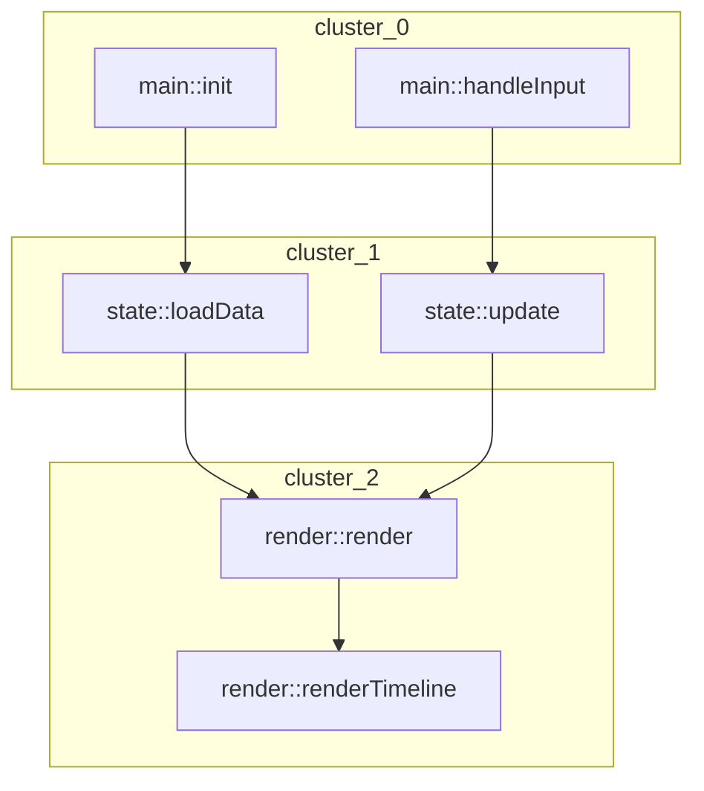
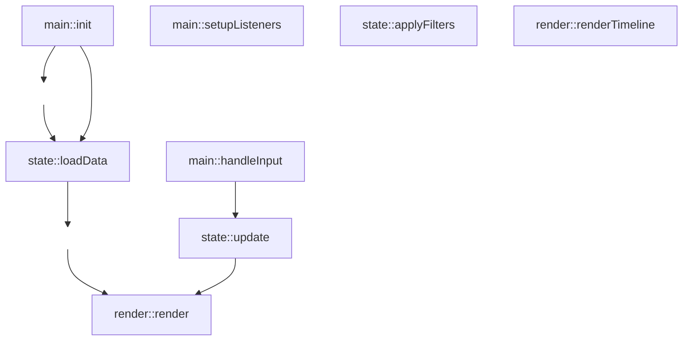
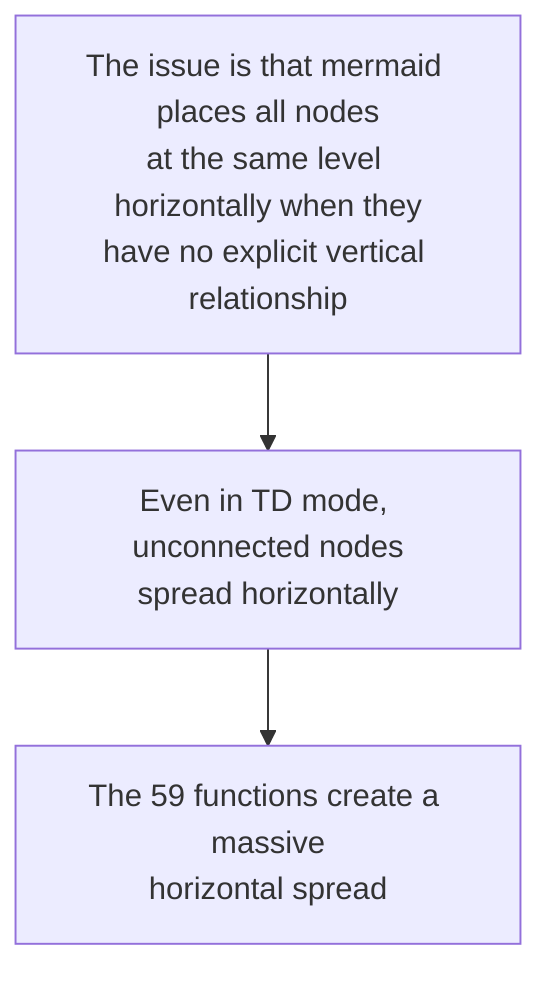

# Testing Vertical Layout

## Using rankdir and rank

```mermaid
graph TB
    subgraph cluster_0
        main_init["main::init"]
        main_handleInput["main::handleInput"]
    end
    
    subgraph cluster_1
        state_loadData["state::loadData"]
        state_update["state::update"]
    end
    
    subgraph cluster_2
        render_render["render::render"]
        render_timeline["render::renderTimeline"]
    end
    
    main_init --> state_loadData
    main_handleInput --> state_update
    state_loadData --> render_render
    state_update --> render_render
    render_render --> render_timeline
```

## Forcing layers with invisible nodes

```mermaid
graph TD
    %% Layer 1
    main_init["main::init"]
    main_handleInput["main::handleInput"]
    main_setup["main::setupListeners"]
    
    %% Invisible spacer
    spacer1[ ]
    style spacer1 fill:transparent,stroke:none
    
    %% Layer 2  
    state_loadData["state::loadData"]
    state_update["state::update"]
    state_apply["state::applyFilters"]
    
    %% Invisible spacer
    spacer2[ ]
    style spacer2 fill:transparent,stroke:none
    
    %% Layer 3
    render_render["render::render"]
    render_timeline["render::renderTimeline"]
    
    %% Force vertical layout
    main_init --> spacer1
    spacer1 --> state_loadData
    state_loadData --> spacer2
    spacer2 --> render_render
    
    %% Real connections
    main_init --> state_loadData
    main_handleInput --> state_update
    state_update --> render_render
```

## The actual problem visualization

```mermaid
graph TD
    A[The issue is that mermaid places all nodes<br/>at the same level horizontally when they<br/>have no explicit vertical relationship]
    
    B[Even in TD mode, unconnected nodes<br/>spread horizontally]
    
    C[The 59 functions create a massive<br/>horizontal spread]
    
    A --> B
    B --> C
```