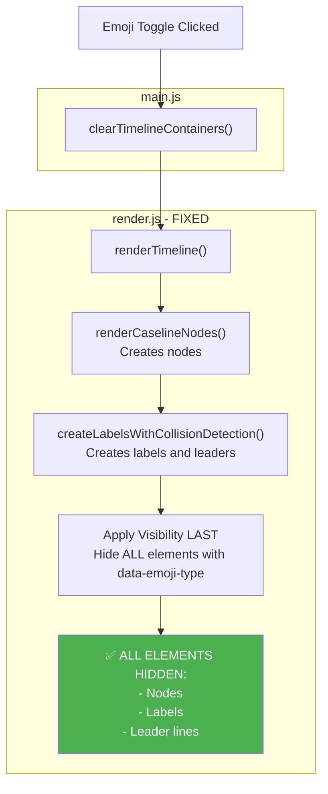

# Visibility Timing Issue

## The COMPLETE Flow

```mermaid
graph TD
    Start["Emoji Toggle Clicked<br/>(e.g. 'notice' checkbox)"] --> NavChange
    
    subgraph "main.js"
        NavChange["nav.addEventListener('change') - Line 163"] 
        NavChange --> CheckClass["target.classList.contains('emoji-toggle') - Line 181"]
        CheckClass --> GetEmojiData["const emojiClass = target.dataset.emojiClass - Line 182<br/>const isVisible = target.checked - Line 183"]
        GetEmojiData --> LogClick["console.log('Emoji toggle clicked:', target) - Line 182"]
        LogClick --> CallHandleInput["handleInput('emojiToggle', {emoji, visible}) - Line 185"]
        
        CallHandleInput --> HandleInput["handleInput(type, providedData) - Line 234"]
        HandleInput --> CheckProvided["providedData exists? - Line 237"]
        CheckProvided -->|Yes| SwitchType["switch(type) - Line 257"]
        SwitchType --> CaseEmoji["case 'emojiToggle': - Line 261"]
        CaseEmoji --> ClearTimeline["clearTimelineContainers() - Line 262<br/>Destroys ALL elements"]
        ClearTimeline --> CallUpdate["update(type, data) - Line 267"]
    end
    
    subgraph "state.js"
        CallUpdate --> Update["update('emojiToggle', data) - Line 132"]
        Update --> SwitchUpdate["switch(type) - Line 133"]
        SwitchUpdate --> EmojiCase["case 'emojiToggle': - Line 183"]
        EmojiCase --> UpdateState["state.emojiVisibility[data.emoji] = data.visible - Line 184"]
        UpdateState --> SaveState["saveEmojiVisibility(state.emojiVisibility) - Line 185"]
        SaveState --> CheckRefilter["Check if needs refilter - Line 229"]
        CheckRefilter -->|'emojiToggle' NOT in list| NoRefilter["Skip applyFilters()"]
        NoRefilter --> CallRender["render(state) - Line 234"]
    end
    
    subgraph "render.js"
        CallRender --> Render["render(state) - Line 18"]
        Render --> UpdateControls["updateControls(state) - Line 20"]
        UpdateControls --> UpdateCheckboxes["Update emoji checkbox states - Lines 101-108"]
        Render --> RenderTimeline["renderTimeline(state) - Line 23"]
        
        RenderTimeline --> GetContainers["Get container elements - Lines 116-118"]
        GetContainers --> CheckEmpty["Check if filteredEvents empty - Line 120"]
        CheckEmpty -->|Has events| CalcRange["calculateDateRange() - Line 135"]
        CalcRange --> DrawYears["drawYearMarkers() - Line 141"]
        
        DrawYears --> CreateNodes["renderCaselineNodes() - Line 144<br/>Creates NEW nodes with data-emoji-type"]
        
        CreateNodes --> ApplyVis["Apply Visibility - Lines 147-154<br/>Queries: [data-emoji-type='notice']<br/>Sets display:none on NODES ONLY"]
        
        ApplyVis --> WhatExists1["🔴 PROBLEM POINT:<br/>✓ Nodes exist and are hidden<br/>✗ Labels don't exist yet<br/>✗ Leader lines don't exist yet"]
        
        WhatExists1 --> LogLabel["console.log('Label recalculation triggered') - Line 157"]
        LogLabel --> CreateLabels["createLabelsWithCollisionDetection() - Line 158<br/>Creates NEW labels with data-emoji-type<br/>Creates NEW leader lines with data-emoji-type"]
        
        CreateLabels --> WhatExists2["🔴 RESULT:<br/>✓ Nodes are hidden<br/>✓ Labels exist but VISIBLE<br/>✓ Leader lines exist but VISIBLE"]
        
        WhatExists2 --> MoreStuff["renderCaseTitles() - Line 163<br/>drawCaselineConnections() - Line 166<br/>calculateStats() - Line 172"]
        
        MoreStuff --> End["❌ NO MORE VISIBILITY CODE<br/>Labels and leaders remain visible!"]
    end
    
    style ClearTimeline fill:#ff6b6b
    style WhatExists1 fill:#ffd700
    style WhatExists2 fill:#ff6b6b
    style End fill:#ff0000,color:#fff
```

## The Fix

Move the visibility application to AFTER all elements are created:

```mermaid
graph TD
    Start["Emoji Toggle Clicked"] --> Clear
    
    subgraph "main.js"
        Clear["clearTimelineContainers()"]
    end
    
    Clear --> Render
    
    subgraph "render.js - FIXED"
        Render["renderTimeline()"] --> CreateNodes
        CreateNodes["renderCaselineNodes()<br/>Creates nodes"] --> CreateLabels
        CreateLabels["createLabelsWithCollisionDetection()<br/>Creates labels and leaders"] --> ApplyVis
        ApplyVis["Apply Visibility LAST<br/>Hide ALL elements with data-emoji-type"]
        ApplyVis --> Success["✅ ALL ELEMENTS HIDDEN:<br/>- Nodes<br/>- Labels<br/>- Leader lines"]
    end
    
    style Success fill:#4caf50,color:#fff
```