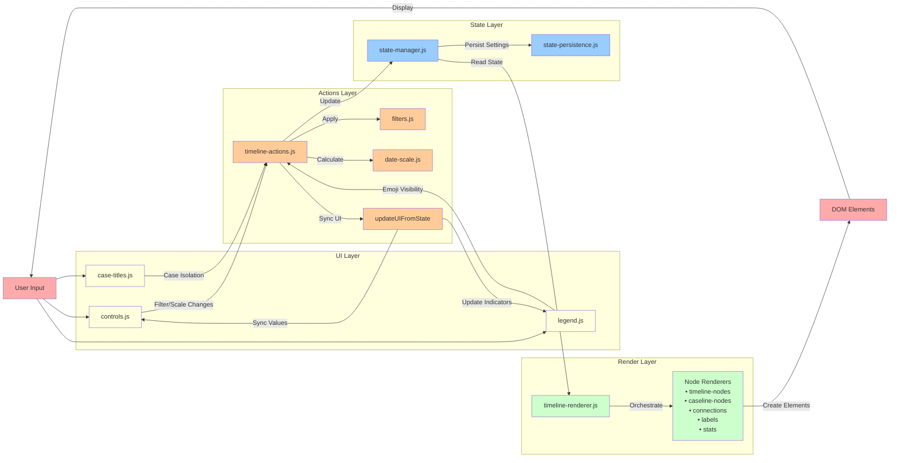
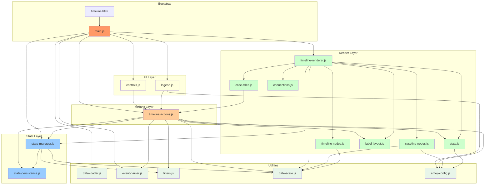

# Timeline v3 Architecture

## State-Centric Architecture (Component View)

```mermaid
graph LR
    subgraph "Bootstrap"
        HTML[timeline.html]
        Main[main.js<br/>• Load data<br/>• Initialize state<br/>• Wire up UI<br/>• Call render]
    end
    
    subgraph "UI Layer"
        Controls[controls.js]
        Legend[legend.js]
        CaseTitles[case-titles.js]
    end
    
    subgraph "Actions Layer"
        TA[timeline-actions.js<br/>All state changes]
    end
    
    subgraph "State Layer"
        SM[state-manager.js<br/>Single source of truth]
    end
    
    subgraph "Render Layer"
        TR[timeline-renderer.js<br/>render&#40;&#41; function]
    end
    
    %% Bootstrap flow
    HTML --> Main
    Main -->|1. Load data| TA
    Main -->|2. Init UI| Controls
    Main -->|2. Init UI| Legend
    Main -->|3. Trigger| TR
    
    %% Runtime cycle
    Controls -->|User events| TA
    Legend -->|User events| TA
    CaseTitles -->|User events| TA
    
    TA -->|Update| SM
    SM -->|Read| TR
    TR -->|Update DOM| Controls
    TR -->|Update DOM| Legend
    TR -->|Update DOM| CaseTitles
    
    %% Consistent styling
    style Main fill:#f96
    style TA fill:#fc9
    style SM fill:#9cf
    style TR fill:#cfc
    style Controls fill:#ffd
    style Legend fill:#ffd
    style CaseTitles fill:#ffd
```



## Data Flow (Process View)



## Module Dependency Graph (Actual After Cleanup)



## Module Reference

### Core Orchestration

#### `main.js`
**Purpose**: Application bootstrap
- Loads and parses timeline data
- Loads and parses cases metadata
- Initializes application state via actions
- Wires up UI components
- Triggers initial render
- Initializes refresh button (delegates to actions)

#### `state-manager.js`
**Purpose**: Centralized state management
- Single source of truth for application state
- State persistence integration
- Default case selection from cases metadata
- **Exports**:
  - `state` - Application state object
  - `updateState()` - Update state and persist
  - `getState()` - Get current state (read-only)
  - `getDefaultCases()` - Get default case selection based on defaultVisible

#### `timeline-actions.js`
**Purpose**: Business logic and state mutations
- All state changes happen here
- Filter and scale calculations
- UI synchronization
- Emoji visibility management
- **Key Functions**:
  - `initializeApp(events, caseNumbers, casesData)` - Set up initial state and render
  - `handleFilterUpdate()` - Central filter handler with date auto-computation
  - `handleScaleUpdate()` - Scale change handler
  - `handleScrollUpdate()` - Save scroll position to state and localStorage
  - `isolateCase()` - Case isolation with state save/restore
  - `resetToDefaults()` - Reset all filters
  - `updateUIFromState()` - Sync all UI to state
  - `checkActiveFilters()` - Update visual indicators
  - `computeDateRangeForCases()` - Calculate dates for selected cases
  - `applyEmojiVisibility()` - Apply emoji visibility state
  - `resetEmojiVisibility()` - Reset emoji visibility to default values from config
  - `toggleEmojiVisibility()` - Toggle specific emoji type
  - `refreshCaselineLabels()` - Refresh labels after visibility change (uses stored nodes)
  - `refreshTimelineData()` - Refresh data while preserving view settings

#### `timeline-renderer.js`
**Purpose**: Pure rendering orchestration
- Coordinates all rendering modules
- Stores caseline nodes in state for label refresh
- Manages render pipeline
- Restores scroll position after render
- **Key Functions**:
  - `render()` - Complete re-render from current state, stores nodes for refresh, restores scroll

### Data Processing

#### `data-loader.js`
**Purpose**: Fetch and extract markdown data
- Cache-busting for fresh data
- Timeline table extraction from markdown
- Cases table extraction from markdown
- **Functions**:
  - `loadTableData()` - Fetches markdown file
  - `extractTableRows()` - Extracts timeline table
  - `extractCasesTable()` - Extracts cases metadata table

#### `event-parser.js`
**Purpose**: Parse table data into event objects
- Header-based column mapping
- Multiple column name fallbacks
- Timeline vs caseline event detection
- Dynamic column finding
- Handles missing columns gracefully

#### `filters.js`
**Purpose**: Event filtering logic
- Date range filtering
- Case number filtering
- Combined filter application
- Supports `manualDateOverride` flag

### Visual Rendering

#### `date-scale.js`
**Purpose**: Date positioning and scaling
- Date to pixel conversion
- Timeline width calculations
- Year marker generation
- Container sizing

#### `timeline-nodes.js`
**Purpose**: Timeline section event rendering
- Public/private event nodes (green/red dots)
- Date label clustering algorithm
- Missing document indicators (❌)
- Tooltips with event details

#### `caseline-nodes.js`
**Purpose**: Caseline section emoji rendering
- Emoji node positioning
- Procedural label overrides
- Case grouping for connections
- Color inheritance system

#### `connections.js`
**Purpose**: SVG connection lines
- Timeline event connections (thin)
- Caseline event connections (thick)
- Color coding by type
- Bypass node handling

#### `case-titles.js`
**Purpose**: Case headers above caseline
- Receives case metadata via parameters
- Year and case name display from cases table
- Color coding by case
- Double-click for case isolation
- Dynamic positioning
- **Functions**:
  - `getCaseInfo(caseNumber, casesData)` - Looks up case metadata
  - `renderCaseTitles(caseGroups, visibleCases, casesData)` - Renders case title elements

#### `label-layout.js`
**Purpose**: Label collision avoidance
- Collision detection algorithm
- Leader line generation
- Boundary constraints
- Dynamic recalculation

#### `stats.js`
**Purpose**: Event statistics display
- Configuration-driven metrics from emoji config
- Dynamic metric ordering via metricDisplay property
- Emoji-aware statistics (respects visibility)
- Real-time updates on filter changes
- Only displays metrics for emojis with metricDisplay property

### User Interface

#### `controls.js`
**Purpose**: User control initialization
- Date filter controls
- Case selection dropdown
- Scale slider
- Fit-to-window toggle
- Mouse wheel horizontal scrolling
- Scroll position tracking
- Delegates all actions to timeline-actions

#### `legend.js`
**Purpose**: Emoji legend in header
- Table-based layout
- Checkbox toggles for emoji visibility
- Double-click for emoji isolation
- Colored squares for timeline legend

### Configuration & Persistence

#### `emoji-config.js`
**Purpose**: Central emoji configuration
- Legend labels and display text
- Colors for caseline connections
- CSS classes for visibility control
- Default visibility settings (`defaultVisible` property)
- Metric display configuration (`metricDisplay` order, `metricLabel` text)
- Special handling (bypass, inherit)

#### `state-persistence.js`
**Purpose**: LocalStorage management
- Filter state persistence
- Scale/zoom persistence
- Emoji visibility persistence
- Scroll position persistence
- Isolation mode tracking
- **Storage Keys**:
  - `timeline-filters`
  - `timeline-scale`
  - `timeline-emoji-visibility`
  - `timeline-scroll-position`
  - `timeline-isolation-mode`

## State Structure

```javascript
state = {
    allEvents: Event[],           // All parsed events
    filteredEvents: Event[],      // Currently visible events
    caseNumbers: string[],        // All unique case numbers
    casesData: CaseData[],        // Case metadata from markdown
    caselineNodes: Array,         // Stored caseline nodes for label refresh
    scale: number,                // Zoom level (0.2 - 3.0)
    fitToWindow: boolean,         // Auto-scale to viewport
    emojiVisibility: Object,      // Emoji type visibility states
    scrollPosition: number,       // Horizontal scroll position
    filters: {
        startDate: Date | null,   // Filter start
        endDate: Date | null,     // Filter end
        selectedCases: string[],  // Active case numbers
        manualDateOverride: boolean  // User manually set dates
    }
}
```

## Data Object Structures

### Event Object
```javascript
{
    date: Date,                    // Parsed date object
    dateStr: "2024-01-15",        // Original date string
    title: "Document Title",       // Document title
    documentUrl: "path/to/doc.pdf", // Document URL if available
    caseNumber: "338-0594",       // Associated case number
    eventType: "timeline" | "caseline",
    eventClass: "tracked-event" | "tracked-event-priv" | "case-procedural",
    isPrivate: boolean,           // Private vs public event
    hasMissingDoc: boolean,       // Has ❌ marker
    caselineEmojis: ["🏛️", "⛔"], // Array of emojis for caseline (supports multiple)
    proceduralLabel: "APPROVED",  // Bold text override
    labelEmphasis: "high" | null,  // High emphasis (!**text**!) or null for normal
    displayDetail: "Additional",  // Additional details
    markers: "🟢⭐",              // All markers from column
    verticalPosition: "public" | "private" | "inline", // Position for caseline nodes
}
```

### CaseData Object
```javascript
{
    caseNumber: "338-0594",       // Case number (or "-" for Historical)
    year: "2014",                 // Year of case
    title: "House",               // Case title/name
    defaultVisible: boolean       // Whether case is visible by default
}
```

## Key Features

### Hybrid Date Filtering
Automatically computes date ranges from selected cases but allows manual override:
```javascript
if (casesChanged && !state.filters.manualDateOverride) {
    // Auto-compute dates from selected cases
    const computedDates = computeDateRangeForCases(selectedCases);
    state.filters.startDate = computedDates.startDate;
    state.filters.endDate = computedDates.endDate;
}
```

### Data-Driven Case Configuration
Case metadata loaded from markdown:
- Case titles, years, and numbers from Google Sheets
- Default visibility configured per case
- No hardcoded case information
- Dynamic case discovery from events

### Case Isolation Mode
Double-click case titles to focus on a single case:
- Saves current state
- Isolates selected case
- Auto-enables fit-to-window
- Double-click again to restore

### Emoji Visibility Control
Individual emoji types can be toggled:
- Checkboxes in legend control visibility
- Default visibility configurable per emoji type
- Labels automatically recalculate positions
- Stats update to reflect visible emojis only
- Connection lines remain visible
- Double-click legend emoji for isolation mode

### Configuration-Driven Metrics
Header statistics are fully configuration-driven:
- `metricDisplay` property controls display order (1, 2, 3...)
- Absence of `metricDisplay` excludes emoji from metrics
- `metricLabel` provides custom metric labels
- Automatically respects emoji visibility settings
- No hardcoded metric calculations

### Dynamic Column Mapping
Handles multiple column name variations:
```javascript
const findColumn = (names) => {
    for (const name of names) {
        const index = headers.findIndex(h => 
            h.toLowerCase().includes(name.toLowerCase())
        );
        if (index !== -1) return index;
    }
    return -1;
};
```

## File Structure

```
/Resources/js/
├── ARCHITECTURE.md       (This file)
├── main.js              (Bootstrap)
├── state-manager.js     (State management)
├── timeline-actions.js  (Business logic)
├── timeline-renderer.js (Render orchestration)
├── data-loader.js       (Data fetching)
├── event-parser.js      (Event parsing)
├── date-scale.js        (Date positioning)
├── timeline-nodes.js    (Timeline rendering)
├── caseline-nodes.js    (Caseline rendering)
├── case-titles.js       (Case headers)
├── connections.js       (Connection lines)
├── label-layout.js      (Label positioning)
├── filters.js           (Filter logic)
├── controls.js          (UI controls)
├── emoji-config.js      (Emoji configuration)
├── legend.js            (Legend display)
├── stats.js            (Statistics)
└── state-persistence.js (LocalStorage)

/Resources/tsv-Converter/
├── tsv2md.py            (Converts TSV to markdown - timeline and cases tables)
└── update_timeline.py   (Monitors Google Sheets, downloads TSV files)

/Resources/
├── timeline.html        (HTML structure)
└── timeline.css         (Styles)
```

## Architecture Achievements

1. **True Separation of Concerns** - Each module has a single responsibility
2. **Clean Dependency Hierarchy** - Clear layering with proper flow:
   - UI Components → Business Logic
   - Business Logic → State Management
   - Rendering → State Management (read-only)
3. **Single Source of Truth** - Centralized state management
4. **Unidirectional Data Flow** - User → Actions → State → Render → User
5. **Pure Rendering** - No side effects in render functions
6. **No Circular Dependencies** - Clean import hierarchy

## Design Patterns

- **Module Pattern** - ES6 modules for encapsulation
- **Observer Pattern** - State changes trigger UI updates
- **Strategy Pattern** - Filter and render strategies
- **Facade Pattern** - timeline-actions as simplified interface
- **Factory Pattern** - Event object creation in parser

## Performance Characteristics

- **Initial load**: <400ms
- **Re-render on filter**: ~40ms  
- **Scale change**: ~25ms
- **Label collision detection**: ~15ms
- **State update cycle**: <10ms

## Browser Compatibility

- Chrome 90+ ✅
- Firefox 88+ ✅  
- Safari 14+ ✅
- Edge 90+ ✅