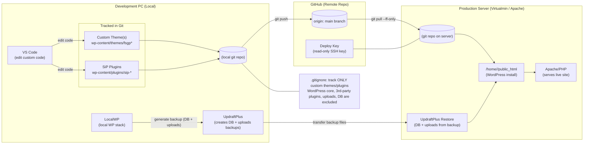

### Setup Steps

1. **Create New Site in LocalWP**  
   LocalWP will create the folder at:  
   `C:\Users\<you>\Local Sites\<sitename>\`

2. **Create `.gitignore` file**  
   Place it inside `app\public`.

3. **Initialize Git in the dev folder**  
   ```powershell
   cd "C:\Users\<you>\Local Sites\<sitename>\app\public"
   git init
   git add .gitignore
   git commit -m "Add .gitignore"
   ```

<details>
<summary><strong>.gitignore (click to expand & copy)</strong></summary>

```gitignore
# --- WordPress core & config ---
/wp-admin/
/wp-includes/
/index.php
/license.txt
/readme.html
/wp-*.php
/wp-config.php
/wp-config-*.php
/.htaccess
/web.config

# --- Composer / Node (if present) ---
/vendor/
/node_modules/
/package-lock.json
/pnpm-lock.yaml
/yarn.lock

# --- Logs & OS cruft ---
*.log
.DS_Store
Thumbs.db

# --- Cache & backups ---
/cache/
/backup/
/backups/
/*.sql
/*.sql.gz

# --- Uploads & media (large; not in git) ---
/wp-content/uploads/
!/wp-content/uploads/.gitkeep

# --- Block ALL plugins by default (3rd-party updates stay out of git) ---
/wp-content/plugins/*

# --- ALLOW ONLY YOUR SiP plugins (tracked) ---
!/wp-content/plugins/sip-printify-manager/
!/wp-content/plugins/sip-plugins-core/
!/wp-content/plugins/sip-development-tools/
# (Add more SiP plugin folders here as you create them)

# --- Must-Use plugins (usually your code) ---
/wp-content/mu-plugins/*
!/wp-content/mu-plugins/
!/wp-content/mu-plugins/*.php
!/wp-content/mu-plugins/sip-*/

# --- Themes: block all by default ---
/wp-content/themes/*

# --- ALLOW ONLY your custom themes (tracked) ---
!/wp-content/themes/fsgp*/
!/wp-content/themes/sip*/
# (Add your exact theme folder(s) as needed)

# --- Disallow common build artifacts inside allowed folders ---
**/.cache/
**/dist/
**/build/
**/*.map

# --- FacetWP, cache plugins, etc. (runtime data) ---
/wp-content/cache/
/wp-content/wflogs/
/wp-content/ai1wm-backups/
/wp-content/upgrade/
/wp-content/debug.log

# --- Keep directory structure where needed ---
!.gitignore
```

</details>
